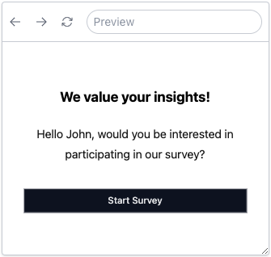

# Advanced Features

SurveyCompo provides a complete set of features for creating surveys. You can make your surveys interactive and smart with features such as input validation, skipping and branching logic, randomization, custom variables and piping.

## Randomization

Randomization in the context of surveys refers to the process of presenting questions or response options in a random order for each respondent. This technique is used to control for the effects of question order bias, where the order in which questions or response options are presented can influence the responses. By randomizing the order, you can ensure that the data collected is not influenced by the sequence of the questions or options.

SurveyCompo allows for randomization at various levels. You can shuffle the sequence of pages in a survey, blocks on a page, and inputs within a block. SurveyCompo gives you control over how much you want to randomize. You can either group certain items together and shuffle them within their groups, or you can shuffle all items individually.

The `randomWithinGroup` key is a powerful tool for adding randomization to your survey. By giving the same `randomWithinGroup` string value to certain items, you can randomize their order while keeping the sequence of other items intact. Let's illustrate this with an example <span style="font-weight: lighter; font-size: smaller">(Hint: Click the 'Close' button to observe the effects of randomization.)</span>

<div style="border: 1px solid gray; width: 320px; height: 400px; margin-bottom: 10px" class="resizable">
	<survey-compo
		src="https://surveycompo.github.io/examples/examples/randomization/source.json"
	/>
</div>

[:material-github:{.right-icon} view source](https://github.com/SurveyCompo/examples/tree/main/examples/randomization){:target="\_blank" .small-text}

The `randomWithinGroup` key can be used with Pages, Blocks, and Inputs in the model. In the given example, we have two pages, each with two questions. By using the `randomWithinGroup` key, these two pages are grouped and shuffled together. Similarly, the two blocks within each page are also grouped and shuffled together. The inputs in the blocks titled 'Which of the following features do you use most often?' and 'How did you first learn about our product/service?' are grouped for randomization. However, the 'Other' inputs are not part of the random group, so they always appear last in their respective blocks. Items without the `randomWithinGroup` key retain their original positions.

It's worth noting that the randomization happens when the survey is initialized and stays the same throughout the survey duration. The specific value assigned to the randomWithinGroup key is irrelevant, as long as it's identical for all items that should be shuffled together.

## Variables

Variables are placeholders for values that can be used in the survey. They can be used to display information, or define conditional logic to control the flow of the survey.

For instance, if you wish to personalize your survey by including the respondent's name, a variable can be used. This variable will hold the name and display it throughout the survey. This feature is referred as 'piping'.

Similarly, variables can be used to tailor the survey based on the respondent's age. By passing the age as a variable, you can reference it in the conditional logic that determines which questions are shown. This way, different age groups can be presented with different sets of questions.

To define variables in SurveyCompo, you can use the `variables` key in the model. The `variables` key is an object that contains key-value pairs. The key is the variable name, and the value is the value of the variable. The variable value can be a string, number, or boolean.

```json
{
  "name": "My Survey",
  "pages": [
    /* ... */
  ],
  "variables": {
    "name": "John Doe",
    "age": 25
  }
}
```

!!! tip "Tip"

    Adhering to a variable naming convention is highly recommended. It is best to use lowercase letters for variable names and avoid special characters. Variable names can not contain spaces.

The upcoming two sections will cover the usage of variables in the context of piping and condition.

## Piping

Piping is a technique that shows the value of a variable or a previously inputted value in a survey. This technique is commonly used to personalize the survey by addressing the respondent by their name or to display any other information that is relevant to the respondent.

### Piping with Variables and Prior Input Values

In SurveyCompo, piping is achieved by using the `{$variableName}` and `{#inputID}` syntax. The variable name or input ID is enclosed within curly braces with `$` and `#` prefixes, respectively.

In the `{$variableName}` syntax, the 'variableName' corresponds to one of the keys in the variables object within the survey model. Similarly, the 'inputID' in `{#inputID}` refers to the id key of one of the Input models. These placeholders can be used in text-based fields of the survey model, like the header, title, description, and options of the inputs. When the survey is displayed, these placeholders are swapped out with the real values of the variables or inputs.

The following example uses piping to display the respondent's name in the start screen:

=== "Preview"

    {: .small .embedded}

=== "JSON"

    ```json
    {
      /* ... */
      "variables": {
    	  "name": "John"
    	},
      "startScreens": [
    			{
    				"header": "We value your insights! ",
    				"description": "Hello {$name}, would you be interested in participating in our survey?",
    				"okButtonLabel": "Start Survey"
    			}
    	]
    }
    ```

But what if you want to have different text based on the value of a variable or input? This is where the piping modifier comes into play.

### Piping Modifiers

A piping modifier is a string added to the variable or input ID inside the curly braces. It's separated from the variable or input ID by a `|`. You can use a piping modifier to change how the variable or input value is displayed.

The following piping modifiers are available in SurveyCompo:

| Modifier  | Example                                               | Description                                                                                                                                                  |
| --------- | ----------------------------------------------------- | ------------------------------------------------------------------------------------------------------------------------------------------------------------ |
| `upper`   | <code>{#name&#124;upper}</code>                       | Convert the variable or input value to uppercase.                                                                                                            |
| `lower`   | <code>{#name&#124;lower}</code>                       | Convert the variable or input value to lowercase.                                                                                                            |
| `cap`     | <code>{#name&#124;cap}</code>                         | Capitalize the first letter of the variable or input value.                                                                                                  |
| `title`   | <code>{#name&#124;title}</code>                       | Convert the variable or input value to title case.                                                                                                           |
| `default` | <code>{$name&#124;default:user}</code>                | Use the first parameter as the output if the variable or input value is falsy (undefined or empty).                                                          |
| `yesno`   | <code>{#adult&#124;yesno:&#36;20:&#36;0}</code>       | If the variable or input value is truthy (defined and not empty), use the first parameter as the output, otherwise use the second parameter as the output.   |
| `plural`  | <code>{#count&#124;plural&#58;person:people}</code>   | If the variable or input value is not evaluated to 1, use the second parameter as the output, otherwise use the first parameter as the output.               |
| `eq`      | <code>{#hungry&#124;eq:true:eat:rest}</code>          | If the variable or input value is equal to the first parameter, use the third parameter as the output, otherwise use the second parameter as the output.     |
| `gt`      | <code>{#height&#124;gt&#58;100:tall:short}</code>     | If the variable or input value is greater than the first parameter, use the third parameter as the output, otherwise use the second parameter as the output. |
| `lt`      | <code>{#price&#124;lt&#58;100:cheap:expensive}</code> | If the variable or input value is less than the first parameter, use the third parameter as the output, otherwise use the second parameter as the output.    |

!!! tip "Tip"

    Parameters for modifiers are divided by a colon `:`. If a parameter includes a colon within it, you should escape it with an underscores, like this: `_:_`. If a parameter is not provided, it's assumed to be an empty string.

Let's bring it all together with this example:

<div style="border: 1px solid gray; width: 320px; height: 400px; margin-bottom: 10px" class="resizable">
	<survey-compo
		src="https://surveycompo.github.io/examples/examples/piping/source.json"
	/>
</div>

[:material-github:{.right-icon} view source](https://github.com/SurveyCompo/examples/tree/main/examples/piping){:target="\_blank" .small-text}

!!! tip "Tip"

    You can technically use piping wherever you prefer, even piping the response to the current question into the question title itself. However, remember that the piped input value will be empty until the response is captured. For a better user experience, it's recommended to use piping in subsequent pages.

## Conditional Logic

Conditional logic, also known as branching logic and skipping logic, involves setting rules that determine whether a question or section of the survey should be shown based on multiple conditions or previous answers. It is used to create a more personalized survey experience for respondents by displaying only the questions that are relevant to them.

SurveyCompo uses Condition Expressions to define conditional logic. `#age > 18` is an example of a Condition Expression. This expression evaluates to a boolean value, which can be used to determine whether a page or a question should be displayed when used with the key `visibleIf`. For example:

```json linenums="1" hl_lines="20"
{
  "name": "My Survey",
  "pages": [
    {
      "blocks": [
        {
          "type": "question",
          "question": "What is your age?",
          "inputs": [
            {
              "id": "age",
              "type": "TEXT",
              "textInputType": "NUMBER"
            }
          ]
        }
      ]
    },
    {
      "visibleIf": "#age > 18",
      "blocks": [
        {
          "type": "question",
          "question": "What is your favorite color?"
        }
      ]
    }
  ]
}
```

In the above example, the page with the question "What is your favorite color?" will only be displayed if the respondent's age is greater than 18. The `visibleIf` key is applicable to Screen, Page, Block, and Input models. You can apply conditional logic to these elements.

### Condition Expression

A Condition Expression is a string designed to evaluate to a boolean value, following the syntax `[variable or input reference] [comparison operator] [value]`. For instance, `#age > 18` illustrates how to use this expression:

- Prefix a variable name with `$` to reference a variable, or use `#` to reference a previous input's value.
- Use comparison operators such as `==`, `!=`, `>`, `<`, `>=`, or `<=` for evaluating conditions.
- The value is what you compare against using the operator.

The 'value' part of the Condition Expression does not need to be quoted. For example, `$name == John Smith`. To compare with a boolean value, use 'true' or 'false' for comparison, for example, `$male == true` and `$male == false`. SurveyCompo offers a shortcut syntax for boolean values: `#male` is equivalent to `#male == true`.

When evaluating equality (i.e.,`==` and `!=`), comparisons are performed as string comparisons. This means that both operands in the comparison are converted to the `String` type before comparison. For instance, the Condition Expression `#age == true` (or `#age`) would evaluate to false, as the numeric value (e.g., "18") is compared against the string representation of a boolean value ("true").

In cases involving other types of comparisons, if the 'value' specified is numeric, the comparison is executed numerically. For instance, the expression `#age > 18` returns true if the 'age' input's value exceeds 18. Conversely, if the 'value' is a string, the comparison is conducted as a string comparison. Thus, `$name > H` would be true if the 'name' variable's value alphabetically follows "H", such as in the case of "John".

!!! note "Note"

    An invalid Condition Expression is treated as false. This means any expression that fails to meet the required syntax or reference valid variables or inputs will be evaluated as false. Conversely, an empty expression is considered true, indicating that no condition was specified. Examples of empty expressions include an empty `string`, `null`, or `undefined`.

### Nested Condition Expression

A nested Condition Expression is an object with one or more logical operator as keys. The logical operators are `$and`, `$or`, and `$not`. The value of these keys is an array of other Condition Expressions. For example:

```json
/* ... visible for those male AND 18+ yo */
"visibleIf": {
  "$and": [
    "#age >= 18",
    "#gender == male"
  ]
}
/* ... */
```

The logical operators are evaluated in the following manner:

- `$and`: All conditions must be true for the expression to evaluate to true.
- `$or`: At least one condition must be true for the expression to evaluate to true.
- `$not`: The condition evaluates to true if the nested condition evaluates to false.

Complex expressions can be crafted by combining logical operators in a nested manner. For instance, consider an expression designed to evaluate as true if the respondent is at least 18 years old, resides in New York City, and possesses either a high level of education or a significant income:

```json
/* ... */
"visibleIf": {
  "$and": [
    {
      "$or": ["#edu == high", "#income == high"]
    },
    "#city == NY"
  ],
  "$not": ["#age <  18"]
}
/* ... */
```

!!! note "Note"

    A nested Condition Expression is deemed invalid if it contains any keys other than the three logical operators, or if the value is not an array. In such cases, the expression is evaluated as `false`. Conversely, an empty nested expression `{}` is considered `true`, indicating that no specific condition was set.

## Validation

Validation is a crucial aspect of survey design. It ensures that the data collected is accurate and reliable. SurveyCompo provides a range of validation options to ensure that respondents provide the correct type of input.

### Input Validation

Input validation is the process of ensuring that the data entered by the respondent meets specific criteria. SurveyCompo offers various validation options for different input types. These options include:

| Type         | Description                                                                              |
| ------------ | ---------------------------------------------------------------------------------------- |
| `REQUIRED`   | Ensures that the input field is not left blank.                                          |
| `NUMERIC`    | Ensures that the input field contains only numeric characters.                           |
| `INTEGER`    | Ensures that the input field contains only integer values.                               |
| `EMAIL`      | Ensures that the input field contains a valid email address.                             |
| `URL`        | Ensures that the input field contains a valid URL.                                       |
| `DOMAIN`     | Ensures that the input field contains a valid domain name.                               |
| `MAX_LENGTH` | Enables you to specify the maximum number of characters allowed in the input field.      |
| `MIN_LENGTH` | Enables you to specify the minimum number of characters allowed in the input field.      |
| `MAX_VALUE`  | Enables you to specify the maximum numeric value that can be entered in the input field. |
| `MIN_VALUE`  | Enables you to specify the minimum numeric value that can be entered in the input field. |
| `REGEX`      | Enables you to validate the input against a regular expression pattern.                  |
| `EQUALS`     | Enables you to validate the input against a specific value.                              |

To apply validation to an input, you can use the `validations` key in the Input model. The `validations` key is an array that contains one or more validation rules for the input.

```json linenums="1" hl_lines="14-24 30-40"
{
  "name": "My Survey",
  "pages": [
    {
      "blocks": [
        {
          "title": "Create a password:",
          "inputs": [
            {
              "id": "pwd",
              "type": "TEXT",
              "textInputType": "PASSWORD",
              "label": "New Password",
              "validations": [
                {
                  "type": "REQUIRED",
                  "message": "A password is required."
                },
                {
                  "type": "REGEX",
                  "value": "^(?=.*[a-z])(?=.*[A-Z])(?=.*[0-9]).+$",
                  "message": "Your password must include at least one uppercase letter, one lowercase letter, and one digit."
                }
              ]
            },
            {
              "type": "TEXT",
              "textInputType": "PASSWORD",
              "label": "Confirm Password",
              "validations": [
                {
                  "type": "REQUIRED",
                  "message": "Confirming your password is required."
                },
                {
                  "type": "EQUALS",
                  "value": "#pwd",
                  "message": "The passwords do not match."
                }
              ]
            }
          ]
        }
      ]
    }
  ]
}
```

In the above example, the first input field requires the respondent to create a password. The input field is validated to ensure that it is not left blank and that it meets the specified regular expression pattern. The second input field is used to confirm the password. It is also validated to ensure that it is not left blank and that it matches the value entered in the first input field.

!!! tip "Tip"

    The `message` key is optional and can be used to provide a custom error message that will be displayed to the respondent if the validation fails. If the `message` key is not provided, a default error message will be displayed.

The `EQUALS` validation rule is used to compare the value of the input field with the value of another input field. The value of the other input field is referenced using the `#` prefix followed by the input ID. You can also reference the value of a variable using the `$` prefix. Additionally, you can enforce that users provide a specific value by specifying the value directly. For instance, to ensure a user's agreement, a checkbox labeled 'Agree' can be configured to require a value of `true`.

### Block Validation

Block validation is a feature that allows you to validate multiple inputs within a block. This feature is useful when you want to ensure that a group of inputs is filled out correctly before proceeding to the next block or page. You can define block validation rules in the Block model using the `validations` key.

The `validations` key holds an array comprising validation rules applicable to the block. Below are the available validation rules:

| Type            | Description                                                |
| --------------- | ---------------------------------------------------------- |
| `REQUIRED`      | Ensures at least one input in the block is not left blank. |
| `MIN_SELECTION` | The minimum number of inputs that must be selected.        |
| `MAX_SELECTION` | The maximum number of inputs that must be selected.        |

```json linenums="1" hl_lines="10-19 57-62"
{
  "name": "My Survey",
  "pages": [
    {
      "blocks": [
        {
          "blocks": [
            {
              "title": "Please select 2 to 3 of your favorite hobbies:",
              "validations": [
                {
                  "type": "MIN_SELECTION",
                  "value": 2
                },
                {
                  "type": "MAX_SELECTION",
                  "value": 3
                }
              ],
              "inputs": [
                {
                  "type": "CHECKBOX",
                  "label": "Reading"
                },
                {
                  "type": "CHECKBOX",
                  "label": "Traveling"
                },
                {
                  "type": "CHECKBOX",
                  "label": "Cooking"
                },
                {
                  "type": "CHECKBOX",
                  "label": "Sports"
                },
                {
                  "type": "CHECKBOX",
                  "label": "Music"
                },
                {
                  "type": "CHECKBOX",
                  "label": "Movies"
                },
                {
                  "type": "CHECKBOX",
                  "label": "Others"
                }
              ]
            }
          ]
        },
        {
          "blocks": [
            {
              "title": "Preferred Contact Method:",
              "validations": [
                {
                  "type": "REQUIRED",
                  "message": "Please select at least one method"
                }
              ],
              "inputs": [
                {
                  "type": "CHECKBOX",
                  "label": "Email"
                },
                {
                  "type": "CHECKBOX",
                  "label": "Phone"
                },
                {
                  "type": "CHECKBOX",
                  "label": "Postage Male"
                }
              ]
            }
          ]
        }
      ]
    }
  ]
}
```

### Validation Example

Let's look at the following example that demonstrates the use of input and block validation:

<div style="border: 1px solid gray; width: 320px; height: 400px; margin-bottom: 10px" class="resizable">
	<survey-compo
		src="https://surveycompo.github.io/examples/examples/validation/source.json"
	/>
</div>

[:material-github:{.right-icon} view source](https://github.com/SurveyCompo/examples/tree/main/examples/validation){:target="\_blank" .small-text}

## Templates
