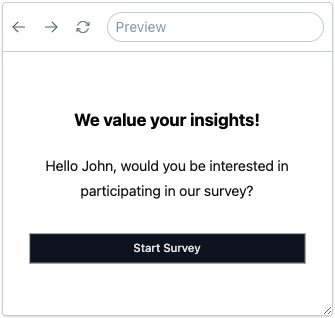

Piping is a technique that shows the value of a variable or a previously inputted value in a survey. This technique is commonly used to personalize the survey by addressing the respondent by their name or to display any other information that is relevant to the respondent.

### Piping with Variables and Prior Input Values

In SurveyCompo, piping is achieved by using the `{$variableName}` and `{#inputID}` syntax. The variable name or input ID is enclosed within curly braces with `$` and `#` prefixes, respectively.

In the `{$variableName}` syntax, the 'variableName' corresponds to one of the keys in the variables object within the survey model. Similarly, the 'inputID' in `{#inputID}` refers to the id key of one of the Input models. These placeholders can be used in text-based fields of the survey model, like the header, title, description, and options of the inputs. When the survey is displayed, these placeholders are swapped out with the real values of the variables or inputs.

The following example uses piping to display the respondent's name in the start screen:

=== "Preview"

    {: .small .embedded}

=== "JSON"

    ```json
    {
      /* ... */
      "variables": {
    	  "name": "John"
    	},
      "startScreens": [
    			{
    				"header": "We value your insights! ",
    				"description": "Hello {$name}, would you be interested in participating in our survey?",
    				"okButtonLabel": "Start Survey"
    			}
    	]
    }
    ```

But what if you want to have different text based on the value of a variable or input? This is where the piping modifier comes into play.

### Piping Modifiers

A piping modifier is a string added to the variable or input ID inside the curly braces. It's separated from the variable or input ID by a `|`. You can use a piping modifier to change how the variable or input value is displayed.

The following piping modifiers are available in SurveyCompo:

| Modifier  | Example                                               | Description                                                                                                                                                  |
| --------- | ----------------------------------------------------- | ------------------------------------------------------------------------------------------------------------------------------------------------------------ |
| `upper`   | <code>{#name&#124;upper}</code>                       | Convert the variable or input value to uppercase.                                                                                                            |
| `lower`   | <code>{#name&#124;lower}</code>                       | Convert the variable or input value to lowercase.                                                                                                            |
| `cap`     | <code>{#name&#124;cap}</code>                         | Capitalize the first letter of the variable or input value.                                                                                                  |
| `title`   | <code>{#name&#124;title}</code>                       | Convert the variable or input value to title case.                                                                                                           |
| `default` | <code>{$name&#124;default:user}</code>                | Use the first parameter as the output if the variable or input value is falsy (undefined or empty).                                                          |
| `yesno`   | <code>{#adult&#124;yesno:&#36;20:&#36;0}</code>       | If the variable or input value is truthy (defined and not empty), use the first parameter as the output, otherwise use the second parameter as the output.   |
| `plural`  | <code>{#count&#124;plural&#58;person:people}</code>   | If the variable or input value is not evaluated to 1, use the second parameter as the output, otherwise use the first parameter as the output.               |
| `eq`      | <code>{#hungry&#124;eq:true:eat:rest}</code>          | If the variable or input value is equal to the first parameter, use the third parameter as the output, otherwise use the second parameter as the output.     |
| `gt`      | <code>{#height&#124;gt&#58;100:tall:short}</code>     | If the variable or input value is greater than the first parameter, use the third parameter as the output, otherwise use the second parameter as the output. |
| `lt`      | <code>{#price&#124;lt&#58;100:cheap:expensive}</code> | If the variable or input value is less than the first parameter, use the third parameter as the output, otherwise use the second parameter as the output.    |

!!! tip "Tip"

    Parameters for modifiers are divided by a colon `:`. If a parameter includes a colon within it, you should escape it with an underscores, like this: `_:_`. If a parameter is not provided, it's assumed to be an empty string.

You can use multiple modifiers in a single piping expression. The modifiers are applied in the order they are written. For example, `{#name|title|default:John}` will first convert the value to title case and then use 'John' if the value is falsy.

Let's bring it all together with this example:

<div class="survey-demo">
	<survey-compo
		src="https://surveycompo.github.io/examples/examples/piping/source.json"
		mode="demo"
	/>
</div>

[:material-github:{.right-icon} view source](https://github.com/SurveyCompo/examples/tree/main/examples/piping){:target="\_blank" .small-text}

!!! tip "Tip"

    You can technically use piping wherever you prefer, even piping the response to the current question into the question title itself. However, remember that the piped input value will be empty until the response is captured. For a better user experience, it's recommended to use piping in subsequent pages.
