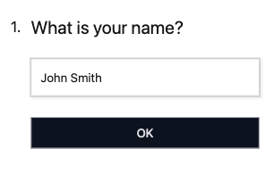
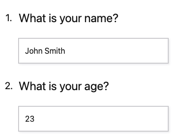

Prefilling answers in a survey is a frequent requirement in many survey applications. This feature enables setting default values for questions, serving various purposes such as:

- Providing context to respondents.
- Saving respondents' time.
- Ensuring response consistency.


### Default Input Value

The Input data model supports a `defaultValue` key to specify default values for inputs. This key accepts a string, boolean, or numeric value representing the default input value. For example:


=== "JSON"

    ```json linenums="1" hl_lines="12"
    {
      "name": "My Survey",
      "pages": [
        {
          "blocks": [
            {
              "title": "What is your name?",
              "inputs": [
                {
                  "id": "name",
                  "type": "TEXT",
                  "defaultValue": "John Smith"
                }
              ]
            }
          ]
        }
      ]
    }
    ```

=== "Preview"

    


In the above example, the question "What is your name?" will be prefilled with the value "John Smith" when the respondent loads the survey.

The `defaultValue` key can be used with all Input types in SurveyCompo. It automatically converts the provided default value to the corresponding type based on the input type if necessary. For instance, for an input type that expects boolean values, the default value is converted into boolean type. For example, '1', 'true', 1, 'yes', 'Yes', 'YES', 'on', 'On', 'ON', 'True', 'TRUE' are all converted to `true`.

!!! Note "Note"

    Default values are applied only at the beginning of a survey session. If the respondent alters the input's value during the session, the default setting will not reapply if the input is cleared or deselected.


### Injected Input Values

There are use cases where input values are injected into the survey in a batch. This functionality is achieved using the `inputValues` key in the [Survey model](/data-models/survey/). It proves beneficial for scenarios where respondents can resume a survey from where they left off or return to it later.

The `inputValues` key is an object that holds input values for each input in the survey, identified by input IDs. For instance:


=== "JSON"


    ```json linenums="1" hl_lines="20"
    {
      "name": "My Survey",
      "inputValues": {
        "name": "John Smith",
        "age" : 23
      },
      "pages": [
        {
          "blocks": [
            {
              "title": "What is your name?",
              "inputs": [
                {
                  "id": "name",
                  "type": "TEXT"
                }
              ]
            },
            {
              "title": "What is your age?",
              "inputs": [
                {
                  "id": "age",
                  "type": "TEXT"
                }
              ]
            }
          ]
        }
      ]
    }
    ```

=== "Preview"

    


