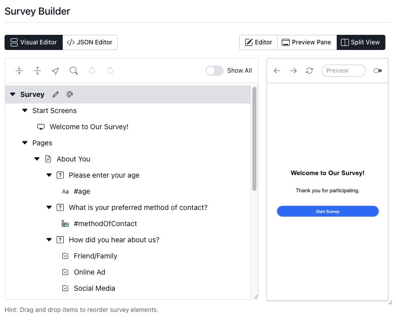

At SurveyComp, we are always striving to make survey creation as smooth and flexible as possible for our users. Today, we're excited to announce the launch of a powerful new feature in SurveyCompo: the Visual Survey Editor.

Building surveys has never been easier. Whether you're creating simple questionnaires or complex, multi-page surveys, the Visual Survey Editor provides an intuitive, graphical interface that simplifies the entire process. Let’s take a closer look at how this new feature will enhance your survey-building experience.

{: .center }

<!-- more -->

## The Power of Drag-and-Drop: Survey Building Made Simple

Gone are the days of having to work exclusively with JSON code to create surveys. The Visual Survey Editor allows you to drag and drop essential survey components—pages, blocks (survey questions), and inputs (choices and text inputs)—directly into your survey. This streamlined process empowers anyone, regardless of coding experience, to build professional surveys in minutes.

The tree structure of the editor ensures that all components are neatly organized, making it easy to understand the overall structure of your survey. You can see at a glance how pages, questions, and inputs are arranged, giving you full control over your survey design.

## Reorder, Customize, and Fine-Tune with Ease

The new Visual Editor isn’t just about dragging and dropping components. You also have the power to reorder, duplicate, delete, and edit elements with just a few clicks. Whether you need to move a page up, tweak a question block, or add new inputs, everything is simple and straightforward.

When you click on a survey element, a pop-up form appears, allowing you to fill in crucial details like text titles, headers, and labels. You can also set up input validation rules and specify conditional logic to ensure your survey runs exactly the way you intend.

## Advanced Features for a Seamless Workflow

The Visual Survey Editor comes equipped with advanced features that make it more than just a tool for beginners. For those creating complex surveys, you’ll appreciate the following functionalities:

- **Undo/Redo**: Made a change you didn’t mean to? No problem! With the undo and redo options, you can quickly backtrack or reapply changes without losing any of your work.
- **Search**: Quickly locate specific survey elements in large, complex surveys using the search function. No more scrolling through endless pages!
- **Collapse/Expand** Tree Branches: Manage long or multi-page surveys more effectively by collapsing and expanding tree branches, allowing you to focus on specific parts of your survey design.

## A Perfect Blend: The Visual Editor and the JSON Editor

For users who are already familiar with SurveyCompo’s powerful JSON editor, don’t worry—it’s not going anywhere! The JSON editor remains the go-to option for handling advanced customizations and complex setups. The Visual Survey Editor complements it by offering a more user-friendly option for quick edits, making survey creation accessible to everyone.

You can easily switch between the two, giving you complete flexibility depending on your project’s needs. Whether you’re making rapid adjustments in the Visual Editor or diving deep into advanced logic in the JSON editor, SurveyCompo has you covered.

## Who Will Benefit from the Visual Survey Editor?

The Visual Survey Editor is perfect for both newcomers and experienced users alike.

- For beginners, it offers an approachable way to build surveys without needing to touch a single line of code.
- For experienced users, the drag-and-drop interface can significantly speed up the workflow, while the JSON editor remains available for more complex use cases.

This editor bridges the gap between ease of use and full customization, making it an ideal tool for anyone looking to build or improve their surveys.

## Getting Started with the Visual Survey Editor

Ready to start using the Visual Survey Editor? Simply log into your SurveyComp account, head to the Survey Builder section, and select "Visual Builder" when creating or editing your survey. You’ll be amazed at how quickly you can bring your survey ideas to life!
