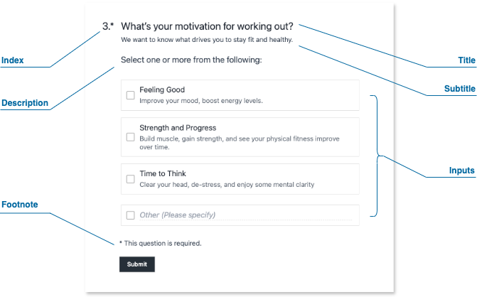

# Concepts

## Surveys

SurveyCompo offers a powerful and versatile way to design surveys using a flexible data model written in JSON. This section introduces you to the key building blocks of a SurveyCompo survey.

### Survey Structure

Imagine your SurveyCompo survey as a journey. Here's a visual breakdown of the key elements:

  *Start Screen (Optional)*

  :   Welcomes users, sets the stage, and provides initial instructions.

  *Survey Pages*

  :   The heart of your survey, where questions are asked and data is collected.  Each page is made up of one or more "Blocks".

  *Blocks*

  :   The fundamental units that hold your questions. They contain input controls where users provide their responses. SurveyCompo offers a variety of input controls, from text boxes to specialized elements like Likert scales.


  *End Screen (Optional)*

  :   Signal the end of the survey.

      SurveyCompo offers two customizable end screens to manage your survey flow.

      - *Completion Screen*: Thanks respondents and may provide further instructions.
      - *Abort Screen*: Informs users if they don't meet survey criteria.

### The User Flow

{: .center}

Imagine a user journey through the survey:

1. **Invitation**: The optional Start Screen introduces the survey.
1. **Questions and Answers**: Users navigate through Survey Pages, providing responses in Blocks.
1. **Outcome**:
    - **Success**: Upon completion, they see the Completion Screen.
    - **Disqualification**: If ineligible, they are directed to the Abort Screen.


### The Survey Data Model

SurveyCompo uses **JSON** (JavaScript Object Notation) to define your survey's structure. Think of JSON as a blueprint, using key-value pairs to describe each survey element and its properties.  Here's a simplified example:

```json linenums="1"
{
    "name": "My Survey",
    "startScreens": [ /* ... */ ],
    "pages": [
       {
          "blocks": [
            {
              "inputs": [/* ... */]
            }
          ],
          /* ... */
       },
       /* ... */
    ],
   "completeScreens": [ /* ... */ ],
   "abortScreens": [ /* ... */ ]
}
```

!!! info "Info"

    **Why Arrays for Screens?** SurveyCompo supports multiple start, completion, and abort screens, allowing you to tailor the survey experience based on user responses..


----

## Screens

Screens are the visual gateways of your SurveyCompo surveys.  They introduce respondents to the survey, provide closure upon completion,  and inform users of eligibility or termination. Let's explore their key functions:

- **Start Screens**: These screens welcome users, present essential information, and invite them to participate in your survey.
- **Complete Screens**:  These screens thank respondents for their time, signaling that the survey has been successfully completed.
- **Abort Screens**:  These screens inform users that they are ineligible or the survey has been terminated, providing clear reasons as needed.


### Screen Composition

A screen can include the following optional elements:

{: .center}

- **Header**: A prominent area for the survey title, section headings, or instructions.

- **Description**: Provides context, additional details, or instructions for the user.

- **Footer**: Use this for additional information, or legal disclaimers.

- **Action Buttons**: Each screen can include up to two customizable action buttons. These buttons determine how users navigate through your survey, allowing them to either proceed or exit the current screen.


### Customizing Screens with HTML

Enhance your screens with the power of HTML:

- **Enhanced Formatting**: Change font size, color, or add emphasis using HTML tags.
- **Embedding Media**: Include images, videos, or audio files to enhance the user experience.
- **Interactive Elements**: Include links to privacy statements or cookie policies.

SurveyCompo uses specific 'html' keys for custom content:

- `htmlHeader`
- `htmlDescription`
- `htmlFooter`

!!! warning "Warning"

    Use valid HTML syntax and prioritize security. Avoid incorporating code from unknown sources or user input, as it could introduce vulnerabilities.


### Multiple Screens and Visibility Condition Logic

SurveyCompo supports multiple start and end screens for flexible survey design. Use the `visibleIf` setting to conditionally show screens based on survey responses or variables.

!!! note "Note"

    Details on visibility logic will be covered in subsequent sections.


### The Screen Data Model

Start, completion, and abort screens share a common data structure within your survey's JSON format.

The following code example demonstrates how a screen integrates into the survey JSON data model. [:material-github:{.right-icon} view source](https://github.com/SurveyCompo/examples/blob/main/examples/anatomy/source.json)


```json linenums="1" hl_lines="4-10"
{
    "name": "My Survey",
    "startScreens": [
        {
        "header": "We value your opinion!",
        "description": "Please take a moment to participate in our brief survey.",
        "htmlFooter": "<p class='footnote'><a href=''>privacy</a> & <a href=''>cookie policy<a></p>",
        "okButtonLabel": "Start Survey",
        "cancelButtonLabel": "Skip"
        }
    ],
    "pages": [ /* ... */ ],
    "completeScreens": [ /* ... */ ],
    "abortScreens": [ /* ... */ ]
}
```


----

## Pages

Pages are the backbone of your SurveyCompo surveys. They contain your survey questions, guide user progress, and offer versatile customization options. Let's explore their structure and features.


### Page Structure

A page can include the following optional elements:


{: .center}

- **Header**: A dedicated area at the top for titles or instructions.

- **Description**: Provides more context about the page's purpose or offers additional instructions for the user.

- **Blocks**: The fundamental building blocks of your survey questions. A page can contain multiple blocks, each typically representing one question. (See the 'Blocks' section for a detailed breakdown.)

- **Footer**:  Use this for additional information, navigation, or legal statements.

- **Next Button**:  Allows users to progress to the following page. Clicking "Next" also triggers validation of the inputs on the current page.


### Page Layout

To customize the arrangement of your page elements, SurveyCompo offers the following settings:

- `vCentered`: Vertically center elements. The default is `true`.
- `hCentered`: Horizontally center elements. The default is `false`.

### Customization with HTML


Enhance headers, descriptions, and footers with custom HTML syntax for:

- **Rich Formatting**: Control fonts, colors, text size, emphasis (bold, italics), and more.
- **Embed Media**: Integrate images, videos, or audio clips to enhance your questions.
- **Interactive Elements**:  Add buttons, links, or other interactive components directly within a page.

SurveyCompo uses specific 'html' keys for custom content:

- `htmlHeader`
- `htmlDescription`
- `htmlFooter`

### Branching/Skipping Logic

Use the `visibleIf` setting to conditionally show or hide pages based on survey responses. This is key for creating adaptive surveys that tailor the experience to the user's input.

!!! note "Note"

    Details on visibility logic will be covered in subsequent sections.


### Page Randomization

Prevent response bias by shuffling the order of pages. SurveyCompo's `randomizedWithinGroup` setting allows for randomization of all or selected pages. (More on randomization in the following section.)


### The Page Data Model

The following code example demonstrates how a page integrates into the survey JSON data model. [:material-github:{.right-icon} view source](https://github.com/SurveyCompo/examples/blob/main/examples/anatomy/source.json)


```json linenums="1" hl_lines="5-11"
{
    "name": "My Survey",
    "startScreens": [ /* ... */ ],
    "pages": [
      {
        "header": "Basic Information",
        "htmlDescription": "<p>Let’s begin by gathering some essential details. <br />We assure you that we will not share personal information.</p>",
        "htmlFooter": "<p class='footnote'><a href=''>privacy</a> & <a href=''>cookie policy<a></p>",
        "blocks": [ /* ... */ ],
        "nextButtonLabel": "Next"
      },
      /* ... */
    ],
    "completeScreens": [ /* ... */ ],
    "abortScreens": [ /* ... */ ]
}
```


----


## Blocks

Blocks are the fundamental building blocks of your SurveyCompo surveys, housing questions and collecting user input. Each block typically represents one survey question, and they offer a high degree of flexibility in how you present information and gather responses.

### Block Structure

Blocks can contain the following optional elements:

{: .center}

- **Index**:  A numerical indicator to help organize and order questions.
- **Title**: The primary text of your survey question.
- **Subtitle**: Provides hints, instructions, or additional context for the question.
- **Description**: Offers further detailed instructions or explanations related to the question.
- **Footnote**:  Use this to include references, links to legal information, or other relevant details.
- **Inputs**: The interactive elements where users provide their responses (e.g., text boxes, dropdowns, checkboxes, and more).


### Inputs within Block

SurveyCompo stands out by allowing you to combine **multiple input types** within a single block. This gives you significant flexibility in question design.

For example, a block titled "Tell us about yourself" could include a text input for the user's name, a dropdown for age range, and a checkbox list for areas of interest.

<!-- Here's a list of the available input types:

- **TEXT**: A single-line text input.
- **TEXTAREA**: A multi-line text input.
- **RADIO**: A single-choice radio button.
- **CHECKBOX**: A multi-choice checkbox.
- **SELECT**: A dropdown selection.
- **LIKERT**: A Likert scale input.
- **MATRIX**: A matrix question input.
- **RANK**: A ranking input.
- **RATING**: A rating input.
- **DATE**: A date picker input.
- **TIME**: A time picker input.
- **EMAIL**: An email input.
- **URL**: A URL input.
- **NUMBER**: A number input.
- **PHONE**: A phone number input. -->
<!-- - **FILE**: A file upload input. -->
<!-- - **HTML**: A custom HTML input. -->

Blocks without input elements have two primary uses:

- Conditional Display: Use the `requiresVisibleInputs` settings to hide the empty block.
- Section Markers: Disable the question index and use these blocks to visually divide your survey into sections, improving organization.

### Advanced Customization with HTML

All text elements within a block (title, subtitle, description, footnote) support custom HTML, enabling a wide range of customization:

- **Rich Formatting**: Control fonts, colors, text size, emphasis (bold, italics), and more.
- **Embed Media**: Integrate images, videos, or audio clips to enhance your questions.
- **Interactive Elements**:  Add buttons, links, or other interactive components directly within a block.

### Branching/Skipping Logic

The `visibleIf` setting lets you control a block's display based on specific survey responses. This is essential for creating dynamic surveys with branching paths that adapt to user input.

!!! note "Note"

    Details about visibility logic will be covered in subsequent sections.


### Question Randomization

Prevent response bias by shuffling the order in which blocks appear on a page. SurveyCompo allows you to randomize all blocks or select specific ones for randomization.

### Responsive Grid Layout

Blocks feature a powerful grid layout engine to arrange input elements:

- Column Layout: Organize inputs into multiple columns for efficient use of space.
- Input Direction: Control whether inputs are stacked vertically or displayed side-by-side.

!!! note "Note"

    Block layout customization will be covered in subsequent sections.


### The Block Data Model

The following code example demonstrates how blocks integrate into the survey JSON data model. [:material-github:{.right-icon} view source](https://github.com/SurveyCompo/examples/blob/main/examples/anatomy/source.json)


```json linenums="1" hl_lines="8-17"
{
    "name": "My Survey",
    "startScreens": [ /* ... */ ],
    "pages": [
      {
        /* ... */
        "blocks": [
          {
            "title": "Gender",
            "layoutColumnCount": 2,
            "layoutColumnWidth": "50%",
            "inputs": [ /* ... */ ]
          },
          {
            "title": "Age",
            "inputs": [ /* ... */ ]
          }
        ]
      },
      /* ... */
    ],
    "completeScreens": [ /* ... */ ],
    "abortScreens": [ /* ... */ ]
}
```


----

## Inputs

Inputs are the heart of data collection within your SurveyCompo surveys.  They provide the interactive elements where users submit their answers, opinions, and feedback. SurveyCompo offers a wide range of input types to accommodate diverse survey needs.


### Key Concepts


- **Inputs within Blocks**:  Remember, Blocks act as containers for one or more input controls. SurveyCompo gives you the flexibility to combine different input types within a single Block.

- **Labels and Hints**:  Most inputs can have an optional label (the question or instruction) and a hint (additional guidance for the user). Both support HTML for customization.

- **Input Values**:  Each input type collects data differently. Some have boolean values (true/false), others text values, numerical values, or selections from a list.

- **Input Randomization**:  You can randomize the order in which inputs appear within a block to prevent response bias.

- **Branching Logic**:  Utilize the `visibleIf` property for inputs to show or hide them based on specific survey responses or variables. This creates dynamic surveys that adapt to user input.

- **Input Validation**:  Define validation rules to ensure users provide data in the expected format (e.g., valid email addresses, numeric values within a range). This improves data quality and the user experience.


### Input Types

Here's a quick overview of the input types currently supported. We'll dive into each in-depth in subsequent sections.

**Checkboxes and Radios**

- **CHECKBOX**: Multiple selections from a list (boolean values).
- **CHECKBOX_TEXT**: A "checkbox + text" combination to capture an 'Other' option.
- **RADIO**: Single selection from a list (boolean value).
- **RADIO_TEXT**: A "radio + text" combination for an 'Other' option.

**Rating Scales**

- **STAR_SCALE**: Familiar star-based rating (integer value)
- **NUMBER_SCALE**: Numeric scale rating (integer value)

**Text-Based Inputs**

- **TEXT**: Single-line text input (text value).
- **TEXTAREA**: Multi-line text input (text value).

**Specialized Inputs**

- **LIKERT_SCALE**: Opinion scale presented in a visually appealing format (text value of the chosen option).
- **TOGGLE**: On/off switch (boolean value).
- **DROPDOWN**: A dropdown list for selecting one option (text value).
- **IMAGE**: Images as selectable options (text values of selected images).
- **MATRIX**: A grid-based question format for collecting responses to multiple related questions using a consistent scale.


### The Input Data Model

The following code example demonstrates how inputs integrate into the survey JSON data model. [:material-github:{.right-icon} view source](https://github.com/SurveyCompo/examples/blob/main/examples/anatomy/source.json)


```json linenums="1" hl_lines="13-28 34-38"
{
    "name": "My Survey",
    "startScreens": [ /* ... */ ],
    "pages": [
      {
        /* ... */
        "blocks": [
          {
            "title": "Gender",
            "layoutColumnCount": 2,
            "layoutColumnWidth": "50%",
            "inputs": [
                {
                  "type": "RADIO",
                  "label": "Male"
                },
                {
                  "type": "RADIO",
                  "label": "Female"
                },
                {
                  "type": "RADIO",
                  "label": "Non-binary"
                },
                {
                  "type": "RADIO",
                  "label": "Prefer not to say"
                }
            ]
          },
          {
            "title": "Age",
            "inputs": [
              {
                "type": "DROPDOWN",
                "hint": "Please select ...",
                "dropdownInputOptions": ["Under 18", "18-24", "25-34", "35-44", "45-54", "55-64", "65 or over"]
              }
            ]
          }
        ]
      },
      /* ... */
    ],
    "completeScreens": [ /* ... */ ],
    "abortScreens": [ /* ... */ ]
}
```