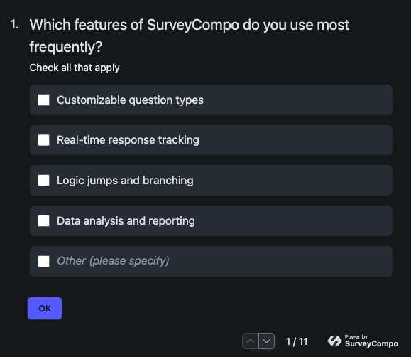
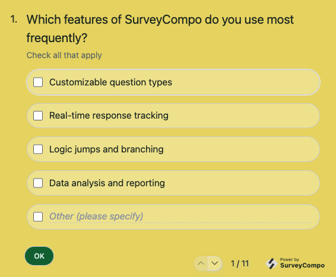
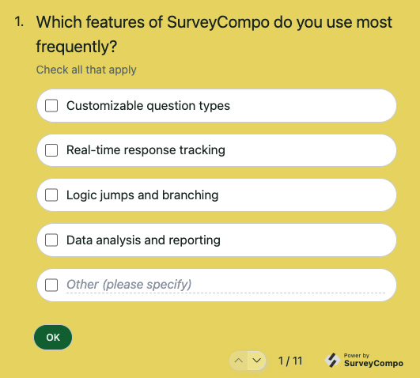
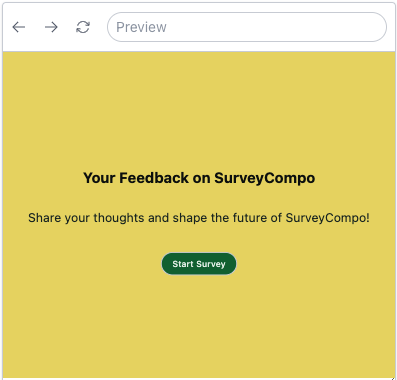
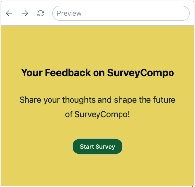
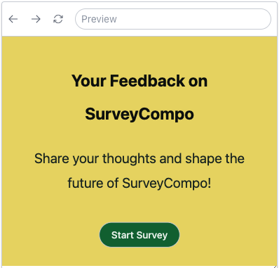

# Customizations

As a web component, SurveyCompo provides a plethora of customization options, enabling it to integrate flawlessly into your website or application. You can modify its size, position, and styling to align with your brand and style using CSS. Additionally, you can customize the survey's appearance by changing its theme, layout, and HTML structure.

Before delving into the specifics, let's explore a key feature that sets SurveyCompo apart in terms of style customization: Style Encapsulation.

## Style Encapsulation

SurveyCompo utilizes Shadow DOM to keep its styles separate. This means that the appearance of SurveyCompo surveys is independent from the rest of the webpage, ensuring that the webpage's styles don't interfere with the survey's look. This feature is particularly useful when embedding surveys in websites with complex styles.

Style Encapsulation also allows you to customize the survey's appearance without affecting the rest of the webpage. You can modify the survey's appearance using CSS, themes, and custom HTML without worrying about the rest of the webpage's styles.

With that in mind, let's explore the various customization options available in SurveyCompo.

## Theme

SurveyCompo provides a configurable [theme model](/data-model/#theme){:target="\_blank"} that makes it easy for you to customize the look of your survey. This model includes a variety of color options, radius settings, and font settings that you can apply to your survey.

As demonstrated in previous examples, SurveyCompo defaults to a light and minimalist theme. If you wish to alter the theme of your survey, you can do so by using the `theme` key in the survey's JSON model.

The following example creates a 'Dark' theme for the survey with just 4 lines:

=== "Preview"

    {: .small .embedded}

=== "JSON"

    ```json
    {
      /* ... */
      "theme": {
        "primaryColor": "#6875ff",
        "backgroundColor": "#1B2025",
        "neutralColor": "#393939",
        "defaultRadius": "0.5em"
      }
    }
    ```

The next example creates a theme with customized background:

=== "Preview"

    {: .small .embedded}

=== "JSON"

    ```json
    {
      /* ... */
      "theme": {
        "primaryColor": "#0b703f",
        "textColor": "#213029",
        "backgroundColor": "#ead971",
        "defaultRadius": "2em",
        "textareaRadius": "1em"
      }
    }
    ```

Here are some common steps to customize your theme:

- `primaryColor`: Define the primary color for buttons and inputs.
- `backgroundColor`: Set the background color of the survey.
- `textColor`: Adjust the text color throughout the survey.
- `neutralColor`: Customize the color of borders, boxes, disabled elements, and secondary buttons.
- `defaultRadius`: Modify the default border radius for inputs and buttons.
- `defaultBorderWidth`: Change or remove (by setting to 0px) the border widths for inputs and buttons.
- Lastly, tweak specific settings that override the default ones for certain elements, like `textareaRadius` for textareas.

All theme model keys are optional, giving you the flexibility to customize the theme as you see fit. SurveyCompo will automatically adjust other default values based on the ones you provide. For instance, if you specify a `backgroundColor` without a `textColor`, SurveyCompo will automatically adjust the text color to ensure readability. For detailed information on the JSON keys and values used in a theme model, refer to the [Themes](/data-model/#theme){:target="\_blank"} section in the documentation.

## CSS

While themes provide a simple way to modify your survey's appearance, you might require more granular customizations.

SurveyCompo allows you to refine your survey's look using CSS. This enables you to adjust the size, position, and style of survey elements to align with your brand's aesthetic. With CSS, you can make more precise changes to the survey's appearance, such as tweaking the font, color, and layout.

### CSS Rules in the Survey JSON

To apply CSS to your survey, you can utilize the `css` key in the survey's JSON model. The `css` attribute accepts a string containing CSS rules that will be applied to the survey. Here's an example of how you can use the `css` attribute to alter the background color for checkbox inputs:

=== "JSON"

    ```json
    {
      /* ... */
      "css": ".sc-checkbox, .sc-checkbox-text { background-color: white; }",
    }
    ```

=== "Preview"

    {: .small .embedded}

### CSS Rules from the Hosting Page

While embedding CSS rules directly into the survey JSON data is possible, it might not be the best approach for complex or lengthy CSS rules. To address this, SurveyCompo allows you to reference a CSS style tag from the hosting page. This way, you can keep your CSS rules separate from the survey data, making them easier to manage and maintain.

To reference a CSS style tag, add a `<style>` tag to the hosting page's HTML with an `id` value of `surveycompo`. It's recommended to place this `<style>` tag in the `<head>` section of the HTML document. Here's an example of how you can reference a CSS style tag from the hosting page:

```html
<html>
  <head>
    <script src="https://tag.surveycompo.com/v1.js"></script>
    <style id="surveycompo">
      .sc-checkbox,
      .sc-checkbox-text {
        background-color: white;
      }
    </style>
  </head>
  <body>
    <survey-compo
      src="https://your-domain.com/survey-source.json"
    ></survey-compo>
  </body>
</html>
```

In this example, the CSS rules for changing the background color of checkbox inputs are placed inside the `<style>` tag with an **`id`** value of **`surveycompo`**. SurveyCompo will automatically apply these CSS rules to the survey when it is rendered.

!!! note "Note"

    CSS rules specified in the survey JSON `css` key have higher priority than the CSS rules defined in the `<style>` tag. Furthermore, CSS rules in the `<style>` tag override the theme styles of the survey. This hierarchy allows you to override specific styles for individual surveys while ensuring a consistent appearance across multiple surveys.

Below are the CSS class names that you can utilize to customize the survey. These class names allow you to apply CSS rules to specific elements within the survey:

| Selector CSS Class                 | Description                                                               |
| ---------------------------------- | ------------------------------------------------------------------------- |
| `:host`                            | SurveyCompo component. Useful for setting `font-*` style.                 |
| `sc-spinner`                       | Loading spinner icon. Useful for adjusting spinner size and color.        |
| `sc-survey`                        | Wrapper for the whole survey component. Useful for Customized background. |
| `sc-survey__close-btn`             | Survey close button. Useful for customizing location and style.           |
| `sc-btn`                           | Buttons on Page and Screen                                                |
| `sc-btn--primary`                  | Primary button.                                                           |
| `sc-btn--disabled`                 | Disabled button.                                                          |
| `sc-btn--secondary`                | Secondary button.                                                         |
| `sc-screen`                        | Survey screen.                                                            |
| `sc-screen__btn-container`         | Screen button container.                                                  |
| `sc-screen__btn`                   | Screen button.                                                            |
| `sc-screen__btn--ok`               | Screen OK button.                                                         |
| `sc-screen__btn--cancel`           | Screen cancel button.                                                     |
| `sc-screen__btn--start`            | Start screen button.                                                      |
| `sc-screen__btn--abort`            | Abort screen button.                                                      |
| `sc-screen__btn--complete`         | Complete screen button.                                                   |
| `sc-screen__header`                | Screen header.                                                            |
| `sc-screen__header--start`         | Start screen header.                                                      |
| `sc-screen__header--abort`         | Abort screen header.                                                      |
| `sc-screen__header--complete`      | Complete screen header.                                                   |
| `sc-screen__description`           | Screen description.                                                       |
| `sc-screen__description--start`    | Start screen description.                                                 |
| `sc-screen__description--abort`    | Abort screen description.                                                 |
| `sc-screen__description--complete` | Complete screen description.                                              |
| `sc-screen__footer`                | Screen footer.                                                            |
| `sc-screen__footer--start`         | Start screen footer.                                                      |
| `sc-screen__footer--abort`         | Abort screen footer.                                                      |
| `sc-screen__footer--complete`      | Complete screen footer.                                                   |
| `sc-nav`                           | Navigator.                                                                |
| `sc-nav__btn-container`            | Navigation button container.                                              |
| `sc-nav__btn`                      | Navigation button.                                                        |
| `sc-nav__btn--disabled`            | Navigation button (disabled).                                             |
| `sc-nav__btn--prev`                | Navigation previous page button.                                          |
| `sc-nav__btn--next`                | Navigation next page button.                                              |
| `sc-nav__progress`                 | Navigation progress label.                                                |
| `sc-page-container`                | Survey page container. Adjust page animation.                             |
| `sc-page`                          | Survey page. Adjust padding, width, alignment etc.                        |
| `sc-page__header`                  | Survey page header.                                                       |
| `sc-page__description`             | Survey page description.                                                  |
| `sc-page__footer`                  | Survey page footer.                                                       |
| `sc-page__btn`                     | Survey page button.                                                       |
| `sc-block`                         | Survey block container.                                                   |
| `sc-block__index`                  | Survey block index.                                                       |
| `sc-block__title`                  | Survey block title.                                                       |
| `sc-block__subtitle`               | Survey block subtitle.                                                    |
| `sc-block__description`            | Survey block description.                                                 |
| `sc-block__error`                  | Survey block error text.                                                  |
| `sc-block__footnote`               | Survey block footnote.                                                    |
| `sc-input__label`                  | Input label.                                                              |
| `sc-input__hint`                   | Input hint.                                                               |
| `sc-input__error`                  | Input error.                                                              |
| `sc-matrix`                        | Likert Matrix container.                                                  |
| `sc-matrix__label`                 | Likert Matrix input label.                                                |
| `sc-matrix__scale`                 | Likert Matrix scale label.                                                |
| `sc-matrix__input`                 | Likert Matrix input control (radio button).                               |
| `sc-checkbox`                      | Checkbox input container.                                                 |
| `sc-checkbox__label`               | Checkbox input label.                                                     |
| `sc-checkbox__input`               | Checkbox input control (checkbox button).                                 |
| `sc-checkbox-text`                 | CheckboxText input container.                                             |
| `sc-checkbox-text__text`           | CheckboxText input text box control                                       |
| `sc-checkbox-text__input`          | CheckboxText input checkbox control                                       |
| `sc-radio`                         | Radio input container.                                                    |
| `sc-radio__label`                  | Radio input label.                                                        |
| `sc-radio__input`                  | Radio input control (radio button).                                       |
| `sc-radio-text`                    | RadioText input container.                                                |
| `sc-radio-text__text`              | RadioText input text box control                                          |
| `sc-radio-text__input`             | RadioText input radio control                                             |
| `sc-star`                          | Star rating input container.                                              |
| `sc-star__label`                   | Star rating input label.                                                  |
| `sc-star__input`                   | Star rating input control (star buttons).                                 |
| `sc-star__icon`                    | Star rating star icon.                                                    |
| `sc-number`                        | Number scale input container.                                             |
| `sc-number__label`                 | Number scale input label.                                                 |
| `sc-number__scale`                 | Number scale input scale label.                                           |
| `sc-number__input`                 | Number scale input control (number button).                               |
| `sc-likert`                        | Likert input container                                                    |
| `sc-likert__label`                 | Likert input label                                                        |
| `sc-likert__option`                | Likert option label                                                       |
| `sc-likert__input`                 | Likert input control (radio button).                                      |
| `sc-text`                          | Text input container.                                                     |
| `sc-text__label`                   | Text input label.                                                         |
| `sc-text__input`                   | Text input control (text box).                                            |
| `sc-textarea`                      | Textarea input container.                                                 |
| `sc-textarea__label`               | Textarea input label.                                                     |
| `sc-textarea__input`               | Textarea input control (textarea box).                                    |
| `sc-toggle`                        | Toggle input container.                                                   |
| `sc-toggle__label`                 | Toggle input label.                                                       |
| `sc-toggle__input`                 | Toggle input control (toggle button).                                     |
| `sc-dropdown`                      | Dropdown input container.                                                 |
| `sc-dropdown__label`               | Dropdown input label.                                                     |
| `sc-dropdown__input`               | Dropdown input control.                                                   |
| `sc-image`                         | Image input container.                                                    |
| `sc-image__label`                  | Image input label.                                                        |
| `sc-image__input`                  | Image input control (image).                                              |
| `sc-image__check-mark`             | Image input check mark.                                                   |

!!! tip "Tip"

    The `:host` CSS selector is primarily used for setting global font styles and base font size. For other global styles such as background color and spacing, use the `.sc-survey` CSS selector.

## CSS Limitation

There are a few limitations to be aware of when using CSS with SurveyCompo:

- Does not support stylesheets from external URLs.
- Supports applying CSS rules from only one static `style` HTML tag.
- Does not support CSS selectors that use hierarchical relationships between sub-components. For example, `.sc-screen sc-btn` does not work, use `.sc-screen__btn` instead.
- CSS rules do not apply to the SurveyCompo branding icon.

## Space

SurveyCompo is designed to be responsive and adapt to various screen sizes. Internally it uses the css 'em' unit for spacing, which is relative to the font size of the root element. This allows the survey to scale proportionally with the font size, ensuring that the survey elements maintain their relative size and spacing.

To adjust the spacing between elements, you can modify the `font-size` property of the `:host` CSS selector. This will change the spacing between elements while maintaining the relative proportions of the survey components. The default `font-size` value is `14px`, which corresponds to `1em`.

You can change the base font size in the Theme model and the CSS rules. The following examples demonstrate how changing the `font-size` property affects the spacing between elements:

=== "font-size: 10px"

    {: .small .embedded}

=== "font-size: 14px (default)"

    {: .small .embedded}

=== "font-size: 16px"

    {: .small .embedded}

!!! tip "Tip"

    When customizing with CSS rules, it's recommended to use `em` units for spacing, sizing and positioning. This ensures that the survey elements retain their relative proportions when SurveyCompo adjusts the UI to fit different screen sizes.

## Custom HTML

### Customizing Screens with HTML

All text elements within a screen (header, description, footer), a page (header, description, footer), and a block (title, subtitle, description, footnote) support custom HTML, enabling a wide range of customization:

- **Enhanced Formatting**: Modify font size, color, or add emphasis using HTML tags.
- **Embedding Media**: Incorporate images, videos, or audio files to enrich the user experience.
- **Interactive Elements**: Add links to privacy statements or cookie policies.

SurveyCompo uses specific 'html' keys for custom content:

- `htmlHeader`
- `htmlDescription`
- `htmlFooter`
- `htmlTitle`
- `htmlSubtitle`
- `htmlFootnote`

For a detailed list of keys applicable to screens, pages, and blocks, please refer to the [Data Models](/data-model/) section in the documentation.

!!! warning "Warning"

    Ensure that you use correct HTML syntax and prioritize security. Be cautious not to include code from untrusted sources or user input, as it could potentially introduce security risks.

## Block Layout

## Input layout

```

```
