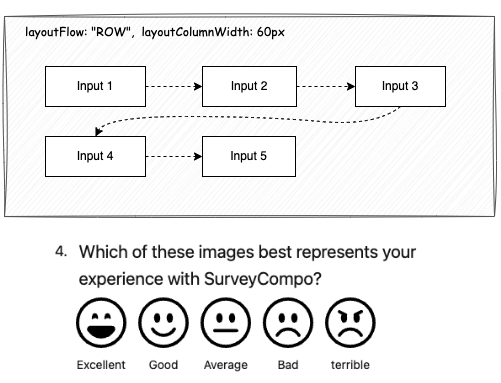
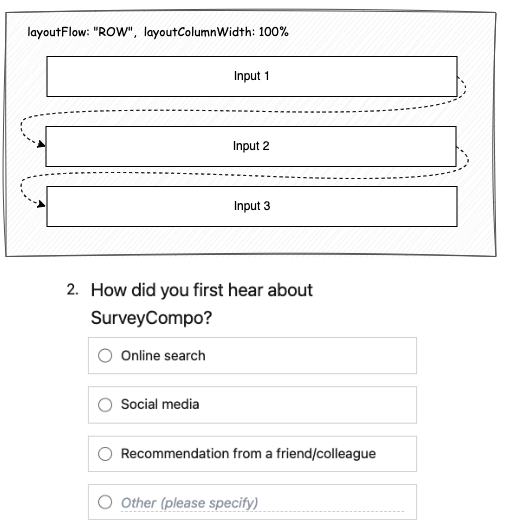
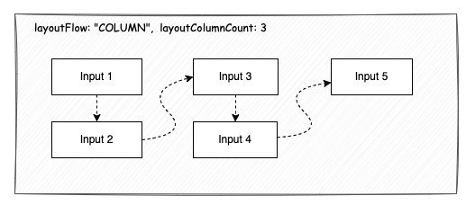
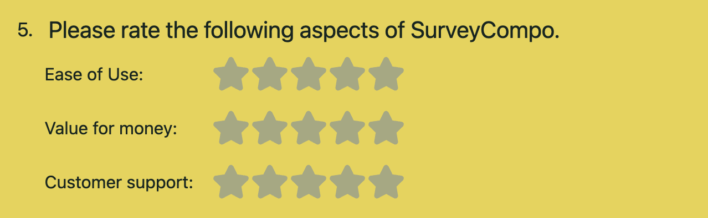

## Block Layout

SurveyCompo allows you to customize the layout of blocks within a survey. You can adjust the layout of blocks to create a visually appealing and user-friendly survey. The layout of blocks can be customized using the `layout*` keys in the [block's JSON model](/data-models/block/#block-data-keys).

Inputs that are of the same type are grouped together and shown in a grid layout. By default, these inputs are lined up in a row, starting from the left and moving to the right. If there isn't enough space in a row for all inputs, they will continue on the next row.

{: .md .center .embedded}

However, it may appear as if the inputs are displayed in a single column. This is because all inputs have a default width of '100%'.

{: .md .center .embedded}

This default layout works well for most survey questions. You also can customize the block layout to display inputs in multiple columns.

### **`layoutColumnCount`**

By default, `layoutColumnCount` is set to `0`, which means the layout engine will try to fit as many items (columns) as possible in a row. If you set `layoutColumnCount` to a value greater than 0, the layout engine will arrange the inputs into the specified number of columns. If there isn't enough horizontal space, a horizontal scroll bar will appear. Therefore, using a fixed number of columns is best suited for blocks with a small number of short inputs and is not recommended if you want a responsive design.

### **`layoutColumnWidth`**

Setting `layoutColumnCount` to `0` allows the layout engine to dynamically adjust the number of columns. If you prioritize responsiveness, you can keep `layoutColumnCount` at 0 and use the `layoutColumnWidth` key to define the width of each column. This lets the layout engine adapt the number of columns based on the available space and the specified column width.

If you want to display inputs in a given number of columns, you can also set the `layoutColumnWidth` to a percentage value that allows multiple columns to fit within the 100% width of the block. for example, if you want to display inputs in 2 columns, you can set the `layoutColumnWidth` to `50%`. and if you want to display inputs in 3 columns, you can set the `layoutColumnWidth` to `33%`. The layout engine will then automatically adjust the number of columns based on the available space, taking into account the gaps between columns.

If you set a percentage value for `layoutColumnWidth` that is larger than 50%, the layout engine will display the inputs in a single column.

Lastly, if you set a value for `layoutColumnWidth` that exceeds the available space, for example, 110%, a horizontal scroll bar will appear. This is because the layout engine tries to accommodate the specified column width, even if it exceeds the available space.

### **`layoutColumnAutoFit`**

When `layoutColumnCount` is set to `0`, the layout engine has the flexibility to adjust the column widths. By default, it will automatically optimize the column widths to fill the entire horizontal space. For instance, if you set `layoutColumnWidth` to `60%`, the layout engine will display inputs in a single column with full width (100%) instead of the specified 60% width. To prevent this automatic adjustment, set `layoutColumnAutoFit` to `false`.

Please note that `layoutColumnAutoFit` is only effective when `layoutColumnCount` is set to `0`. If you've specified a certain number of columns using `layoutColumnCount`, the layout engine will adhere to the specified column width, regardless of the `layoutColumnAutoFit` setting.

### **`layoutFlow`**

The `layoutFlow` key controls the direction in which the inputs are displayed within a multi-column layout. By default, `layoutFlow` is set to `ROW`, which means the inputs are arranged in a row from left to right. If you change `layoutFlow` to `COLUMN`, the inputs will be arranged in a column from top to bottom.

{: .md .center .embedded}

However, if you set `layoutColumnCount` to `0` and `layoutFlow` to `COLUMN`, the layout engine will display the inputs in a single column, regardless of the available space. This is because the layout engine is instructed to place each input below the previous one.

Therefore, the `COLUMN` layout flow is only useful when `layoutColumnCount` is given an explicit value.

## Input layout

Input layout configuration is more straightforward compared to block layout. Two keys primarily control the layout of an input: `labelPosition` and `labelWidth`.

`labelPosition` determines the placement of the label relative to the input control. SurveyCompo assigns a sensible default value based on the input type. For most input types, the label is positioned at the `TOP` of the input control. However, for `IMAGE` controls, the default label position is `BOTTOM`.

`labelWidth` controls the width of the label. By default, it's set to `100%`, meaning the label will occupy the full width of the input control. You can adjust this to a fixed value (like `200px`) or a percentage value (like `50%`). The `labelWidth` key is crucial for aligning inputs within a block.

The following example illustrates how `labelWidth` affects the alignment of inputs within a block:

=== "Without Using `labelWidth`"

    {: .small .embedded}

=== "With `labelWidth` Set to `10em`"

    {: .small .embedded}

=== "JSON"

    ```json
    {
        /* ... */
        "blocks": [
          {
            "title": "Please rate the following aspects of SurveyCompo.",
            "inputs": [
              {
                "type": "STAR_SCALE",
                "label": "Ease of Use:",
                "labelPosition": "LEFT",
                "labelWidth": "10em"
              },
              {
                "type": "STAR_SCALE",
                "label": "Value for money:",
                "labelPosition": "LEFT",
                "labelWidth": "10em"
              },
              {
                "type": "STAR_SCALE",
                "label": "Customer support:",
                "labelPosition": "LEFT",
                "labelWidth": "10em"
              }
            ]
          }
        ]
    }
    ```

!!! tip "Tip"

    The Likert Matrix involves multiple inputs within a block. To adjust the width of the label for each scale in the Likert Matrix, use the block key `layoutLikertMatrixLabelWidth`.
