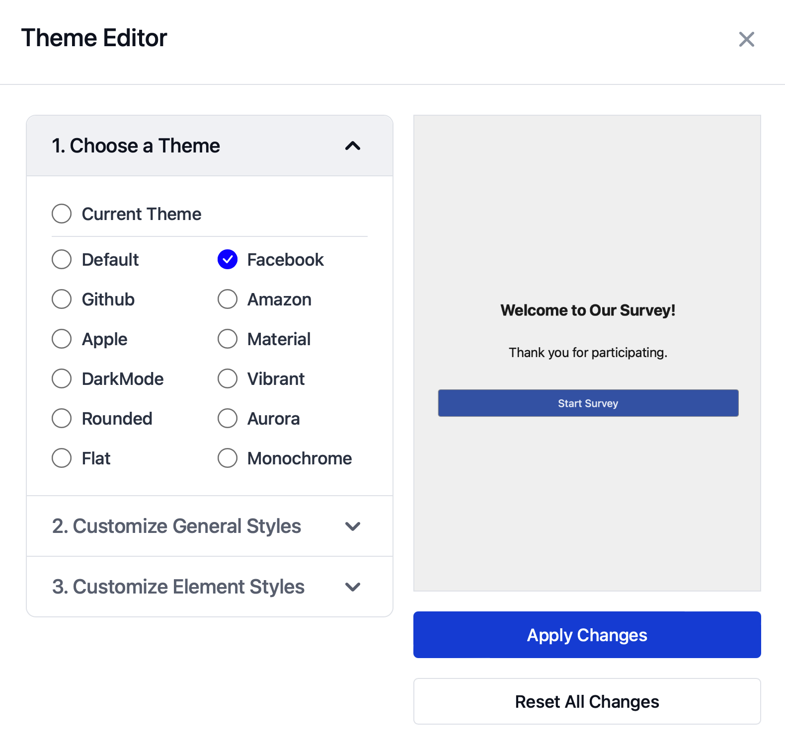

SurveyCompo provides a configurable [theme model](/data-models/other-models/){:target="\_blank"} that makes it easy for you to customize the look of your survey. This model includes a variety of color options, radius settings, and font settings that you can apply to your survey.

As demonstrated in previous examples, SurveyCompo defaults to a light and minimalist theme. If you wish to alter the theme of your survey, you can do so by using the `theme` key in the survey's JSON model.

The following example creates a 'Dark' theme for the survey with just a few lines:

=== "Preview"

    {: .small .embedded}

=== "JSON"

    ```json
    {
      /* ... */
      "theme": {
        "primaryColor": "#6875ff",
        "backgroundColor": "#1B2025",
        "baseColor": "#2b333a",
        "neutralColor": "#393939",
        "defaultRadius": "0.5em"
      }
    }
    ```

The next example creates a theme with customized background:

=== "Preview"

    {: .small .embedded}

=== "JSON"

    ```json
    {
      /* ... */
      "theme": {
        "primaryColor": "#0b703f",
        "textColor": "#213029",
        "backgroundColor": "#ead971",
        "baseColor": "#efe192",
        "defaultRadius": "2em",
        "textareaRadius": "1em"
      }
    }
    ```


## The Theme Model

Here are some common properties you can use to customize the theme:

- `primaryColor`: Define the primary color for buttons and inputs.
- `backgroundColor`: Set the background color of the survey.
- `baseColor`: Set the background color of some input containers. e.g. Textarea, Checkbox, Radio etc.
- `textColor`: Adjust the text color throughout the survey.
- `neutralColor`: Customize the color of borders, boxes, disabled elements, and secondary buttons.
- `defaultRadius`: Modify the default border radius for inputs and buttons.
- `defaultBorderWidth`: Change or remove (by setting to 0px) the border widths for inputs and buttons.
- Lastly, tweak specific settings that override the default ones for certain elements, like `textareaRadius` for textareas.

All theme model properties are optional. You have the flexibility to customize the theme as you see fit. SurveyCompo will automatically adjust other default values based on the ones you provide. For instance, if you specify a `backgroundColor` without a `textColor`, SurveyCompo will automatically adjust the text color to ensure readability. For detailed information on the JSON keys and values used in a theme model, refer to the [Themes](/data-models/other-models/){:target="\_blank"} section in the documentation.


## The Theme Editor

SurveyCompo also provides a Theme Editor tool that allows you to visually customize the theme of your survey. This tool provides a user-friendly interface that lets you adjust the colors, radius, and font settings of your survey. Once you've customized the theme to your liking, you can apply it to your survey.

To access the Theme Editor, click on the 'Theme Editor' icon button in the top-right corner of the survey JSON Editor or click on the theme icon next to the Survey node in the Visual Editor. The Theme Maker will open in a new window, allowing you to customize the theme of your survey. Once you've made your changes, click the 'Apply' button to apply the theme to your survey.

{: .small .embedded}