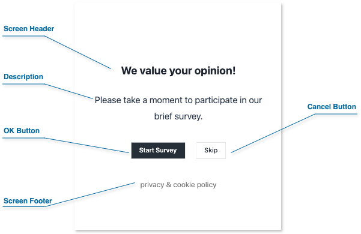

# Data Model

## Survey

SurveyCompo offers a powerful and versatile way to design surveys using a flexible data model written in JSON. This section introduces you to the key building blocks of a SurveyCompo survey.

### Survey Structure

Imagine your SurveyCompo survey as a journey. Here's a visual breakdown of the key elements:

_Start Screen (Optional)_

: Welcomes users, sets the stage, and provides initial instructions.

_Survey Pages_

: The heart of your survey, where questions are asked and data is collected. Each page is made up of one or more "Blocks". SurveyCompo gives you the freedom to design your surveys in either of these styles:

      - **Single Page**: All questions are displayed on one page.
      - **Multi-Page**: Questions are divided into multiple pages, guiding users through the survey.

_Blocks_

: The fundamental units that hold your questions. They contain input controls where users provide their responses. SurveyCompo offers a variety of input controls, from text boxes to specialized elements like Likert scales.

_End Screen (Optional)_

: Signal the end of the survey.

      SurveyCompo offers two customizable end screens to manage your survey flow.

      - *Completion Screen*: Thanks respondents and may provide further instructions.
      - *Abort Screen*: Informs users if they don't meet survey criteria.

### The User Flow

{: .center}

Imagine a user journey through the survey:

1. **Invitation**: The optional Start Screen introduces the survey.
1. **Questions and Answers**: Users navigate through Survey Pages, providing responses in Blocks.
1. **Outcome**:
   - **Success**: Upon completion, they see the Completion Screen.
   - **Disqualification**: If ineligible, they are directed to the Abort Screen.

### Survey JSON Example

SurveyCompo uses **JSON** (JavaScript Object Notation) to define your survey's structure. Think of JSON as a blueprint, using key-value pairs to describe each survey element and its properties. Here's a simplified example:

```json linenums="1"
{
  "name": "My Survey",
  "startScreens": [
    /* ... */
  ],
  "pages": [
    {
      "blocks": [
        {
          "inputs": [
            /* ... */
          ]
        }
      ]
      /* ... */
    }
    /* ... */
  ],
  "completeScreens": [
    /* ... */
  ],
  "abortScreens": [
    /* ... */
  ]
}
```

### Survey Data Keys

| Method              | Type                          | Default        | Description                                                                                                                      |
| ------------------- | ----------------------------- | -------------- | -------------------------------------------------------------------------------------------------------------------------------- |
| `name`              | string                        | n/a (Required) | The name of the survey.                                                                                                          |
| `customRef`         | string                        | null           | A custom reference ID for the survey.                                                                                            |
| `variables`         | object                        | {}             | A map of external key-value pairs, such as user name, product name, etc. Variables can be used with piping and conditional logic |
| `pageTemplates`     | [Page[]](#page-data-keys)     | []             | An array of Page templates, used to share common key values across multiple pages.                                               |
| `blockTemplates`    | [Block[]](#block-data-keys)   | []             | An array of Block templates, used to share common key values across multiple blocks.                                             |
| `pages`             | [Page[]](#page-data-keys)     | []             | Array of survey pages.                                                                                                           |
| `startScreens`      | [Screen[]](#screen-data-keys) | []             | An array of Screen models, one of which will be displayed at the start of the survey.                                            |
| `abortScreens`      | [Screen[]](#screen-data-keys) | []             | An array of Screen models, one of which will be displayed when the participant is disqualified from the survey.                  |
| `completeScreens`   | [Screen[]](#screen-data-keys) | []             | An array of Screen models, one of which will be displayed upon the survey's completion.                                          |
| `theme`             | [Theme](#theme)               | null           | The Theme model for customizing the survey's appearance.                                                                         |
| `css`               | string                        | null           | Global custom CSS applicable to custom HTML elements.                                                                            |
| `uiShowNavigation`  | boolean                       | true           | Determines if the navigation buttons should be displayed.                                                                        |
| `uiShowProgress`    | boolean                       | true           | Determines if the page progress indicator should be displayed.                                                                   |
| `uiShowCloseButton` | boolean                       | false          | Determines if a close button should be displayed at the top-right corner.                                                        |
| `uiUseAnimation`    | boolean                       | true           | Determines if a sliding animation should be used for page navigation.                                                            |
| `timeoutSeconds`    | number                        | 1800           | The duration of inactivity, in seconds, before the survey session times out and resets.                                          |

!!! info "Info"

    **Why Arrays for Screens?** SurveyCompo supports multiple start, completion, and abort screens. By using conditional logic, these multiple screens enable you to customize the survey experience based on user responses and/or external variables.

---

## Screen

Screens are the visual gateways of your SurveyCompo surveys. They introduce respondents to the survey, provide closure upon completion, and inform users of eligibility or termination. Let's explore their key functions:

- **Start Screens**: These screens welcome users, present essential information, and invite them to participate in your survey.
- **Complete Screens**: These screens thank respondents for their time, signaling that the survey has been successfully completed.
- **Abort Screens**: These screens inform users that they are ineligible or the survey has been terminated, providing clear reasons as needed.

### Screen Composition

A screen can include the following optional elements:

{: .center .md}

- **Header**: A prominent area for the survey title, section headings, or instructions.

- **Description**: Provides context, additional details, or instructions for the user.

- **Footer**: Use this for additional information, or legal disclaimers.

- **Action Buttons**: Each screen can include up to two customizable action buttons. These buttons determine how users navigate through your survey, allowing them to either proceed or exit the current screen.

### Customizing Screens with HTML

Enhance your screens with the power of HTML:

- **Enhanced Formatting**: Change font size, color, or add emphasis using HTML tags.
- **Embedding Media**: Include images, videos, or audio files to enhance the user experience.
- **Interactive Elements**: Include links to privacy statements or cookie policies.

SurveyCompo uses specific 'html' keys for custom content:

- `htmlHeader`
- `htmlDescription`
- `htmlFooter`

!!! warning "Warning"

    Use valid HTML syntax and prioritize security. Avoid incorporating code from unknown sources or user input, as it could introduce vulnerabilities.

### Multiple Screens and Visibility Conditional Logic

SurveyCompo supports multiple start and end screens for flexible survey design. Use the `visibleIf` setting to conditionally show screens based on survey responses or variables.

!!! note "Note"

    Details on conditional logic will be covered in subsequent sections.

### Screen JSON Example

Start, completion, and abort screens share a common data structure within your survey's JSON format.

The following code example demonstrates how a screen integrates into the survey JSON data model. [:material-github:{.right-icon} view source](https://github.com/SurveyCompo/examples/blob/main/examples/anatomy/source.json)

```json linenums="1" hl_lines="4-10"
{
  "name": "My Survey",
  "startScreens": [
    {
      "header": "We value your opinion!",
      "description": "Please take a moment to participate in our brief survey.",
      "htmlFooter": "<p class='footnote'><a href=''>privacy</a> & <a href=''>cookie policy<a></p>",
      "okButtonLabel": "Start Survey",
      "cancelButtonLabel": "Skip"
    }
  ],
  "pages": [
    /* ... */
  ],
  "completeScreens": [
    /* ... */
  ],
  "abortScreens": [
    /* ... */
  ]
}
```

### Screen Data Keys

| Method              | Type                    | Default | Description                                                                                    |
| ------------------- | ----------------------- | ------- | ---------------------------------------------------------------------------------------------- |
| `name`              | string                  | null    | The name of the screen.                                                                        |
| `customRef`         | string                  | null    | A custom reference ID for the screen.                                                          |
| `header`            | string                  | null    | The text for the screen's header.                                                              |
| `htmlHeader`        | string                  | null    | The screen's header in HTML format.                                                            |
| `description`       | string                  | null    | The text for the screen's description.                                                         |
| `htmlDescription`   | string                  | null    | The screen's description in HTML format.                                                       |
| `footer`            | string                  | null    | The text for the screen's footer.                                                              |
| `htmlFooter`        | string                  | null    | The screen's footer in HTML format.                                                            |
| `okButtonLabel`     | string                  | null    | The label for the screen's OK button. If not set, the OK button will not be displayed.         |
| `okButtonURL`       | string                  | null    | The URL to redirect to when the OK button is clicked.                                          |
| `cancelButtonLabel` | string                  | null    | The label for the screen's Cancel button. If not set, the Cancel button will not be displayed. |
| `cancelButtonURL`   | string                  | null    | The URL to redirect to when the Cancel button is clicked.                                      |
| `hCentered`         | boolean                 | true    | If true, the screen content is centered horizontally.                                          |
| `vCentered`         | boolean                 | true    | If true, the screen content is centered vertically.                                            |
| `visibleIf`         | [Condition](#condition) | true    | The condition for screen visibility. The screen is visible only if the condition is met.       |

---

## Page

Pages are the backbone of your SurveyCompo surveys. They contain your survey questions, guide user progress, and offer versatile customization options. Let's explore their structure and features.

### Page Structure

A page can include the following optional elements:

{: .center .md}

- **Header**: A dedicated area at the top for titles or instructions.

- **Description**: Provides more context about the page's purpose or offers additional instructions for the user.

- **Blocks**: The fundamental building blocks of your survey questions. A page can contain multiple blocks, each typically representing one question. (See the 'Blocks' section for a detailed breakdown.)

- **Footer**: Use this for additional information, navigation, or legal statements.

- **Next Button**: Allows users to progress to the following page. Clicking "Next" also triggers validation of the inputs on the current page.

### Page Layout

To customize the arrangement of your page elements, SurveyCompo offers the following settings:

- `vCentered`: Vertically center elements. The default is `true`.
- `hCentered`: Horizontally center elements. The default is `false`.

### Customization with HTML

Enhance headers, descriptions, and footers with custom HTML syntax for:

- **Rich Formatting**: Control fonts, colors, text size, emphasis (bold, italics), and more.
- **Embed Media**: Integrate images, videos, or audio clips to enhance your questions.
- **Interactive Elements**: Add buttons, links, or other interactive components directly within a page.

SurveyCompo uses specific 'html' keys for custom content:

- `htmlHeader`
- `htmlDescription`
- `htmlFooter`

### Branching/Skipping Logic

Use the `visibleIf` setting to conditionally show or hide pages based on survey responses. This is key for creating adaptive surveys that tailor the experience to the user's input.

!!! note "Note"

    Details on conditional logic will be covered in subsequent sections.

### Page Randomization

Prevent response bias by shuffling the order of pages. SurveyCompo's `randomizedWithinGroup` setting allows for randomization of all or selected pages. (More on randomization in the following section.)

### Page JSON Example

The following code example demonstrates how a page integrates into the survey JSON data model. [:material-github:{.right-icon} view source](https://github.com/SurveyCompo/examples/blob/main/examples/anatomy/source.json)

```json linenums="1" hl_lines="7-15"
{
  "name": "My Survey",
  "startScreens": [
    /* ... */
  ],
  "pages": [
    {
      "header": "Basic Information",
      "htmlDescription": "<p>Let’s begin by gathering some essential details. <br />We assure you that we will not share personal information.</p>",
      "htmlFooter": "<p class='footnote'><a href=''>privacy</a> & <a href=''>cookie policy<a></p>",
      "blocks": [
        /* ... */
      ],
      "nextButtonLabel": "Next"
    }
    /* ... */
  ],
  "completeScreens": [
    /* ... */
  ],
  "abortScreens": [
    /* ... */
  ]
}
```

### Page Data Keys

| Method                  | Type                        | Default | Description                                                                            |
| ----------------------- | --------------------------- | ------- | -------------------------------------------------------------------------------------- |
| `name`                  | string                      | null    | The name of the page.                                                                  |
| `customRef`             | string                      | null    | A custom reference ID for the page.                                                    |
| `templateName`          | string                      | null    | The page template name. The current page inherits keys from the matched template.      |
| `header`                | string                      | null    | The page header text.                                                                  |
| `htmlHeader`            | string                      | null    | The page header in HTML format.                                                        |
| `description`           | string                      | null    | A text description for the page.                                                       |
| `htmlDescription`       | string                      | null    | The page description in HTML format.                                                   |
| `footer`                | string                      | null    | The page footer text.                                                                  |
| `htmlFooter`            | string                      | null    | The page footer in HTML format.                                                        |
| `blocks`                | [Block[]](#block-data-keys) | []      | An array of blocks on the page.                                                        |
| `nextButtonLabel`       | string                      | 'OK'    | The label on the page's next button.                                                   |
| `nextButtonURL`         | string                      | null    | The URL to redirect to when the next button is clicked.                                |
| `nextButtonHidden`      | boolean                     | false   | If true, the next button is hidden.                                                    |
| `autoAdvancePage`       | boolean                     | false   | If true, the page automatically advances to the next when applicable.                  |
| `hCentered`             | boolean                     | false   | If true, the page content is centered horizontally.                                    |
| `vCentered`             | boolean                     | true    | If true, the page content is centered vertically.                                      |
| `visibleIf`             | [Condition](#condition)     | false   | The condition for page visibility. The page is displayed only if the condition is met. |
| `requiresVisibleBlocks` | boolean                     | false   | If true, the page is displayed only if there are visible blocks on the page.           |
| `randomWithinGroup`     | string                      | false   | If set, the display order of pages with the same group name is randomized.             |

---

## Block

A ‘Block’ in SurveyCompo is a section of content on a survey page - it’s the building block of your survey. It can serve as a container for a survey question, housing both the question itself and its corresponding input controls for answers, and it offers a high degree of flexibility in how you present information and gather responses. It can also be utilized to provide instructions or explanations, guiding your respondents through the survey.

### Block Structure

Blocks can contain the following optional elements:

{: .center .md}

- **Index**: A numerical indicator to help organize and order questions.
- **Title**: The primary text of your survey question.
- **Subtitle**: Provides hints, instructions, or additional context for the question.
- **Description**: Offers further detailed instructions or explanations related to the question.
- **Footnote**: Use this to include references, links to legal information, or other relevant details.
- **Inputs**: The interactive elements where users provide their responses (e.g., text boxes, dropdowns, checkboxes, and more).

### Inputs within Block

SurveyCompo stands out by allowing you to combine **multiple input types** within a single block. This gives you significant flexibility in question design.

For example, a block titled "Tell us about yourself" could include a text input for the user's name, a dropdown for age range, and a checkbox list for areas of interest.

When a Block is used to provide instructions or explanations rather than to collect user inputs, it will have an empty list of inputs. This is a common practice in survey design to guide respondents through the survey flow. For example, a block titled "Instructions" may contain only a description and footnote, with no input controls. This is a powerful feature that allows you to create dynamic and engaging surveys tailored to your specific needs. SurveyCompo gives you the flexibility to design your survey in a way that best suits your goals and audience.

### Advanced Customization with HTML

All text elements within a block (title, subtitle, description, footnote) support custom HTML, enabling a wide range of customization:

- **Rich Formatting**: Control fonts, colors, text size, emphasis (bold, italics), and more.
- **Embed Media**: Integrate images, videos, or audio clips to enhance your questions.
- **Interactive Elements**: Add buttons, links, or other interactive components directly within a block.

### Branching/Skipping Logic

The `visibleIf` setting lets you control a block's display based on specific survey responses. This is essential for creating dynamic surveys with branching paths that adapt to user input.

!!! note "Note"

    Details about conditional logic will be covered in subsequent sections.

### Question Randomization

Prevent response bias by shuffling the order in which blocks appear on a page. SurveyCompo allows you to randomize all blocks or select specific ones for randomization.

### Responsive Grid Layout

Blocks feature a powerful grid layout engine to arrange input elements:

- Column Layout: Organize inputs into multiple columns for efficient use of space.
- Input Direction: Control whether inputs are stacked vertically or displayed side-by-side.

!!! note "Note"

    Block layout customization will be covered in subsequent sections.

### Block JSON Example

The following code example demonstrates how blocks integrate into the survey JSON data model. [:material-github:{.right-icon} view source](https://github.com/SurveyCompo/examples/blob/main/examples/anatomy/source.json)

```json linenums="1" hl_lines="10-17"
{
  "name": "My Survey",
  "startScreens": [
    /* ... */
  ],
  "pages": [
    {
      /* ... */
      "blocks": [
        {
          "title": "Gender",
          "layoutColumnCount": 2,
          "layoutColumnWidth": "50%",
          "inputs": [
            /* ... */
          ]
        },
        {
          "title": "Age",
          "inputs": [
            /* ... */
          ]
        }
      ]
    }
    /* ... */
  ],
  "completeScreens": [
    /* ... */
  ],
  "abortScreens": [
    /* ... */
  ]
}
```

### Block Data Keys

| Method                         | Type                        | Default | Description                                                                                 |
| ------------------------------ | --------------------------- | ------- | ------------------------------------------------------------------------------------------- |
| `name`                         | string                      | null    | The name of the block.                                                                      |
| `customRef`                    | string                      | null    | A custom reference to the block.                                                            |
| `templateName`                 | string                      | null    | The block template name. If set, the current block inherits keys from the matched template. |
| `title`                        | string                      | null    | The title of the block.                                                                     |
| `htmlTitle`                    | string                      | null    | The block's title in HTML format.                                                           |
| `subtitle`                     | string                      | null    | The subtitle of the block.                                                                  |
| `htmlSubtitle`                 | string                      | null    | The block's subtitle in HTML format.                                                        |
| `description`                  | string                      | null    | A text description for the block.                                                           |
| `htmlDescription`              | string                      | null    | The block's description in HTML format.                                                     |
| `footnote`                     | string                      | null    | A footnote to the block.                                                                    |
| `htmlFootnote`                 | string                      | null    | The block's footnote in HTML format.                                                        |
| `inputs`                       | [Input[]](#input-data-keys) | []      | An array of inputs within the block.                                                        |
| `showIndexNumber`              | boolean                     | true    | If true, index numbers for inputs in the block are displayed.                               |
| `validations`                  | [Validation[]](#validation) | []      | An array of validation rules for the block.                                                 |
| `visibleIf`                    | [Condition](#condition)     | null    | The condition for block visibility. The block is displayed only if the condition is met.    |
| `requiresVisibleInputs`        | boolean                     | false   | If true, the block is displayed only if there are visible inputs in the block.              |
| `randomWithinGroup`            | string                      | null    | If set, the display order of blocks with the same group name is randomized.                 |
| `layoutColumnCount`            | number                      | 1       | The column count of the block layout.                                                       |
| `layoutColumnWidth`            | string                      | '100%'  | The column width of the block layout. Accepts CSS width values (e.g., 200px, 50%).          |
| `layoutColumnGap`              | string                      | '0'     | The column gap of the block layout. Accepts CSS width values (e.g., 5px, 1em).              |
| `layoutRowGap`                 | string                      | '1em'   | The row gap of the block layout. Accepts CSS width values (e.g., 5px, 1em).                 |
| `layoutCenterAligned`          | boolean                     | false   | If true, the block layout is centered.                                                      |
| `layoutLikertMatrixWidth`      | string                      | '100%'  | The width of the Likert Matrix table. Only applicable to Likert input types.                |
| `layoutLikertMatrixLabelWidth` | string                      | '25%'   | The width of the label column in a Likert Matrix. Only applicable to Likert input types.    |

---

## Input

Inputs are the heart of data collection within your SurveyCompo surveys. They provide the interactive elements where users submit their answers, opinions, and feedback. SurveyCompo offers a wide range of input types to accommodate diverse survey needs.

### Key Concepts

- **Inputs within Blocks**: Remember, Blocks act as containers for one or more input controls. SurveyCompo gives you the flexibility to combine different input types within a single Block.

- **Labels and Hints**: Most inputs can have an optional label (the question or instruction) and a hint (additional guidance for the user). Both support HTML for customization.

- **Input Values**: Each input type collects data differently. Some have boolean values (true/false), others text values, numerical values, or selections from a list.

- **Input Randomization**: You can randomize the order in which inputs appear within a block to prevent response bias.

- **Branching Logic**: Utilize the `visibleIf` property for inputs to show or hide them based on specific survey responses or variables. This creates dynamic surveys that adapt to user input.

- **Input Validation**: Define validation rules to ensure users provide data in the expected format (e.g., valid email addresses, numeric values within a range). This improves data quality and the user experience.

### Input Types

Here's a quick overview of the input types currently supported. We'll dive into each in-depth in subsequent sections.

**Checkboxes and Radios**

- **CHECKBOX**: Multiple selections from a list (boolean values).
- **CHECKBOX_TEXT**: A "checkbox + text" combination to capture an 'Other' option.
- **RADIO**: Single selection from a list (boolean value).
- **RADIO_TEXT**: A "radio + text" combination for an 'Other' option.

**Rating Scales**

- **STAR_SCALE**: Familiar star-based rating (integer value)
- **NUMBER_SCALE**: Numeric scale rating (integer value)

**Text-Based Inputs**

- **TEXT**: Single-line text input (text value).
- **TEXTAREA**: Multi-line text input (text value).

**Specialized Inputs**

- **LIKERT_SCALE**: Opinion scale presented in a visually appealing format (text value of the chosen option).
- **TOGGLE**: On/off switch (boolean value).
- **DROPDOWN**: A dropdown list for selecting one option (text value).
- **IMAGE**: Images as selectable options (text values of selected images).
- **MATRIX**: A grid-based question format for collecting responses to multiple related questions using a consistent scale.

### Input JSON Example

The following code example demonstrates how inputs integrate into the survey JSON data model. [:material-github:{.right-icon} view source](https://github.com/SurveyCompo/examples/blob/main/examples/anatomy/source.json)

```json linenums="1" hl_lines="14-31 36-48"
{
  "name": "My Survey",
  "startScreens": [
    /* ... */
  ],
  "pages": [
    {
      /* ... */
      "blocks": [
        {
          "title": "Gender",
          "layoutColumnCount": 2,
          "layoutColumnWidth": "50%",
          "inputs": [
            {
              "type": "RADIO",
              "label": "Male"
            },
            {
              "type": "RADIO",
              "label": "Female"
            },
            {
              "type": "RADIO",
              "label": "Non-binary"
            },
            {
              "type": "RADIO",
              "label": "Prefer not to say"
            }
          ]
        },
        {
          "title": "Age",
          "inputs": [
            {
              "type": "DROPDOWN",
              "hint": "Please select ...",
              "dropdownInputOptions": [
                "Under 18",
                "18-24",
                "25-34",
                "35-44",
                "45-54",
                "55-64",
                "65 or over"
              ]
            }
          ]
        }
      ]
    }
    /* ... */
  ],
  "completeScreens": [
    /* ... */
  ],
  "abortScreens": [
    /* ... */
  ]
}
```

### Input Data Keys

| Method                          | Type                                   | Default               | Description                                                                                                                                       |
| ------------------------------- | -------------------------------------- | --------------------- | ------------------------------------------------------------------------------------------------------------------------------------------------- |
| `id`                            | string                                 | null                  | ID of this input. IDs are used to uniquely identify inputs within a survey and are used to support features such as piping and conditional logic. |
| `name`                          | string                                 | null                  | Name of the input.                                                                                                                                |
| `customRef`                     | string                                 | null                  | Custom reference associated with the input.                                                                                                       |
| `type`                          | [InputTypeEnum](#enum-data-types)      | null                  | The type of the input, such as 'CHECKBOX' or 'RADIO'.                                                                                             |
| `label`                         | string                                 | null                  | The text label for the input field.                                                                                                               |
| `htmlLabel`                     | string                                 | null                  | The HTML formatted label for the input field.                                                                                                     |
| `hint`                          | string                                 | null                  | A hint or guidance for the input field.                                                                                                           |
| `htmlHint`                      | string                                 | null                  | The HTML formatted hint for the input field.                                                                                                      |
| `defaultValue`                  | integer, string, boolean               | null                  | The default value for the input field.                                                                                                            |
| `visibleIf`                     | [Condition](#condition)                | null                  | The condition for input visibility. The input field is displayed only if this condition is satisfied.                                             |
| `labelPosition`                 | [LabelPositionEnum](#enum-data-types)  | Depends on input type | The position of the input labels.                                                                                                                 |
| `labelWidth`                    | string                                 | '100%'                | The width of the input label column. Accepts CSS width values (e.g., 200px, 50%).                                                                 |
| `validations`                   | [Validation[]](#validation)            | []                    | An array of validation rules applicable for the input field.                                                                                      |
| `randomWithinGroup`             | string                                 | null                  | If set, the display order of inputs within the same group is randomized in the parent block.                                                      |
| `imageInputSrc`                 | string                                 | null                  | The source URL for the image, applicable only for IMAGE type inputs.                                                                              |
| `imageInputAllowMultiple`       | boolean                                | false                 | Determines whether multiple images can be selected. Applicable only for IMAGE type inputs.                                                        |
| `imageInputPadding`             | string                                 | '0px'                 | The padding around the image. Applicable only for IMAGE type inputs. Accepts CSS width values (e.g., 200px, 50%).                                 |
| `imageInputNoBorder`            | boolean                                | false                 | Specifies if the image should be displayed with a box border. This is only applicable for inputs of the IMAGE type.                               |
| `imageInputCheckMarkPosition`   | 'TOP', 'BOTTOM'                        | 'TOP'                 | Determines the location of the check mark when an image is selected. This setting is only relevant for inputs of the IMAGE type.                  |
| `likertInputPreset`             | [LikertPresetEnum](#enum-data-types)   | null                  | The name of a predefined set of likert options. Applicable only for LIKERT type inputs.                                                           |
| `likertInputOptions`            | string[] or Object                     | []                    | A list of labels, or a map of value-label pairs as likert options.                                                                                |
| `numberScaleInputMin`           | number                                 | 1                     | The minimum value of selectable numbers. Applicable only for NUMBER_SCALE type inputs.                                                            |
| `numberScaleInputMax`           | number                                 | 10                    | The maximum value of selectable numbers. Applicable only for NUMBER_SCALE type inputs.                                                            |
| `numberScaleInputLabels`        | string[]                               | []                    | A list of labels for selectable numbers. Applicable only for NUMBER_SCALE type inputs.                                                            |
| `numberScaleInputLabelPosition` | 'TOP', 'BOTTOM'                        | 'BOTTOM'              | The position of labels. Applicable only for NUMBER_SCALE type inputs.                                                                             |
| `dropdownInputPreset`           | [DropdownPresetEnum](#enum-data-types) | null                  | The name of a predefined set of dropdown options. Applicable only for DROPDOWN type inputs.                                                       |
| `dropdownInputOptions`          | string[] or Object                     | []                    | A list of labels, or a map of value-label pairs as dropdown options. Applicable only for DROPDOWN type inputs.                                    |
| `starInputCount`                | number                                 | 5                     | The number of stars. Allows values from 2 to 11. Applicable only for STAR_SCALE type inputs.                                                      |
| `starInputColor`                | string                                 | '#f1c40f'             | The color of stars in hex string format. Applicable only for STAR_SCALE type inputs.                                                              |
| `textInputType`                 | [TextInputTypeEnum](#enum-data-types)  | TEXT                  | The type of the text input. Applicable only for Text input.                                                                                       |
| `textInputMin`                  | string, number                         | null                  | The minimum value allowed. Applicable only for Text Input Type of Date, DateTime and Number.                                                      |
| `textInputMax`                  | string, number                         | null                  | The maximum value allowed. Applicable only for Text Input Type of Date, DateTime and Number.                                                      |
| `textareaInputRows`             | number                                 | 5                     | The height of the textarea input in terms of number of rows. Applicable only for TEXTAREA inputs.                                                 |

## Other Data Models

### Theme

The `Theme` model allows you to customize the appearance of your survey. You can define colors, fonts, and other visual elements to match your brand or create a specific look and feel for your survey.

| Method               | Type   | Default         | Description                                                                                                   |
| -------------------- | ------ | --------------- | ------------------------------------------------------------------------------------------------------------- |
| `fontFamily`         | string | "ui-sans-serif" | The text font family. Accepts CSS font-family values.                                                         |
| `fontSize`           | string | '14px'          | The base font size. Accepts CSS font size values.                                                             |
| `primaryColor`       | string | '#0f172a'       | The primary base color using a hexadecimal code.                                                              |
| `backgroundColor`    | string | '#ffffff'       | The background color of the survey using a hexadecimal code.                                                  |
| `textColor`          | string | null            | The base color of the text using a hexadecimal code.                                                          |
| `errorColor`         | string | '#dc2626'       | The base color of error messages using a hexadecimal code.                                                    |
| `neutralColor`       | string | '#18181b'       | The base color of neutral elements using a hexadecimal code.                                                  |
| `buttonColor`        | string | null            | The base color of buttons using a hexadecimal code.                                                           |
| `borderColor`        | string | null            | The base color of borders using a hexadecimal code.                                                           |
| `defaultRadius`      | string | '0'             | The default radius for buttons, boxes, and inputs. Accepts CSS radius values (e.g., '0.5em').                 |
| `buttonRadius`       | string | null            | The radius for buttons. If set, it overrides the default radius. Accepts CSS radius values.                   |
| `boxRadius`          | string | null            | The radius for box containers. If set, it overrides the default radius. Accepts CSS radius values.            |
| `inputRadius`        | string | null            | The radius for input elements. If set, it overrides the default radius. Accepts CSS radius values.            |
| `textareaRadius`     | string | null            | The radius for textareas. If set, it overrides the default radius. Accepts CSS radius values.                 |
| `defaultBorderWidth` | string | '1px'           | The default border width for buttons, boxes, and inputs. Accepts CSS width values (e.g., '1px').              |
| `buttonBorderWidth`  | string | null            | The border width for buttons. If set, it overrides the default border width. Accepts CSS width values.        |
| `boxBorderWidth`     | string | null            | The border width for boxes. If set, it overrides the default border width. Accepts CSS width values.          |
| `inputBorderWidth`   | string | null            | The border width for input elements. If set, it overrides the default border width. Accepts CSS width values. |

### Validation

The `Validation` model defines rules to ensure that user input meets specific criteria. You can set requirements for input fields, such as minimum and maximum values, selection limits, and valid formats (e.g., email addresses).

| Method         | Type                                   | Default                                    | Description                                                                                                                                             |
| -------------- | -------------------------------------- | ------------------------------------------ | ------------------------------------------------------------------------------------------------------------------------------------------------------- |
| `type`         | [ValidationTypeEnum](#enum-data-types) | n/a (Required)                             | Specifies the type of the validation rule. e.g. EMAIL                                                                                                   |
| `value`        | string, number, boolean                | null                                       | Represents the value that is relevant to the selected validation rule. For example, for a "MIN_LENGTH" rule, this would be the minimum length required. |
| `message`      | string                                 | (Default message based on validation type) | Defines the message that will be displayed when the validation rule is not met.                                                                         |
| `applicableIf` | [Condition](#condition)                | null                                       | Specifies a condition for the validation rule. If set, the rule will only be applied if the condition is met.                                           |

### Condition

The `Condition` model is used to define conditional logic within your survey. Conditions determine when specific survey elements (e.g., screens, pages, blocks, inputs) are displayed based on user responses or external variables.

Condition expression can be a `string` or an `object` with the following properties:

| Method | Type        | Default | Description                                             |
| ------ | ----------- | ------- | ------------------------------------------------------- |
| `$and` | Condition[] | n/a     | Logical `AND` operator for one or more condition rules. |
| `$or`  | Condition[] | n/a     | Logical `OR` operator for one or more condition rules.  |
| `$not` | Condition[] | n/a     | Logical `NOT` operator for one or more condition rules. |

Conditional logic is a powerful tool for creating dynamic surveys that adapt to user input and external variables. For an in-depth understanding, kindly consult the 'Conditional Logic' section in our documentation.

## Enum Data Types

| Enum Name            | Description               | Values                                                                                                                                     |
| -------------------- | ------------------------- | ------------------------------------------------------------------------------------------------------------------------------------------ |
| `InputTypeEnum`      | Input Types               | CHECKBOX, CHECKBOX_TEXT, RADIO, RADIO_TEXT, STAR_SCALE, NUMBER_SCALE, LIKERT_SCALE, TEXT, TEXTAREA, TOGGLE, DROPDOWN, IMAGE                |
| `LabelPositionEnum`  | Label Positions           | TOP, BOTTOM, LEFT, RIGHT, NONE                                                                                                             |
| `LikertPresetEnum`   | Likert Option Presets     | AGREEMENT, FREQUENCY, SATISFACTION, QUALITY, IMPORTANCE, FAMILIARITY, AWARENESS, LIKELIHOOD, CONCERN                                       |
| `DropdownPresetEnum` | Dropdown Option Presets   | YEARS, MONTHS, MONTHS_SHORT, WEEK_DAYS, WEEK_DAYS_SHORT, MONTH_DAYS, COUNTRIES                                                             |
| `TextInputTypeEnum`  | Text Input Value          | EMAIL, NUMBER, DATE, DATETIME, TIME, TEXT                                                                                                  |
| `ValidationTypeEnum` | Types of Validation Rules | REQUIRED, NUMERIC, INTEGER, MIN_LENGTH, MAX_LENGTH, MIN_VALUE, MAX_VALUE, MIN_SELECTION, MAX_SELECTION, EMAIL, URL, DOMAIN, EQUALS, REGEX. |
