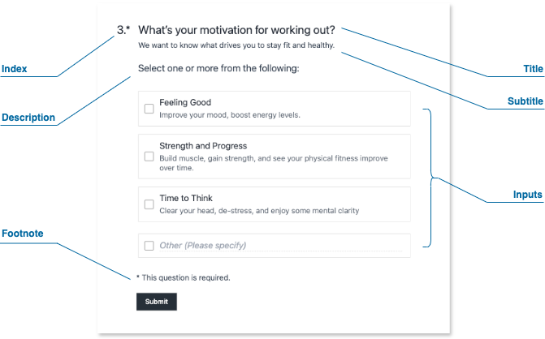

A ‘Block’ in SurveyCompo is a section of content on a survey page - it’s the building block of your survey. It can serve as a container for a survey question, housing both the question itself and its corresponding input controls for answers, and it offers a high degree of flexibility in how you present information and gather responses. It can also be utilized to provide instructions or explanations, guiding your respondents through the survey.

### Block Structure

Blocks can contain the following optional elements:

{: .center .md}

- **Index**: A numerical indicator to help organize and order questions.
- **Title**: The primary text of your survey question.
- **Subtitle**: Provides hints, instructions, or additional context for the question.
- **Description**: Offers further detailed instructions or explanations related to the question.
- **Footnote**: Use this to include references, links to legal information, or other relevant details.
- **Inputs**: The interactive elements where users provide their responses (e.g., text boxes, dropdowns, checkboxes, and more).

### Inputs within Block

SurveyCompo stands out by allowing you to combine **multiple input types** within a single block. This gives you significant flexibility in question design.

For example, a block titled "Tell us about yourself" could include a text input for the user's name, a dropdown for age range, and a checkbox list for areas of interest.

When a Block is used to provide instructions or explanations rather than to collect user inputs, it will have an empty list of inputs. This is a common practice in survey design to guide respondents through the survey flow. For example, a block titled "Instructions" may contain only a description and footnote, with no input controls. This is a powerful feature that allows you to create dynamic and engaging surveys tailored to your specific needs. SurveyCompo gives you the flexibility to design your survey in a way that best suits your goals and audience.

### Advanced Customization with HTML

All text elements within a block (title, subtitle, description, footnote) support custom HTML, enabling a wide range of customization:

- **Rich Formatting**: Control fonts, colors, text size, emphasis (bold, italics), and more.
- **Embed Media**: Integrate images, videos, or audio clips to enhance your questions.
- **Interactive Elements**: Add buttons, links, or other interactive components directly within a block.

### Branching/Skipping Logic

The `visibleIf` setting lets you control a block's display based on specific survey responses. This is essential for creating dynamic surveys with branching paths that adapt to user input.

!!! note "Note"

    Details about conditional logic will be covered in subsequent sections.

### Question Randomization

Prevent response bias by shuffling the order in which blocks appear on a page. SurveyCompo allows you to randomize all blocks or select specific ones for randomization.

### Responsive Grid Layout

Blocks feature a powerful grid layout engine to arrange input elements:

- Column Layout: Organize inputs into multiple columns for efficient use of space.
- Input Direction: Control whether inputs are stacked vertically or displayed side-by-side.

!!! note "Note"

    Block layout customization will be covered in subsequent sections.

### Block JSON Example

The following code example demonstrates how blocks integrate into the survey JSON data model. [:material-github:{.right-icon} view source](https://github.com/SurveyCompo/examples/blob/main/examples/anatomy/source.json)

```json linenums="1" hl_lines="10-17"
{
  "name": "My Survey",
  "startScreens": [
    /* ... */
  ],
  "pages": [
    {
      /* ... */
      "blocks": [
        {
          "title": "Gender",
          "layoutColumnCount": 2,
          "layoutColumnWidth": "50%",
          "inputs": [
            /* ... */
          ]
        },
        {
          "title": "Age",
          "inputs": [
            /* ... */
          ]
        }
      ]
    }
    /* ... */
  ],
  "completeScreens": [
    /* ... */
  ],
  "abortScreens": [
    /* ... */
  ]
}
```

### Block Data Keys

| Method                         | Type                        | Default | Description                                                                                                                                          |
| ------------------------------ | --------------------------- | ------- | ---------------------------------------------------------------------------------------------------------------------------------------------------- |
| `name`                         | string                      | null    | The name of the block.                                                                                                                               |
| `customRef`                    | string                      | null    | A custom reference to the block.                                                                                                                     |
| `templateName`                 | string                      | null    | The block template name. If set, the current block inherits keys from the matched template.                                                          |
| `title`                        | string                      | null    | The title of the block.                                                                                                                              |
| `htmlTitle`                    | string                      | null    | The block's title in HTML format.                                                                                                                    |
| `subtitle`                     | string                      | null    | The subtitle of the block.                                                                                                                           |
| `htmlSubtitle`                 | string                      | null    | The block's subtitle in HTML format.                                                                                                                 |
| `description`                  | string                      | null    | A text description for the block.                                                                                                                    |
| `htmlDescription`              | string                      | null    | The block's description in HTML format.                                                                                                              |
| `footnote`                     | string                      | null    | A footnote to the block.                                                                                                                             |
| `htmlFootnote`                 | string                      | null    | The block's footnote in HTML format.                                                                                                                 |
| `inputs`                       | [Input[]](#input-data-keys) | []      | An array of inputs within the block.                                                                                                                 |
| `showIndexNumber`              | boolean                     | true    | If true, index numbers for inputs in the block are displayed.                                                                                        |
| `validations`                  | [Validation[]](#validation) | []      | An array of validation rules for the block.                                                                                                          |
| `visibleIf`                    | [Condition](#condition)     | null    | The condition for block visibility. The block is displayed only if the condition is met.                                                             |
| `requiresVisibleInputs`        | boolean                     | false   | If true, the block is displayed only if there are visible inputs in the block.                                                                       |
| `randomWithinGroup`            | string                      | null    | If set, the display order of blocks with the same group name is randomized.                                                                          |
| `layoutColumnCount`            | number                      | 1       | The column count of the block layout.                                                                                                                |
| `layoutColumnWidth`            | string                      | '100%'  | The column width of the block layout. Accepts CSS width values (e.g., 200px, 50%).                                                                   |
| `layoutColumnAutoFit`          | boolean                     | true    | When set to true, the block layout will adjust the columns to occupy the full width of the available space..                                         |
| `layoutColumnGap`              | string                      | '0'     | The column gap of the block layout. Accepts CSS width values (e.g., 5px, 1em).                                                                       |
| `layoutRowGap`                 | string                      | '1em'   | The row gap of the block layout. Accepts CSS width values (e.g., 5px, 1em).                                                                          |
| `layoutFlow`                   | 'COLUMN', 'ROW'             | 'ROW'   | Determines the direction in which the survey elements are arranged. This could be either vertically (top to bottom) or horizontally (left to right). |
| `layoutCenterAligned`          | boolean                     | false   | If true, the block layout is centered.                                                                                                               |
| `layoutLikertMatrixWidth`      | string                      | '100%'  | The width of the Likert Matrix table. Only applicable to Likert input types.                                                                         |
| `layoutLikertMatrixLabelWidth` | string                      | '25%'   | The width of the label column in a Likert Matrix. Only applicable to Likert input types.                                                             |
| `layoutLikertMatrixMode`       | 'AUTO', 'LIKERT', 'MATRIX'  | 'AUTO'  | Manages the visibility of the Likert Matrix Table on smaller screens                                                                                 |

---
