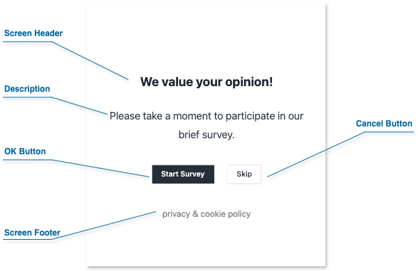

Screens are the visual gateways of your SurveyCompo surveys. They introduce respondents to the survey, provide closure upon completion, and inform users of eligibility or termination. Let's explore their key functions:

- **Start Screens**: These screens welcome users, present essential information, and invite them to participate in your survey.
- **Complete Screens**: These screens thank respondents for their time, signaling that the survey has been successfully completed.
- **Abort Screens**: These screens inform users that they are ineligible or the survey has been terminated, providing clear reasons as needed.

### Screen Composition

A screen can include the following optional elements:

{: .center .md}

- **Header**: A prominent area for the survey title, section headings, or instructions.

- **Description**: Provides context, additional details, or instructions for the user.

- **Footer**: Use this for additional information, or legal disclaimers.

- **Action Buttons**: Each screen can include up to two customizable action buttons. These buttons determine how users navigate through your survey, allowing them to either proceed or exit the current screen.

### Customizing Screens with HTML

Enhance your screens with the power of HTML:

- **Enhanced Formatting**: Change font size, color, or add emphasis using HTML tags.
- **Embedding Media**: Include images, videos, or audio files to enhance the user experience.
- **Interactive Elements**: Include links to privacy statements or cookie policies.

SurveyCompo uses specific 'html' keys for custom content:

- `htmlHeader`
- `htmlDescription`
- `htmlFooter`

!!! warning "Warning"

    Use valid HTML syntax and prioritize security. Avoid incorporating code from unknown sources or user input, as it could introduce vulnerabilities.

### Multiple Screens and Visibility Conditional Logic

SurveyCompo supports multiple start and end screens for flexible survey design. Use the `visibleIf` setting to conditionally show screens based on survey responses or variables.

!!! note "Note"

    Details on conditional logic will be covered in subsequent sections.

### Screen JSON Example

Start, completion, and abort screens share a common data structure within your survey's JSON format.

The following code example demonstrates how a screen integrates into the survey JSON data model. [:material-github:{.right-icon} view source](https://github.com/SurveyCompo/examples/blob/main/examples/anatomy/source.json)

```json linenums="1" hl_lines="4-10"
{
  "name": "My Survey",
  "startScreens": [
    {
      "header": "We value your opinion!",
      "description": "Please take a moment to participate in our brief survey.",
      "htmlFooter": "<p class='footnote'><a href=''>privacy</a> & <a href=''>cookie policy<a></p>",
      "okButtonLabel": "Start Survey",
      "cancelButtonLabel": "Skip"
    }
  ],
  "pages": [
    /* ... */
  ],
  "completeScreens": [
    /* ... */
  ],
  "abortScreens": [
    /* ... */
  ]
}
```

### Screen Data Keys

| Method              | Type                    | Default | Description                                                                                    |
| ------------------- | ----------------------- | ------- | ---------------------------------------------------------------------------------------------- |
| `name`              | string                  | null    | The name of the screen.                                                                        |
| `customRef`         | string                  | null    | A custom reference ID for the screen.                                                          |
| `header`            | string                  | null    | The text for the screen's header.                                                              |
| `htmlHeader`        | string                  | null    | The screen's header in HTML format.                                                            |
| `description`       | string                  | null    | The text for the screen's description.                                                         |
| `htmlDescription`   | string                  | null    | The screen's description in HTML format.                                                       |
| `footer`            | string                  | null    | The text for the screen's footer.                                                              |
| `htmlFooter`        | string                  | null    | The screen's footer in HTML format.                                                            |
| `okButtonLabel`     | string                  | null    | The label for the screen's OK button. If not set, the OK button will not be displayed.         |
| `okButtonURL`       | string                  | null    | The URL to redirect to when the OK button is clicked.                                          |
| `cancelButtonLabel` | string                  | null    | The label for the screen's Cancel button. If not set, the Cancel button will not be displayed. |
| `cancelButtonURL`   | string                  | null    | The URL to redirect to when the Cancel button is clicked.                                      |
| `hCentered`         | boolean                 | true    | If true, the screen content is centered horizontally.                                          |
| `vCentered`         | boolean                 | true    | If true, the screen content is centered vertically.                                            |
| `visibleIf`         | [Condition](#condition) | true    | The condition for screen visibility. The screen is visible only if the condition is met.       |

---
