# Input Types

SurveyCompo supports a variety of input types. Each input type is designed to capture a specific type of data. The following [:material-github:{.right-icon}example survey](https://github.com/SurveyCompo/examples/blob/main/examples/inputs/source.json){:target="\_blank"} demonstrates the different input types that SurveyCompo supports.

<div style="border: 1px solid gray; width: 300px; height: 420px; padding-bottom: 10px" index="1" class="resizable center">
	<survey-compo
		src="https://surveycompo.github.io/examples/examples/inputs/source.json"
	/>
</div>

## Checkbox

The `CHECKBOX` input type is designed to capture boolean values. It is depicted as a checkbox that users can either check or uncheck. The value of the checkbox is `true` when checked and `false` when unchecked. The `CHECKBOX` input type is commonly used for multiple-choice questions allowing users to select multiple options. Each `CHECKBOX` input represents a single option.

```json
{
  "type": "CHECKBOX",
  "name": "agree",
  "label": "I agree to the terms and conditions",
  "hint": "Please read the terms and conditions before agreeing"
}
```

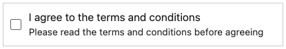{: .small .embedded}

You can also add a `REQUIRED` validation rule for the checkbox input type. If the checkbox is required, the user must check the checkbox to proceed.

```json
{
  "type": "CHECKBOX",
  "name": "agree",
  "label": "I agree to the terms and conditions",
  "hint": "Please read the terms and conditions before agreeing",
  "validations": [
    {
      "type": "REQUIRED",
      "message": "You must agree to the ToC"
    }
  ]
}
```

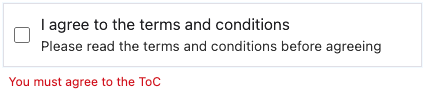{: .small .embedded}

## Checkbox Text

The `CHECKBOX_TEXT` input type is designed to capture text values. It is represented as a checkbox that users can select or deselect, accompanied by a text input field for capturing textual data. The `CHECKBOX_TEXT` input type is often used in conjunction with other `CHECKBOX` inputs, typically serving as an 'Other' option that allows users to provide open-ended responses.

!!! info "Info"

    An input of type `CHECKBOX_TEXT` captures the text value from the text input field. If the checkbox is checked, but the text input field is empty, a boolean `true` value will be captured. The `hint` or `label` will be displayed as a placeholder in the text input field.

```json
{
  "type": "CHECKBOX_TEXT",
  "hint": "Other (please specify)"
}
```

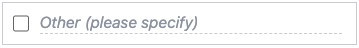{: .small .embedded}

## Radio

The `RADIO` input type is designed to capture single-choice questions. It is depicted as a radio button that users can select. The value of the checkbox is `true` when checked and `false` when unchecked. The `RADIO` input type is commonly used for single-choice questions where users can only select one option.

```json
{
  "type": "RADIO",
  "label": "Online search"
}
```

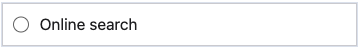{: .small .embedded}

## Radio Text

The `RADIO_TEXT` input type is designed to capture text values. It is represented as a radio button that users can select or deselect, accompanied by a text input field for capturing textual data. The `RADIO_TEXT` input type is often used in conjunction with other `RADIO` inputs, typically serving as an 'Other' option that allows users to provide open-ended responses.

!!! info "Info"

    An input of type `RADIO_TEXT` captures the text value from the text input field. If the radio button is checked, but the text input field is empty, a boolean `true` value will be captured. The `hint` or `label` will be displayed as a placeholder in the text input field.

```json
{
  "type": "RADIO_TEXT",
  "hint": "Other (please specify)"
}
```

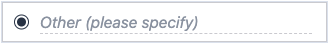{: .small .embedded}

## Text

The `TEXT` input type is designed to capture short textual data. It is depicted as a text input field that users can type in. The `TEXT` input type is commonly used for capturing short textual data such as names, email addresses, and phone numbers.

```json
{
  "type": "TEXT",
  "hint": "name@example.com",
  "textInputType": "EMAIL"
}
```

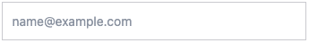{: .small .embedded}

### Text Label

Like other input types, you can specify a `label` field for the text input. This is typically used when a survey question presents multiple inputs:

```json
"inputs": [
  {
    "type": "TEXT",
    "label": "First Name"
  },
  {
    "type": "TEXT",
    "label": "Last Name"
  }
]
```

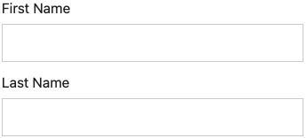{: .small .embedded}

### Text Types

The `TEXT` input type supports different text input types. You can specify the `textInputType` field to define the type of text input field. The following text input types are supported:

EMAIL, NUMBER, DATE, DATETIME, TIME, TEXT

- `TEXT` - Default text type
- `EMAIL` - Email input text.
- `NUMBER` - Number input text
- `DATE` - Date input text
- `DATETIME` - Date and time input text
- `TIME` - Time input text

!!! info "Info"

    Although assigning a `textInputType` doesn't inherently enforce the validity of entries for the specified type, it does modify the virtual keyboard layout on most mobile browsers and may prompt warnings. For instance, if `EMAIL` is selected, the email keyboard layout, including the '@' symbol, will be displayed. If an invalid email is input, a tooltip containing a warning will be shown. For more rigorous validation of input values, consider adding `validations` rules to the input.

The following example demonstrates the `TEXT` input type with different `textInputType` values:

=== "Preview"

    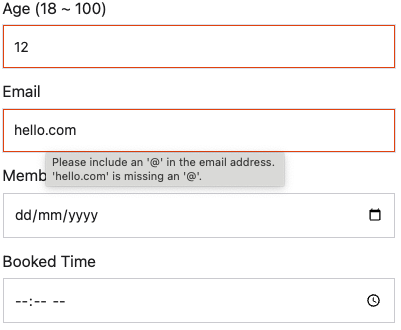{: .small .embedded}

=== "JSON"

    ```json
    ...
    "inputs": [
      {
        "type": "TEXT",
        "label": "Age (18 ~ 100)",
        "textInputType": "NUMBER",
        "textInputMax": 100,
        "textInputMin": 18
      },
      {
        "type": "TEXT",
        "label": "Email",
        "textInputType": "EMAIL"
      },
      {
        "type": "TEXT",
        "label": "Member Since",
        "textInputType": "DATE",
        "textInputMin": "2000-01-01",
        "textInputMax": "2025-01-01"
      },
      {
        "type": "TEXT",
        "label": "Booked Time",
        "textInputType": "TIME",
        "textInputMin": "09:00",
        "textInputMax": "17:00"
      }
    ]
    ...
    ```

## Textarea

The `TEXTAREA` input type is designed to capture long textual data. It is depicted as a text area field that users can type in. The `TEXTAREA` input type is commonly used for capturing long textual data such as comments, feedback, and descriptions.

The `textareaInputRows` key can be used to specify the number of rows in the textarea. The default value is 5.

```json
{
  "type": "TEXTAREA",
  "hint": "Please provide your feedback here",
  "textareaInputRows": 4
}
```

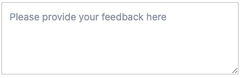{: .small .embedded}

## Dropdown

The `DROPDOWN` input type is designed to capture single-choice questions. It is depicted as a dropdown list that users can select. The `DROPDOWN` input type is commonly used for single-choice questions where users can only select one option.

The `dropdownInputOptions` key is used to specify the options in the dropdown list. The options are represented as an array of strings or an object with key-value pairs. If the dropdown list is an array of strings, the value of the selected option is the same as the displayed text. If the dropdown list is an object with key-value pairs, the value of the selected option is the key of the selected option.

=== "Preview"

    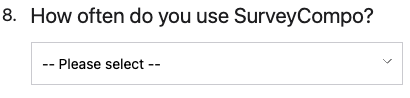{: .small .embedded}

=== "JSON Option1"

    ```json
    {
      "title": "How often do you use SurveyCompo?",
      "inputs": [
        {
          "type": "DROPDOWN",
          "hint": "-- Please select --",
          "dropdownInputOptions": ["Daily", "Weekly", "Monthly", "Less often"]
        }
      ]
    }
    ```

=== "JSON Option2"

    ```json
    {
      "title": "How often do you use SurveyCompo?",
      "inputs": [
        {
          "type": "DROPDOWN",
          "hint": "-- Please select --",
          "dropdownInputOptions": {"daily":"Daily", "weekly": "Weekly", "monthly": "Monthly", "less":"Less often"}
        }
      ]
    }
    ```

Alternatively, the `dropdownInputPreset` key can be used to specify a preset list of options. The following preset options are supported:

- `COUNTRIES` - A list of countries. e.g. `Afghanistan`, `Albania`, etc.
- `MONTHS` - A list of months. e.g. `January`, `February`, etc.
- `MONTHS_SHORT` - A list of months in short form. e.g. `Jan`, `Feb`, etc.
- `MONTH_DAYS` - A list of days of the month (from 1 to 31)
- `WEEK_DAYS` - A list of days of the week. e.g. `Sunday`, `Monday`, etc.
- `WEEK_DAYS_SHORT` - A list of days of the week in short form. e.g. `Sun`, `Mon`, etc.
- `YEARS` - A list of years (from 100 years ago to the current year)

```json
{
  "title": "Which Country would you like to visit?",
  "inputs": [
    {
      "type": "DROPDOWN",
      "hint": "-- Please select --",
      "dropdownInputPreset": "COUNTRIES"
    }
  ]
}
```

## Number Scale

The `NUMBER_SCALE` input type is designed to capture numerical data on a scale. It is depicted as a scale with a range of numbers that users can select. The `NUMBER_SCALE` input type is commonly used for capturing numerical data on a scale, such as satisfaction ratings, agreement levels, and likelihood scores.

The `numberScaleInputMin` and `numberScaleInputMax` keys are used to specify the minimum and maximum values of the scale. The default values are 0 and 10, respectively.

The value of `numberScaleInputMin` should be less than `numberScaleInputMax`, and the maximum value that `numberScaleInputMax` can take is 10.

The `numberScaleInputLabels` key assigns labels to the scale. These labels, represented as an array of strings, are evenly distributed across the scale. The `numberScaleInputLabelPosition` key can be used to determine the labels' placement, with `BOTTOM` as the default position.

=== "Preview"

    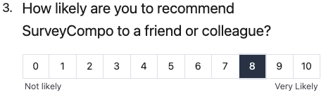{: .small .embedded}

=== "JSON"

    ```json
    "inputs": [
      {
        "type": "NUMBER_SCALE",
        "numberScaleInputMin": 0,
        "numberScaleInputMax": 5,
        "numberScaleInputLabelPosition": "BOTTOM",
        "numberScaleInputLabels": [
          "Not likely",
          "Very Likely"
        ]
      }
    ]
    ```

## Star Rating

The `STAR_RATING` input type is designed to capture ratings on a scale. It is depicted as a set of stars that users can select. The `STAR_RATING` input type is commonly used for capturing ratings on a scale, such as satisfaction ratings, agreement levels, and likelihood scores.

The `starInputCount` key is used to specify the maximum number of stars in the rating scale. The default value is 5. The `starInputColor` determines the color of the stars. The default color is yellow (#f1c40f).

=== "Preview"

    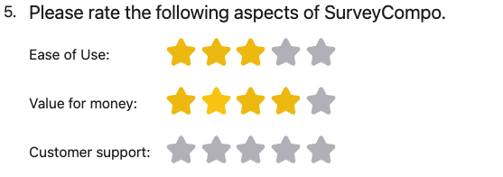{: .small .embedded}

=== "JSON"

    ```json
    "inputs": [
      {
        "type": "STAR_SCALE",
        "label": "Ease of Use:",
        "labelPosition": "LEFT",
        "labelWidth": "10em"
      },
      {
        "type": "STAR_SCALE",
        "label": "Value for money:",
        "labelPosition": "LEFT",
        "labelWidth": "10em"
      },
      {
        "type": "STAR_SCALE",
        "label": "Customer support:",
        "labelPosition": "LEFT",
        "labelWidth": "10em"
      }
    ]
    ```

## Image

The `IMAGE` input type is designed for displaying and selecting images within surveys.

By default, the `IMAGE` input behaves similarly to a `RADIO` input, except for the visual representation. Users can select or deselect the image. When an `IMAGE` input is selected, a checkmark icon appears at the top right corner of the image. The position of this checkmark icon can be adjusted by setting the `imageInputCheckmarkPosition` key to `BOTTOM`.

To enable the selection of multiple `IMAGE` inputs within the same block, set the `imageInputMultiple` key to `true`. This setting removes the exclusivity of the selection, allowing users to choose multiple images within the same block.

The `imageInputPadding` key allows you to add additional padding around the image for aesthetic or clarity purposes, while the `imageInputNoBorder` key removes the box border surrounding the image. This is particularly useful when you prefer to display the image without any border.

Keep in mind that SurveyCompo automatically resizes the image to fit within the block. You can utilize the block layout settings to fine-tune the size and spacing of the images.

=== "Preview"

    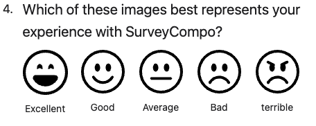{: .small .embedded}

=== "JSON"

    ```json
    {
      "title": "Which of these images best represents your experience with SurveyCompo?",
      "layoutColumnCount": 5,
      "layoutColumnWidth": "80px",
      "layoutColumnGap": "1em",
      "inputs": [
        {
          "type": "IMAGE",
          "imageInputSrc": "https://surveycompo.github.io/examples/images/face-laughing.svg",
          "imageInputNoBorder": true,
          "label": "Excellent"
        },
        {
          "type": "IMAGE",
          "imageInputSrc": "https://surveycompo.github.io/examples/images/face-smile.svg",
          "imageInputNoBorder": true,
          "label": "Good"
        },
        {
          "type": "IMAGE",
          "imageInputSrc": "https://surveycompo.github.io/examples/images/face-neutral.svg",
          "imageInputNoBorder": true,
          "label": "Average"
        },
        {
          "type": "IMAGE",
          "imageInputSrc": "https://surveycompo.github.io/examples/images/face-frown.svg",
          "imageInputNoBorder": true,
          "label": "Bad"
        },
        {
          "type": "IMAGE",
          "imageInputSrc": "https://surveycompo.github.io/examples/images/face-angry.svg",
          "imageInputNoBorder": true,
          "label": "terrible"
        }
      ]
    }
    ```

## Toggle

The `TOGGLE` input type is designed to capture binary data. It is depicted as a toggle switch that users can slide to the left or right. The value of the toggle switch is `true` when slid to the right and `false` when slid to the left. The `TOGGLE` input type is commonly used for capturing binary data such as yes/no questions, true/false statements, and on/off settings.

=== "Preview"

    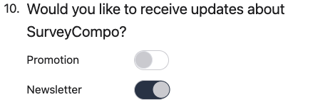{: .small .embedded}

=== "JSON"

    ```json
    "inputs": [
      {
        "type": "TOGGLE",
        "label": "Promotion",
        "labelPosition": "LEFT",
        "labelWidth": "10em"
      },
      {
        "type": "TOGGLE",
        "label": "Newsletter",
        "labelPosition": "LEFT",
        "labelWidth": "10em"
      }
    ]
    ```

## Likert Rating

## Likert Matrix

```

```

```

```

```

```
