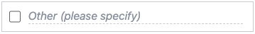

The `CHECKBOX_TEXT` input type is designed to capture text values. It is represented as a checkbox that users can select or deselect, accompanied by a text input field for capturing textual data. The `CHECKBOX_TEXT` input type is often used in conjunction with other `CHECKBOX` inputs, typically serving as an 'Other' option that allows users to provide open-ended responses.

!!! info "Info"

    An input of type `CHECKBOX_TEXT` captures the text value from the text input field. If the checkbox is checked, but the text input field is empty, a boolean `true` value will be captured. The `hint` or `label` will be displayed as a placeholder in the text input field.

```json
{
  "type": "CHECKBOX_TEXT",
  "hint": "Other (please specify)"
}
```

{: .small .embedded}
