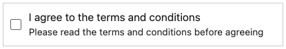
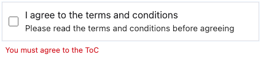

The `CHECKBOX` input type is designed to capture boolean values. It is depicted as a checkbox that users can either check or uncheck. The value of the checkbox is `true` when checked and `false` when unchecked. The `CHECKBOX` input type is commonly used for multiple-choice questions allowing users to select multiple options. Each `CHECKBOX` input represents a single option.

```json
{
  "type": "CHECKBOX",
  "name": "agree",
  "label": "I agree to the terms and conditions",
  "hint": "Please read the terms and conditions before agreeing"
}
```

{: .small .embedded}

You can also add a `REQUIRED` validation rule for the checkbox input type. If the checkbox is required, the user must check the checkbox to proceed.

```json
{
  "type": "CHECKBOX",
  "name": "agree",
  "label": "I agree to the terms and conditions",
  "hint": "Please read the terms and conditions before agreeing",
  "validations": [
    {
      "type": "REQUIRED",
      "message": "You must agree to the ToC"
    }
  ]
}
```

{: .small .embedded}
