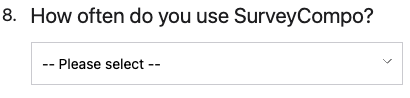

The `DROPDOWN` input type is designed to capture single-choice questions. It is depicted as a dropdown list that users can select. The `DROPDOWN` input type is commonly used for single-choice questions where users can only select one option.

The `dropdownInputOptions` key is used to specify the options in the dropdown list. The options are represented as an array of strings or an object with key-value pairs. If the dropdown list is an array of strings, the value of the selected option is the same as the displayed text. If the dropdown list is an object with key-value pairs, the value of the selected option is the key of the selected option.

=== "Preview"

    {: .small .embedded}

=== "JSON Option1"

    ```json
    {
      "title": "How often do you use SurveyCompo?",
      "inputs": [
        {
          "type": "DROPDOWN",
          "hint": "-- Please select --",
          "dropdownInputOptions": ["Daily", "Weekly", "Monthly", "Less often"]
        }
      ]
    }
    ```

=== "JSON Option2"

    ```json
    {
      "title": "How often do you use SurveyCompo?",
      "inputs": [
        {
          "type": "DROPDOWN",
          "hint": "-- Please select --",
          "dropdownInputOptions": {"daily":"Daily", "weekly": "Weekly", "monthly": "Monthly", "less":"Less often"}
        }
      ]
    }
    ```

Alternatively, the `dropdownInputPreset` key can be used to specify a preset list of options. The following preset options are supported:

- `COUNTRIES` - A list of countries. e.g. `Afghanistan`, `Albania`, etc.
- `MONTHS` - A list of months. e.g. `January`, `February`, etc.
- `MONTHS_SHORT` - A list of months in short form. e.g. `Jan`, `Feb`, etc.
- `MONTH_DAYS` - A list of days of the month (from 1 to 31)
- `WEEK_DAYS` - A list of days of the week. e.g. `Sunday`, `Monday`, etc.
- `WEEK_DAYS_SHORT` - A list of days of the week in short form. e.g. `Sun`, `Mon`, etc.
- `YEARS` - A list of years (from 100 years ago to the current year)

```json
{
  "title": "Which Country would you like to visit?",
  "inputs": [
    {
      "type": "DROPDOWN",
      "hint": "-- Please select --",
      "dropdownInputPreset": "COUNTRIES"
    }
  ]
}
```

There a also a special preset in the form of `RANGE:START:END:STEP`. This preset generates a range of whole numbers from `START` (inclusive) to `END` (inclusive) with an optional `STEP` value. If `STEP` is not specified, the default value is 1.

```json
{
  "title": "How likely are you to recommend SurveyCompo to a friend or colleague?",
  "inputs": [
    {
      "type": "DROPDOWN",
      "hint": "-- Please select --",
      "dropdownInputPreset": "RANGE:0:10"
    }
  ]
}
```

!!! tip "Tip"

    The `dropdownInputPresetReverse` key allows you to reverse the order of preset values. By default, this key is set to `false`.
