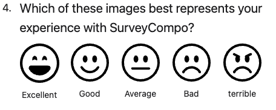

The `IMAGE` input type is designed for displaying and selecting images within surveys.

By default, the `IMAGE` input behaves similarly to a `RADIO` input, except for the visual representation. Users can select or deselect the image. When an `IMAGE` input is selected, a checkmark icon appears at the top right corner of the image. The position of this checkmark icon can be adjusted by setting the `imageInputCheckmarkPosition` key to `BOTTOM`.

To enable the selection of multiple `IMAGE` inputs within the same block, set the `imageInputMultiple` key to `true`. This setting removes the exclusivity of the selection, allowing users to choose multiple images within the same block.

The `imageInputPadding` key allows you to add additional padding around the image for aesthetic or clarity purposes, while the `imageInputNoBorder` key removes the box border surrounding the image. This is particularly useful when you prefer to display the image without any border.

To adjust the image size and spacing, use the block layout settings. The `layoutColumnWidth` key sets the width of the column containing the image, while the `layoutColumnGap` key defines the spacing between columns.

=== "Preview"

    {: .small .embedded}

=== "JSON"

    ```json
    {
      "title": "Which of these images best represents your experience with SurveyCompo?",
      "layoutColumnWidth": "80px",
      "layoutColumnGap": "1em",
      "inputs": [
        {
          "type": "IMAGE",
          "imageInputSrc": "https://surveycompo.github.io/examples/images/face-laughing.svg",
          "imageInputNoBorder": true,
          "label": "Excellent"
        },
        {
          "type": "IMAGE",
          "imageInputSrc": "https://surveycompo.github.io/examples/images/face-smile.svg",
          "imageInputNoBorder": true,
          "label": "Good"
        },
        {
          "type": "IMAGE",
          "imageInputSrc": "https://surveycompo.github.io/examples/images/face-neutral.svg",
          "imageInputNoBorder": true,
          "label": "Average"
        },
        {
          "type": "IMAGE",
          "imageInputSrc": "https://surveycompo.github.io/examples/images/face-frown.svg",
          "imageInputNoBorder": true,
          "label": "Bad"
        },
        {
          "type": "IMAGE",
          "imageInputSrc": "https://surveycompo.github.io/examples/images/face-angry.svg",
          "imageInputNoBorder": true,
          "label": "terrible"
        }
      ]
    }
    ```
