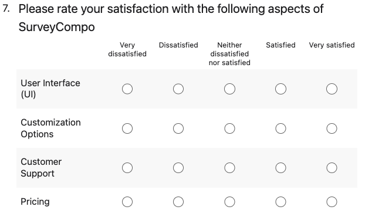

Likert Matrix allow you to combine multiple Likert input with the same options. This is most useful when you need to ask multiple questions that should be rated on the same scale.

SurveyCompo automatically groups adjacent Likert inputs with the same options into a matrix. There's no need to specify the matrix explicitly. Likert Matrix requires at least two Likert inputs with the same options to be present in the survey. If there's only one Likert input with options, it will be displayed as a standalone Likert input.

Since the Likert Matrix comprises multiple Likert inputs, the associated settings are configured at the containing **Block** level. You can adjust the matrix table width using the `layoutLikertMatrixWidth` key (default: '100%'). Additionally, the width of the first column, which contains the labels, can be controlled with the `layoutLikertMatrixLabelWidth` key (default: '25%').

The Likert Matrix, which presents multiple questions in a tabular format, typically requires a larger display area. By default, the block's `layoutLikertMatrixMode` setting is set to `AUTO`. This means that on mobile devices or smaller screens, the Likert Matrix automatically adapts to display as individual Likert inputs for a better user experience. However, you can override this behavior. By setting `layoutLikertMatrixMode` to `LIKERT`, you can ensure that Likert questions are always displayed as individual inputs. If `layoutLikertMatrixMode` is set to `MATRIX`, the Likert Matrix table will be displayed regardless of the screen size. In this case, SurveyCompo will attempt to scale the Likert Matrix table to fit the screen size as needed.

=== "Preview"

    {: .small .embedded}

=== "JSON"

    ```json
    {
      "title": "Please rate your satisfaction with the following aspects of SurveyCompo",
      "inputs": [
        {
          "type": "LIKERT_SCALE",
          "label": "User Interface (UI)",
          "likertInputPreset": "SATISFACTION"
        },
        {
          "type": "LIKERT_SCALE",
          "label": "Customization Options",
          "likertInputPreset": "SATISFACTION"
        },
        {
          "type": "LIKERT_SCALE",
          "label": "Customer Support",
          "likertInputPreset": "SATISFACTION"
        },
        {
          "type": "LIKERT_SCALE",
          "label": "Pricing",
          "likertInputPreset": "SATISFACTION"
        }
      ]
    }
    ```
