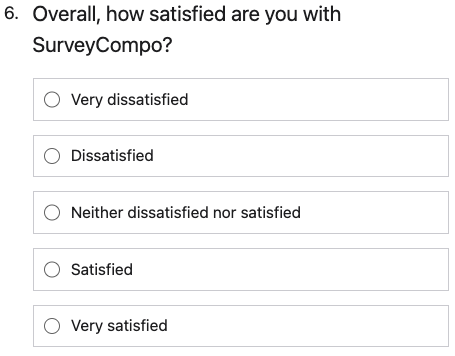

The `LIKERT_RATING` input type is designed to capture responses on a Likert scale, a widely used psychometric scale in surveys and questionnaires to gauge the level of agreement or disagreement with a statement. The `LIKERT_RATING` input is depicted as a set of radio inputs that users can select.

The `likertInputOptions` key is used to define the options in the Likert scale. These options can be represented as an array of strings or an object with key-value pairs. If `likertInputOptions` is an array of strings, the value of the selected option matches the displayed text. However, if `likertInputOptions` is an object with key-value pairs, the value that gets recorded when an option is selected is the key associated with that option, not the displayed text.

Like the `DROPDOWN` input type, the `LIKERT_RATING` input type also supports preset options. The `likertInputPreset` key can be used to specify a preset list of options. The following preset options are supported:

- `AGREEMENT` - A 5-point Likert scale for agreement levels. e.g. `Strongly Disagree`, `Disagree`, `Neither agree nor disagree`, `Agree`, `Strongly Agree`.
- `FREQUENCY` - A 5-point Likert scale for frequency levels. e.g. `Never`, `Rarely`, `Sometimes`, `Often`, `Always`.
- `SATISFACTION` - A 5-point Likert scale for satisfaction levels. e.g. `Very Dissatisfied`, `Dissatisfied`, `Neither dissatisfied nor satisfied`, `Satisfied`, `Very Satisfied`.
- `QUALITY` - A 5-point Likert scale for quality levels. e.g. `Very Poor`, `Poor`, `Acceptable`, `Good`, `Very Good`.
- `IMPORTANCE` - A 5-point Likert scale for importance levels. e.g. `Very unimportant`, `Unimportant`, `Neutral`, `Important`, `Very important`.
- `FAMILIARITY` - A 5-point Likert scale for familiarity levels. e.g. `Very unfamiliar`, `Unfamiliar`, `Somewhat familiar`, `Familiar`, `Very familiar`.
- `AWARENESS` - A 5-point Likert scale for awareness levels. e.g. `Very unaware`, `Unaware`, `Neither aware nor unaware`, `aware`, `Very aware`.
- `LIKELIHOOD` - A 5-point Likert scale for likelihood levels. e.g. `Very Unlikely`, `Unlikely`, `Neutral`, `Likely`, `Very Likely`.
- `CONCERN` - A 5-point Likert scale for concern levels. e.g. `Very unconcerned`, `Unconcerned`, `Neither aware nor Neutral`, `Concerned`, `Very concerned`.
- `DIFFICULTY` - A 5-point Likert scale for difficulty levels. e.g. `Very easy`, `Easy`, `Neutral`, `Difficult`, `Very difficult`.

=== "Preview"

    {: .small .embedded}

=== "JSON"

    ```json
    {
      "title": "Overall, how satisfied are you with SurveyCompo?",
      "inputs": [
        {
          "type": "LIKERT_SCALE",
          "likertInputPreset": "SATISFACTION"
        }
      ]
    }
    ```

!!! tip "Tip"

    The `likertInputPresetReverse` key allows you to reverse the order of preset values. By default, this key is set to `false`.
