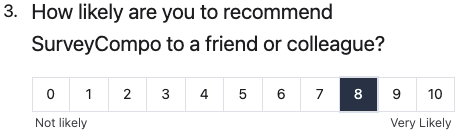

The `NUMBER_SCALE` input type is designed to capture numerical data on a scale. It is depicted as a scale with a range of numbers that users can select. The `NUMBER_SCALE` input type is commonly used for capturing numerical data on a scale, such as satisfaction ratings, agreement levels, and likelihood scores.

The `numberScaleInputMin` and `numberScaleInputMax` keys are used to specify the minimum and maximum values of the scale. The default values are 0 and 10, respectively.

The value of `numberScaleInputMin` should be less than `numberScaleInputMax`, and the maximum value that `numberScaleInputMax` can take is 10.

The `numberScaleInputLabels` key assigns labels to the scale. These labels, represented as an array of strings, are evenly distributed across the scale. The `numberScaleInputLabelPosition` key can be used to determine the labels' placement, with `BOTTOM` as the default position.

=== "Preview"

    {: .small .embedded}

=== "JSON"

    ```json
    "inputs": [
      {
        "type": "NUMBER_SCALE",
        "numberScaleInputMin": 0,
        "numberScaleInputMax": 5,
        "numberScaleInputLabelPosition": "BOTTOM",
        "numberScaleInputLabels": [
          "Not likely",
          "Very Likely"
        ]
      }
    ]
    ```
