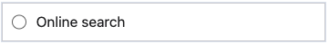

The `RADIO` input type is designed to capture single-choice questions. It is depicted as a radio button that users can select. The value of the checkbox is `true` when checked and `false` when unchecked. The `RADIO` input type is commonly used for single-choice questions where users can only select one option.

```json
{
  "type": "RADIO",
  "label": "Online search"
}
```

{: .small .embedded}
