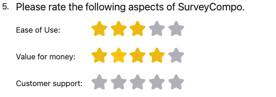

The `STAR_RATING` input type is designed to capture ratings on a scale. It is depicted as a set of stars that users can select. The `STAR_RATING` input type is commonly used for capturing ratings on a scale, such as satisfaction ratings, agreement levels, and likelihood scores.

The `starInputCount` key is used to specify the maximum number of stars in the rating scale. The default value is 5. The `starInputColor` determines the color of the stars. The default color is yellow (#f1c40f).

=== "Preview"

    {: .small .embedded}

=== "JSON"

    ```json
    "inputs": [
      {
        "type": "STAR_SCALE",
        "label": "Ease of Use:",
        "labelPosition": "LEFT",
        "labelWidth": "10em"
      },
      {
        "type": "STAR_SCALE",
        "label": "Value for money:",
        "labelPosition": "LEFT",
        "labelWidth": "10em"
      },
      {
        "type": "STAR_SCALE",
        "label": "Customer support:",
        "labelPosition": "LEFT",
        "labelWidth": "10em"
      }
    ]
    ```
