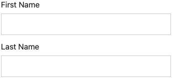
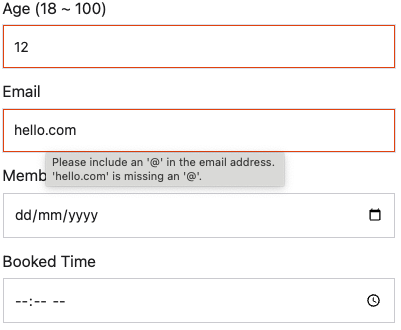

The `TEXT` input type is designed to capture short textual data. It is depicted as a text input field that users can type in. The `TEXT` input type is commonly used for capturing short textual data such as names, email addresses, and phone numbers.

```json
{
  "type": "TEXT",
  "hint": "name@example.com",
  "textInputType": "EMAIL"
}
```

{: .small .embedded}

### Text Label

Like other input types, you can specify a `label` field for the text input. This is typically used when a survey question presents multiple inputs:

```json
"inputs": [
  {
    "type": "TEXT",
    "label": "First Name"
  },
  {
    "type": "TEXT",
    "label": "Last Name"
  }
]
```

{: .small .embedded}

### Text Types

The `TEXT` input type supports different text input types. You can specify the `textInputType` field to define the type of text input field. The following text input types are supported:

EMAIL, NUMBER, DATE, DATETIME, TIME, TEXT

- `TEXT` - Default text type
- `EMAIL` - Email input text.
- `NUMBER` - Number input text
- `DATE` - Date input text
- `DATETIME` - Date and time input text
- `TIME` - Time input text

!!! info "Info"

    Although assigning a `textInputType` doesn't inherently enforce the validity of entries for the specified type, it does modify the virtual keyboard layout on most mobile browsers and may prompt warnings. For instance, if `EMAIL` is selected, the email keyboard layout, including the '@' symbol, will be displayed. If an invalid email is input, a tooltip containing a warning will be shown. For more rigorous validation of input values, consider adding `validations` rules to the input.

The following example demonstrates the `TEXT` input type with different `textInputType` values:

=== "Preview"

    {: .small .embedded}

=== "JSON"

    ```json
    ...
    "inputs": [
      {
        "type": "TEXT",
        "label": "Age (18 ~ 100)",
        "textInputType": "NUMBER",
        "textInputMax": 100,
        "textInputMin": 18
      },
      {
        "type": "TEXT",
        "label": "Email",
        "textInputType": "EMAIL"
      },
      {
        "type": "TEXT",
        "label": "Member Since",
        "textInputType": "DATE",
        "textInputMin": "2000-01-01",
        "textInputMax": "2025-01-01"
      },
      {
        "type": "TEXT",
        "label": "Booked Time",
        "textInputType": "TIME",
        "textInputMin": "09:00",
        "textInputMax": "17:00"
      }
    ]
    ...
    ```
