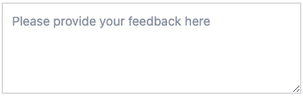

The `TEXTAREA` input type is designed to capture long textual data. It is depicted as a text area field that users can type in. The `TEXTAREA` input type is commonly used for capturing long textual data such as comments, feedback, and descriptions.

The `textareaInputRows` key can be used to specify the number of rows in the textarea. The default value is 5.

```json
{
  "type": "TEXTAREA",
  "hint": "Please provide your feedback here",
  "textareaInputRows": 4
}
```

{: .small .embedded}
