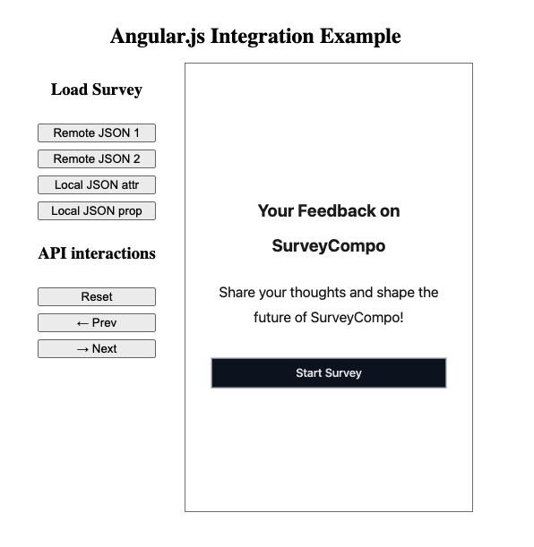

Integrating SurveyCompo survey component in a Angular.js project involves a few steps:

1. Add the SurveyCompo component JavaScript to the HTML page template.
2. Add custom elements schema to the Angular project.
3. Use the survey component in your Angular component as you would with any other HTML element.

### Adding SurveyCompo Component JavaScript

Include the script tag in the HTML page (typically `index.html`) header.

```html linenums="1" hl_lines="10"
<!DOCTYPE html>
<html lang="en">
  <head>
    <meta charset="utf-8" />
    <title>ExampleAngular</title>
    <base href="/" />
    <meta name="viewport" content="width=device-width, initial-scale=1" />
    <link rel="icon" type="image/x-icon" href="favicon.ico" />
    <!-- You can also add the script in angular.json -->
    <script async src="https://tag.surveycompo.com/v1.js"></script>
  </head>

  <body>
    <app-root></app-root>
  </body>
</html>
```

You can also add the script to the `angular.json` configuration file.

### Add custom elements schema to the Angular project.

Add the custom elements schema to the `schemas` array in the `app.module.ts` file.

```typescript linenums="1" hl_lines="11"
import { NgModule, CUSTOM_ELEMENTS_SCHEMA } from "@angular/core"
import { BrowserModule } from "@angular/platform-browser"

import { AppComponent } from "./app.component"

@NgModule({
  declarations: [AppComponent],
  imports: [BrowserModule],
  providers: [],
  bootstrap: [AppComponent],
  schemas: [CUSTOM_ELEMENTS_SCHEMA]
})
export class AppModule {}
```

If your project is in standalone mode, you can add the custom elements schema to the `app.component.ts` file:

```typescript linenums="1" hl_lines="3 13"
import {
  Component,
  CUSTOM_ELEMENTS_SCHEMA,
  ElementRef,
  ViewChild
} from "@angular/core"
import { RouterOutlet } from "@angular/router"
import { exampleJSON } from "./example"

@Component({
  selector: "app-root",
  standalone: true,
  schemas: [CUSTOM_ELEMENTS_SCHEMA],
  imports: [RouterOutlet],
  templateUrl: "./app.component.html",
  styleUrl: "./app.component.css"
})
export class AppComponent {
  /* ... */
}
```

## Using the Survey Component

You can now use `survey-compo` element anywhere in your `src/app/app.component.html` template.

=== "app.component.html"

    ```html linenums="1" hl_lines="17-18"
    <main>
      <div class="main">
        <h1 class="title">Angular.js Integration Example</h1>
        <div class="layout">
          <div class="button-group">
            <h3>Load Survey</h3>
            <button (click)="changeSurvey('survey1')">Remote JSON 1</button>
            <button (click)="changeSurvey('survey2')">Remote JSON 2</button>
            <button (click)="changeSurvey('local')">Local JSON attr</button>
            <button (click)="setSurveyJson()">Local JSON prop</button>
            <h3>API interactions</h3>
            <button (click)="resetSurvey()">Reset</button>
            <button (click)="goPrev()"> &#8592; Prev</button>
            <button (click)="goNext()"> &#8594; Next</button>
          </div>
          <div class="survey-container">
            <survey-compo #my_survey cache="memory" [src]="surveySource" (surveychange)="handleChange($event)"
              cache="memory" />
          </div>
        </div>
      </div>
    </main>
    <router-outlet />
    ```

=== "app.component.ts"

    ```typescript linenums="1"
    import { Component, CUSTOM_ELEMENTS_SCHEMA, ElementRef, ViewChild } from '@angular/core';
    import { RouterOutlet } from '@angular/router';
    import {exampleJSON} from './example';

    const surveys: Record<string, unknown> = {
      survey1: 'https://raw.githubusercontent.com/SurveyCompo/examples/main/examples/inputs/source.json',
      survey2: 'https://raw.githubusercontent.com/SurveyCompo/examples/main/examples/style/source.json',
      local: JSON.stringify(exampleJSON),
    };
    @Component({
      selector: 'app-root',
      standalone: true,
      schemas: [CUSTOM_ELEMENTS_SCHEMA],
      imports: [RouterOutlet],
      templateUrl: './app.component.html',
      styleUrl: './app.component.css'
    })
    export class AppComponent {
      @ViewChild('my_survey') surveycompo: ElementRef| undefined = undefined;

      surveySource = surveys['survey1'];

      changeSurvey = (name: string) => {
        this.surveySource =  surveys[name] || ''
      }

      setSurveyJson = () => {
        if (this.surveycompo?.nativeElement) {
          this.surveycompo.nativeElement.src = exampleJSON;
        }
      }

      handleChange = (event:unknown) => {
        console.log(event);
      }
      resetSurvey = () => {
        this.surveycompo?.nativeElement?.api?.reset()
      }
      goNext = () => {
        this.surveycompo?.nativeElement?.api?.goNext()
      }
      goPrev = () => {
        this.surveycompo?.nativeElement?.api?.goPrev()
      }
    }
    ```

## Example

You can refer to the following example repository for a working example of SurveyCompo Angular.js integration. This example demonstrates how to load a survey from remote and local JSON files and interact with the survey component using the API. [:material-github:{.right-icon} View source on GitHub](https://github.com/SurveyCompo/example-angular-js){:target="\_blank" .small-text}

{: .center .md .embedded}
