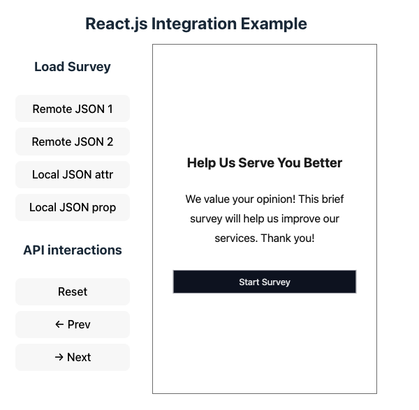

Integrating SurveyCompo survey component in a React.js project involves a few steps:

1. Add the SurveyCompo component JavaScript to the HTML page template.
2. If your project uses TypeScript, declare the SurveyCompo component type.
3. Use the survey component in your React component as you would with any other HTML element.

### Adding SurveyCompo Component JavaScript

Include the script tag in the HTML page (typically `index.html`) header.

```html linenums="1" hl_lines="8"
<!DOCTYPE html>
<html lang="en">
  <head>
    <meta charset="UTF-8" />
    <link rel="icon" type="image/png" href="/logo.png" />
    <meta name="viewport" content="width=device-width, initial-scale=1.0" />
    <title>SurveyCompo React.js Integration Example</title>
    <script async src="https://tag.surveycompo.com/v1.js"></script>
  </head>
  <body>
    <div id="root"></div>
    <script type="module" src="/src/main.tsx"></script>
  </body>
</html>
```

### Declaring the SurveyCompo Component Type

For TypeScript projects, add component type declarations. Create a `types.d.ts` file in the project root directory and declare the SurveyCompo component type.

```typescript
// types.d.ts
import * as React from "react"

interface SurveyCompoAttributes
  extends React.DetailedHTMLProps<
    React.HTMLAttributes<HTMLElement>,
    HTMLElement
  > {
  src?: string | unknown
  class?: string
  ref?: unknown
  onchange?: unknown
  onload?: unknown
  cache?: "memory" | "localstorage"
}

declare global {
  namespace JSX {
    interface IntrinsicElements {
      "survey-compo": SurveyCompoAttributes
    }
  }
}
```

## Using the Survey Component

To use the SurveyCompo component in a React component, create a new component and use the `survey-compo` element.

```typescript linenums="1" hl_lines="72"
import { useEffect, useRef, useState } from "react"
import "./App.css"
import localExample from "./example.json"

function App() {
  const surveys: Record<string, unknown> = {
    survey1:
      "https://raw.githubusercontent.com/SurveyCompo/examples/main/examples/inputs/source.json",
    survey2:
      "https://raw.githubusercontent.com/SurveyCompo/examples/main/examples/style/source.json",
    local: JSON.stringify(localExample)
  }

  const [sourceName, setSourceName] = useState("survey1")

  const surveySource = surveys[sourceName]
  const surveyElement = useRef<{
    src: unknown
    api: { reset: () => void; goNext: () => void; goPrev: () => void }
  }>()

  const onSurveyChange = (event: Event) => {
    const customEventDetail = (event as CustomEvent).detail
    console.log(customEventDetail)
  }

  const resetSurvey = () => {
    surveyElement.current?.api.reset()
  }
  const goNext = () => {
    surveyElement.current?.api.goNext()
  }
  const goPrev = () => {
    surveyElement.current?.api.goPrev()
  }

  const setDataToInstance = () => {
    if (surveyElement.current) {
      surveyElement.current.src = localExample
    }
  }

  useEffect(() => {
    window.addEventListener("surveychange", onSurveyChange)
    return () => {
      window.removeEventListener("surveychange", onSurveyChange)
    }
  }, [sourceName, onSurveyChange])

  return (
    <>
      <h1 className="title">React.js Integration Example</h1>
      <div className="layout">
        <div className="button-group">
          <h3>Load Survey</h3>
          <button onClick={() => setSourceName("survey1")}>
            Remote JSON 1
          </button>
          <button onClick={() => setSourceName("survey2")}>
            Remote JSON 2
          </button>
          <button onClick={() => setSourceName("local")}>
            Local JSON attr
          </button>
          <button onClick={() => setDataToInstance()}>Local JSON prop</button>
          <h3>API interactions</h3>
          <button onClick={() => resetSurvey()}>Reset</button>
          <button onClick={() => goPrev()}> &#8592; Prev</button>
          <button onClick={() => goNext()}> &#8594; Next</button>
        </div>
        <div className="survey-container">
          <survey-compo ref={surveyElement} cache="memory" src={surveySource} />
        </div>
      </div>
    </>
  )
}

export default App
```

## Example

You can refer to the following example repository for a working example of SurveyCompo React.js integration. This example demonstrates how to load a survey from remote and local JSON files and interact with the survey component using the API. [:material-github:{.right-icon} View source on GitHub](https://github.com/SurveyCompo/example-react-js){:target="\_blank" .small-text}

{: .center .md .embedded}
