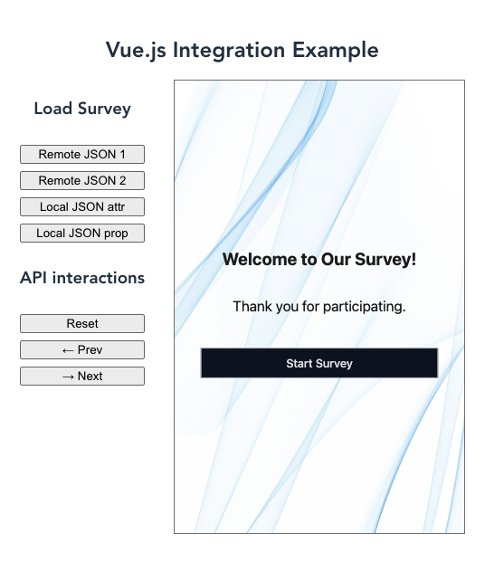

Integrating SurveyCompo survey component in a Vue.js project involves a few steps:

1. Add the SurveyCompo component JavaScript to the HTML template.
2. Skipping component resolution for custom elements.
3. Use the survey component in your Vue component as you would with any other HTML element.

### Adding SurveyCompo Component JavaScript

Include the script tag in the HTML page (typically `index.html`) header.

```html linenums="1" hl_lines="9"
<!DOCTYPE html>
<html lang="">

<head>
  <meta charset="utf-8">
  <meta http-equiv="X-UA-Compatible" content="IE=edge">
  <meta name="viewport" content="width=device-width,initial-scale=1.0">
  <link rel="icon" href="<%= BASE_URL %>favicon.ico">
  <script async src="https://tag.surveycompo.com/v1.js"></script>
  <title>
    <%= htmlWebpackPlugin.options.title %>
  </title>
</head>

<body>
  <div id="app"></div>
  <!-- built files will be auto injected -->
</body>

</html>
```

### Skipping Component Resolution

By default, Vue will attempt to resolve a non-native HTML tag as a registered Vue component before falling back to rendering it as a custom element. This will cause Vue to emit a "failed to resolve component" warning during development. To let Vue know that certain elements should be treated as custom elements and skip component resolution, we can specify the [compilerOptions.isCustomElement](https://vuejs.org/api/application#app-config-compileroptions) option.


```javascript linenums="1" hl_lines="10-13"
const { defineConfig } = require('@vue/cli-service')
module.exports = defineConfig({
  transpileDependencies: true,
  chainWebpack: config => {
    config.module
      .rule('vue')
      .use('vue-loader')
      .tap(options => ({
        ...options,
        compilerOptions: {
          // treat survey-compo tag as custom element
          isCustomElement: tag => tag === 'survey-compo'
        }
      }))
 }})

```

Depends how  your Vue project is set up, you may need to set the `isCustomElement` option in a different way. For more details, refer to the [Vue documentation](https://vuejs.org/guide/extras/web-components).


### Using the Survey Component

You can now use `survey-compo` element anywhere in your component templates.

```vue linenums="1" hl_lines="18"
// SurveyExample.vue
<template>
  <div class="main">
    <h1 class="title">Vue.js Integration Example</h1>
    <div class="layout">
      <div class="button-group">
        <h3>Load Survey</h3>
        <button @click="setSurvey('survey1')">Remote JSON 1</button>
        <button @click="setSurvey('survey2')">Remote JSON 2</button>
        <button @click="setLocalSurveyByAttr()" >Local JSON attr</button>
        <button @click="setLocalSurveyByProp()" >Local JSON prop</button>
        <h3>API interactions</h3>
        <button @click="reset()">Reset</button>
        <button @click="goPrev()"> &#8592; Prev</button>
        <button @click="goNext()"> &#8594; Next</button>
      </div>
      <div class="survey-container">
        <survey-compo ref="surveycompo" cache="memory" :src="surveySource" />
      </div>
    </div>
  </div>
</template>

<script>
import {exampleJSON} from './example'
const surveys = {
  survey1: 'https://raw.githubusercontent.com/SurveyCompo/examples/main/examples/inputs/source.json',
  survey2: 'https://raw.githubusercontent.com/SurveyCompo/examples/main/examples/style/source.json',
  local: JSON.stringify(exampleJSON),
};
export default {
  name: 'SurveyExample',
  data() {
    return {
      surveySource: 'https://raw.githubusercontent.com/SurveyCompo/examples/main/examples/basic/source.json',
      memory: true
    }
  },
  methods: {
    setSurvey(surveyName) {
      this.surveySource = surveys[surveyName];
    },
    setLocalSurveyByAttr() {
      this.surveySource = JSON.stringify(exampleJSON);
    },
    setLocalSurveyByProp() {
      this.$refs.surveycompo.src = exampleJSON;
    },
    reset() {
      this.$refs.surveycompo.api.reset();
    },
    goNext() {
      this.$refs.surveycompo.api.goNext();
    },
    goPrev() {
      this.$refs.surveycompo.api.goPrev();
    },
  }
}
</script>

<!-- Add "scoped" attribute to limit CSS to this component only -->
<style scoped>
.main {
  max-width: 1280px;
  margin: 0 auto;
  padding: 2rem;
  text-align: center;
}

.layout {
  display: flex;
  flex-direction: row;
  margin: 0 auto;
  gap: 2rem;
  width: fit-content;
}

.title {
  font-size: 1.5rem;
  margin-bottom: 1rem;
}

.button-group {
  display: flex;
  gap: 0.5rem;
  flex-direction: column;
}

.survey-container {
  border: 1px solid gray;
  width: 320px;
  height: 500px;
  margin-bottom: 1rem;
}

</style>

```

## Example

You can refer to the following example repository for a working example of SurveyCompo Vue.js integration. This example demonstrates how to load a survey from remote and local JSON files and interact with the survey component using the API. [:material-github:{.right-icon} View source on GitHub](https://github.com/SurveyCompo/example-vue-js){:target="\_blank" .small-text}

{: .center .md .embedded}
