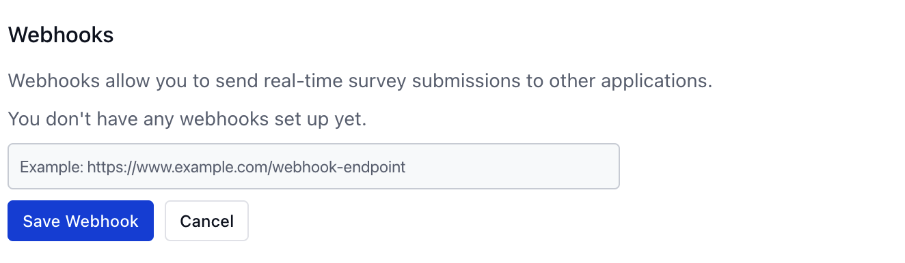
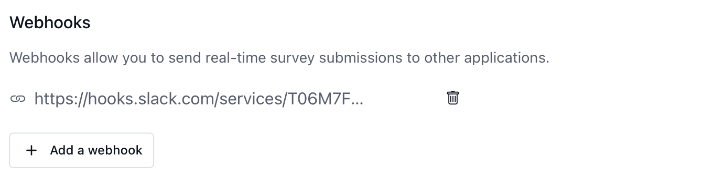

Webhooks are a method for your application to receive real-time notifications when a survey submission event occurs. SurveyCompo sends a `POST` request to the specified webhook URL with the survey response data in the request body.

!!! note "Note"

    Webhooks only function when you choose to send all survey events to SurveyCompo.

### Webhook Requests

SurveyCompo will retry the request up to five times in case of network errors. It is your responsibility to handle the webhook requests and ensure that the data is processed correctly and securely.

The request body contains the survey response data in JSON format.

| Fields     | Description                                         |
|------------|-----------------------------------------------------|
| `teamId`   | Your team ID                                        |
| `sessionId`| Survey session ID. You can use this to uniquely identify a survey session. |
| `surveyId` | Survey ID                                           |
| `startTs`  | Timestamp when the survey started (i.e., when the first page was loaded) |
| `completeTs`| Timestamp when the survey was completed (i.e., when the last page was finished) |
| `initTs`   | Timestamp when the survey was initialized (i.e., when the start screen was shown) |
| `finalTs`  | Timestamp when the survey was finalized (i.e., when the complete screen button was clicked) |
| `variables`| Custom variables set, if any                        |
| `inputs`   | An array of survey inputs with responded values     |

Each input response has the following fields:

| Fields     | Description                                         |
|------------|-----------------------------------------------------|
| `id`       | Input ID                                            |
| `group`    | An optional group name assigned to the input        |
| `customRef`| Custom reference assigned to the input, if set      |
| `value`    | Value selected or entered by the respondent         |

### Setting up Webhooks

To set up a webhook for a survey, visit the survey settings page and add the webhook URL.

{: .center .md .embedded}

### A Slack Example

Here is an example of a webhook that sends survey responses to a Slack channel. Learn more about [sending messages to Slack using incoming webhook](https://api.slack.com/messaging/webhooks).

{: .center .md .embedded}

SurveyCompo detects the Slack webhook and applies basic formatting to post a message to the target Slack channel with the response data.
