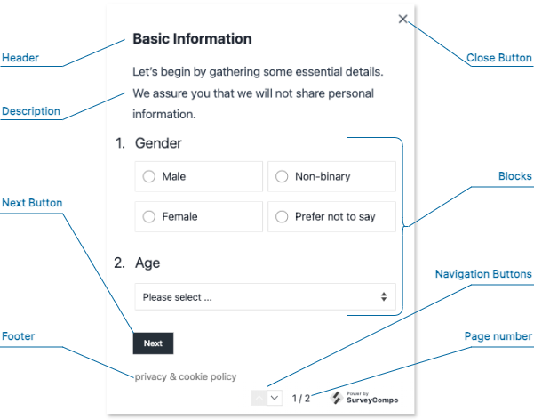

# Pages

Pages are the backbone of your SurveyCompo surveys. They contain your survey questions, guide user progress, and offer versatile customization options. Let's explore their structure and features.


## Page Structure

A page can include the following optional elements:


{: .center}

- **Header**: A dedicated area at the top for titles or instructions.

- **Description**: Provides more context about the page's purpose or offers additional instructions for the user.

- **Blocks**: The fundamental building blocks of your survey questions. A page can contain multiple blocks, each typically representing one question. (See the 'Blocks' section for a detailed breakdown.)

- **Footer**:  Use this for additional information, navigation, or legal statements.

- **Next Button**:  Allows users to progress to the following page. Clicking "Next" also triggers validation of the inputs on the current page.


## Page Layout

To customize the arrangement of your page elements, SurveyCompo offers the following settings:

- `vCentered`: Vertically center elements. The default is `true`.
- `hCentered`: Horizontally center elements. The default is `false`.

## Customization with HTML


Enhance headers, descriptions, and footers with custom HTML syntax for:

- **Rich Formatting**: Control fonts, colors, text size, emphasis (bold, italics), and more.
- **Embed Media**: Integrate images, videos, or audio clips to enhance your questions.
- **Interactive Elements**:  Add buttons, links, or other interactive components directly within a page.

SurveyCompo uses specific 'html' keys for custom content:

- `htmlHeader`
- `htmlDescription`
- `htmlFooter`

## Branching/Skipping Logic

Use the `visibleIf` setting to conditionally show or hide pages based on survey responses. This is key for creating adaptive surveys that tailor the experience to the user's input.

!!! note "Note"

    Details on visibility logic will be covered in subsequent sections.


## Page Randomization

Prevent response bias by shuffling the order of pages. SurveyCompo's `randomizedWithinGroup` setting allows for randomization of all or selected pages. (More on randomization in the following section.)


## The Page Data Model

The following code example demonstrates how a page integrates into the survey JSON data model. [:material-github:{.right-icon} view source](https://github.com/SurveyCompo/examples/blob/main/examples/anatomy/source.json)


```json linenums="1" hl_lines="5-11"
{
    "name": "My Survey",
    "startScreens": [ /* ... */ ],
    "pages": [
      {
        "header": "Basic Information",
        "htmlDescription": "<p>Let’s begin by gathering some essential details. <br />We assure you that we will not share personal information.</p>",
        "htmlFooter": "<p class='footnote'><a href=''>privacy</a> & <a href=''>cookie policy<a></p>",
        "blocks": [ /* ... */ ],
        "nextButtonLabel": "Next"
      },
      /* ... */
    ],
    "completeScreens": [ /* ... */ ],
    "abortScreens": [ /* ... */ ]
}
```
