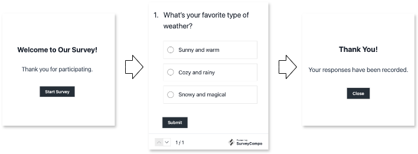

# Overview

SurveyCompo offers a powerful and flexible way to design surveys through its data model written in JSON. This section will introduce you to the top-level components that make up a survey in SurveyCompo.

## Survey Structure

At the top level, a SurveyCompo survey consists of the following key elements:

**Start Screen (Optional)**

:   This screen allows you to display introductory information or instructions before users begin the survey.

**One or More Survey Pages**

:   These pages contain the core questions and data collection elements of your survey.

    Each page is built from one or more **blocks**.  Think of blocks as the building blocks of your questions. They act as containers that house the actual data collection elements, known as **input** controls.  SurveyCompo offers a wide range of user-friendly input controls, including common options like text boxes, radio buttons, and even specialized elements like Likert scales and matrix questions.


**End Screen (Optional)**

:   This screen can be used to display a completion message, thank respondents, or provide further instructions.

    SurveyCompo offers two customizable end screens to manage your survey flow. **Completion screens** thank respondents and provide further instructions after successful submission, while **abort screens** display upon disqualification,  informing users when they don't meet survey criteria.

## The user flow

{: .center}

Imagine a user journey through the survey:

1. The user sees an optional **Start Screen** introducing the survey or providing instructions.
1. They proceed to the first **Survey Page** containing questions or data collection elements.
1. They navigate through subsequent **Survey Pages** (there can be one or more) by answering questions or completing tasks.
1. At any point, the user might encounter a disqualification based on their responses or other conditions. If so, they are directed to the **Abort Screen**.
1. If the user successfully completes all survey pages, they are presented with the **Completion Screen**, which might offer a thank you message, further instructions, or a link to additional resources.

## The Survey data model

Now that you've explored the major building blocks of a SurveyCompo survey - screens, pages, blocks, and inputs - let's dive into how these elements translate into the world of code. The magic happens through **JSON (JavaScript Object Notation)**. JSON is a lightweight and human-readable format that acts like a blueprint for your survey.

Think of it this way: just like building blocks come together to form a structure, JSON uses key-value pairs to represent the different components and their properties within your survey. Each key acts as a label, while the value defines the specific details of that element.

By understanding the JSON structure, you can easily create, modify, and manage your surveys. Don't worry, the format is designed to be easy to understand, even for those without coding experience.

The following example showcases how components translate into code so far. While we've omitted some details for brevity, this example should give you a solid foundation for understanding the core structure.

```json
{
    "name": "My Survey",
    "startScreens": [
       ...
    ],
    "pages": [
       {
         "blocks": [
            {
                "inputs": [...]
            },
            ...
       },
       ...
    ],
    "completeScreens": [
       ...
    ],
    "abortScreens": [
       ...
    ]
}
```

!!! info "Info"

    Why are `startScreens`, `completeScreens` and `abortScreens` defined as arrays?  SurveyCompo allows you to include multiple start screens and completion screens within a single survey. This flexibility empowers you to create different introduction points or tailor endings based on user responses. We'll explore the detailed composition of screens in the next section.
