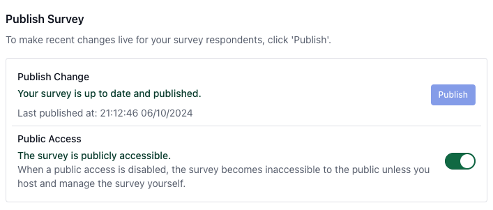
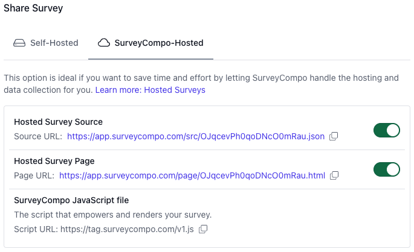
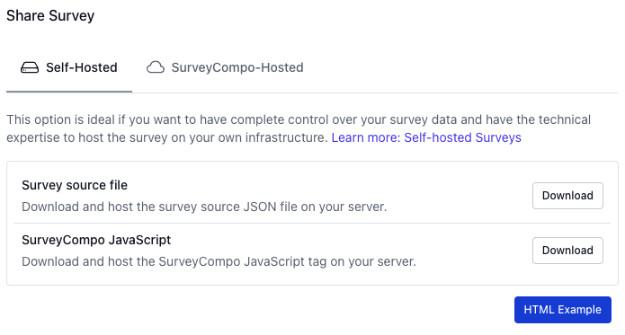

## Publishing Surveys

Congratulations! You have created a survey and are ready to publish and share it with your target audience.

Publishing a survey involves finalizing your edits to the survey JSON model and creating a version of the JSON file ready to feed in to the SurveyCompo web component for presentation. During this process, SurveyCompo assigns a unique survey ID and a signature hash to the published JSON model. The survey ID uniquely identifies the survey, and the signature hash ensures the integrity of the JSON data.

If you make any changes to a survey after publishing it, you will need to publish the survey again to make the changes available to your audience.

For users with a paid subscription plan, there's an option to remove SurveyCompo branding from the survey, which can be enabled during publishing.

{: .center .embedded}

!!! note "Note"

    Publishing a survey is not mandatory if you decide to host and collect survey data yourself and do not wish to remove the SurveyCompo branding. You can host and serve the JSON file from your own server. In this case, you are responsible for managing data collection and storage. SurveyCompo does not collect or store any survey data in this scenario.

## Sharing Surveys

Sharing a survey involves making it available to your audience so they can respond.

There are three major aspects involved in making this work:

1. The survey JSON file;
1. The JavaScript library file that defines the SurveyCompo Web Component;
1. A data collection service that gathers and stores the survey responses collected by the SurveyCompo Web Component.

Depending on how much control you want over the survey data and how you want to present the survey to your audience, there are a few options to share a survey:

### Let SurveyCompo Handle Everything

Allow SurveyCompo to host the survey for you. SurveyCompo provides a unique page for each survey, ready to be shared and collect responses. This is the easiest way to share a survey. You can share the survey page link with your audience and start collecting responses.

{: .center .md}

### Manage Some Tasks Yourself

You might want more control over the survey data and how the survey is presented to your audience by choosing to do one or more of the following:

- Host the survey JSON file on your own server;
- Host the SurveyCompo web component JavaScript file on your own server;
- Integrate the SurveyCompo web component into your website or application;
- Collect survey responses and performance data using your preferred server-side technology.

SurveyCompo provides downloads for the survey JSON file and the SurveyCompo web component JavaScript file. You can download and host them on your server.

{: .center .md}

For collecting survey responses and performance data, you can use SurveyCompo Events.
For more details on collecting responses using survey Events, refer to the [Survey Events](/integration/#events) section in our documentation.
