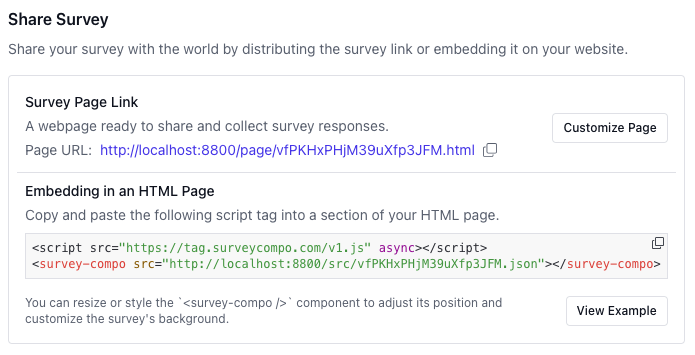
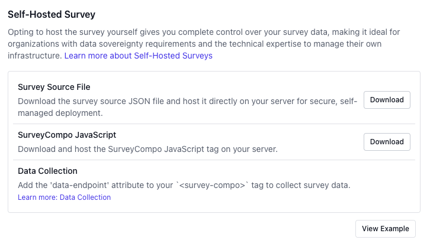

## Publishing Surveys

Congratulations! You have created a survey and are ready to publish and share it with your target audience.

SurveyCompo provides a one-click button for publishing surveys. During this process, SurveyCompo consolidates all pending edits since the last publish, generates a new version of the survey JSON model with a unique survey ID and a signature hash.

If you make any changes to a survey after publishing it, you will need to publish the survey again to make the changes available to your audience.

Published surveys are publicly accessible and can be shared with your audience. If you need to pause a survey or keep it private for self-hosting and data collection, you can disable public access.

{: .center .embedded .md}

## Sharing Surveys

Sharing a survey involves making it available to your audience so they can respond.
SurveyCompo provides the following options for sharing a survey.

1. Share a survey with a unique URL
1. Embed the survey on your web page

{: .center .md}

### Share a survey with a unique URL

SurveyCompo provides a dedicated, unique page for each survey by default, making it easy to share and start collecting responses immediately. Simply share the survey link with your audience—through email, for instance, and responses will begin populating in real time. You can also customize the survey page by setting the background color, adding a page header or footer, and adjusting other display options to match your brand's style.

### Embed the survey on your web page

To embed the survey on your HTML page, simply copy and paste the embed code provided by SurveyCompo. This lets you display the survey within any section or block on your page. You can style the survey with CSS to align with your design, adjusting colors, fonts, and layout. Additionally, you can control its visibility with JavaScript, showing or hiding it in a modal, popup, or slide-in panel as needed.

## Hosting surveys yourself

SurveyCompo offers an option to host surveys and collect responses on your own server.

To set up self-hosting, follow these steps:

- Host the survey JSON file on your own server.
- Host the SurveyCompo web component JavaScript file on your server.
- Integrate the SurveyCompo web component into your website or application.
- Collect survey responses and performance data using your preferred server-side technology.

{: .center .md}

You can download both the survey JSON file and the SurveyCompo JavaScript library and host them on your server.

For collecting survey responses and performance data, you can also use **SurveyCompo Events**. For more details on collecting survey data, refer to the [Survey Events](/integration/event-and-api/) and [Data Collection](/integration/data-collection) documentation.

!!! note "Note"

    Collecting survey responses with self-hosted surveys requires a Premium Plan or higher. For more details, please refer to the [Pricing page](https://www.surveycompo.com/pricing).
