# Tutorial - Build Your Survey

Welcome to this Getting Started Tutorial !

In this tutorial, we'll build a Product Satisfaction Survey using SurveyCompo. This survey is perfect for creating a feedback loop with your customers to understand their needs and preferences. We'll cover the basics of creating a survey, adding logic, and using advanced features to tailor the survey experience.


## Building a Product Satisfaction Survey

The survey commences with a welcome screen and concludes with a thank you message. To gather demographic data, we will inquire about age and preferred contact method. Additionally, we will ask participants to indicate how they became aware of our product or service. Finally, the survey will assess product satisfaction through a rating scale and open-ended feedback questions. Participants who are under the age of 18 will be disqualified from completing the survey.


Let's take a look at the questions we'll be turning into an interactive survey:

**About You**

- Question 1: Please enter your age
- Question 2: What is your preferred method of contact?
- Question 3: How did you hear about us?

**Product Satisfaction**

- Question 4: Overall, how satisfied are you with our product?
- Question 5: What do you like most about our product? (if satisfied)
- Question 6: What could be improved about our product? (if not satisfied)


<!-- todo: add screen shot and links to source code -->

Let's Get Started!


!!! tip  "Tip"

    If you don't have a SurveyCompo account, register for a free one at SurveyCompo: [https://www.surveycompo.com/](https://www.surveycompo.com/).
    Once you have registered, you can log in to the SurveyCompo Portal and start creating surveys.


## The SurveyCompo Survey Builder

The SurveyCompo Survey Builder is a powerful tool for creating and managing your surveys. Whether you're a seasoned JSON expert or prefer visual tools, our builder offers flexibility and ease of use.


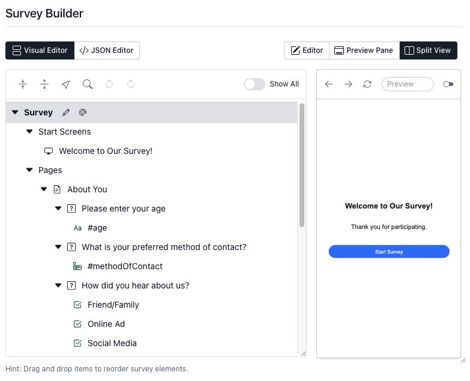{: .center .embedded}

**Key Features**:

- **Code Like a Pro**: Write and edit your survey definitions directly in JSON within a rich editor that offers auto-formatting, code hints, and validation.
- **Visual Tools**: No coding? No problem! Use our intuitive visual building tools. Access it through the toolbar and create your survey using familiar form controls. The visual tools automatically generate the corresponding JSON code.
- **Live Preview**: See your survey take shape in real-time as you update your JSON code.
- **Survey Templates**: Start quickly with our selection of ready-made survey templates for common use cases.
- **Import/Export**:  Take your work with you! Easily upload existing JSON survey sources or download your creation for offline use.

As a registered SurveyCompo user, you'll find the Survey Builder easily accessible at [https://app.surveycompo.com/surveys](https://app.surveycompo.com/surveys).

The following sections of this tutorial will dive into the JSON data model used to define surveys in SurveyCompo. We won't cover the Survey Builder's visual interface in detail.  While the Survey Builder is a powerful tool for creating surveys, understanding the JSON data model gives you direct control and flexibility over your survey design.

!!! tip  "Do you know?"

    You don't have to register a SurveyCompo account and use the Survey Builder to create surveys.
    You can also create a survey JSON source file using your favorite text editor. The Survey Builder is a convenient tool for creating and managing surveys, but it's not the only way to use SurveyCompo.

## Creating a New Survey

To create a new survey, click the `New Survey` button in the SurveyCompo [Portal](https://app.surveycompo.com). You can then create a new survey from scratch or choose from a selection of survey templates. For this tutorial, we'll create a new survey from scratch.


A minimal survey JSON source looks like this:

```json
{
  "name": "Product Satisfaction Survey",
}
```

The survey JSON source is a structured document that defines the survey's questions, answers, and logic. The JSON source is the foundation of your survey and is used to render the survey in the Survey Builder. A `name` is required for the survey JSON source, and it's the only required property. The `name` is displayed in the SurveyCompo Portal and helps you identify your survey.

Let's start by adding the start screen.

## Adding the Start Screen

The welcome screen is the first screen participants see when they start the survey. It provides an introduction to the survey and sets the stage for the questions to follow.

Here's the JSON source with a welcome screen:

```json
{
  "name": "Product Satisfaction Survey",
  "startScreens": [
    {
      "header": "Welcome to Our Survey!",
      "description": "Thank you for participating.",
      "okButtonLabel": "Start Survey"
    }
  ]
}
```

The welcome screen JSON source includes the following properties:

- `header`: The header of the welcome screen.
- `description`: The description or message displayed on the welcome screen.
- `okButtonLabel`: The text displayed on the button that participants click to start the survey.

The `startScreens` property is an array that can contain multiple screens. If there are multiple screens, one of them is randomly selected as the start screen when the survey is loaded. In this case, we have only one screen.

!!! info  "Info"

    For a full list of screen properties, see the [Screen](/data-model/#screen) documentation.

Let's add the welcome screen to our survey JSON source and preview it in the Survey Builder.

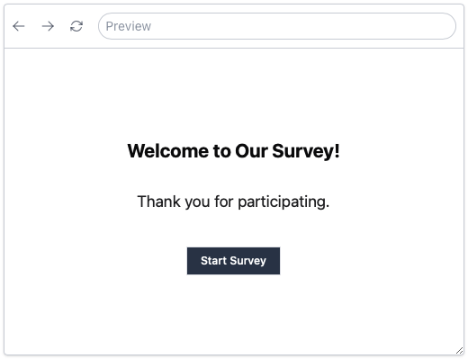{: .center}


## Adding the First Page

The first page of the survey will ask participants to enter their age. We'll use a text input field for this question.

Here's the JSON source with the first page:

```json
{
  "name": "Product Satisfaction Survey",
  "startScreens": [ /* ... */ ],
  "pages": [
       {
      "header": "About You",
      "blocks": [
        {
          "title": "Please enter your age",
          "inputs": [
            {
              "type": "TEXT",
              "textInputType": "NUMBER"
            }
          ]
        },
        {
          "title": "What is your preferred method of contact?",
          "inputs": [
            {
              "type": "DROPDOWN",
              "hint": "Please select",
              "dropdownInputOptions":  ["Email", "Phone", "Text Message"]
            }
          ]
        },
        {
          "title": "How did you hear about us?",
          "inputs": [
            {
              "type": "CHECKBOX",
              "label":  "Friend/Family"
            },
            {
              "type": "CHECKBOX",
              "label": "Online Ad"
            },
            {
              "type": "CHECKBOX",
              "label":  "Social Media"

            },
            {
              "type": "CHECKBOX",
              "label":  "Search Engine"
            },
            {
              "type": "CHECKBOX_TEXT",
              "label":  "Others"
            }
          ]
        }
      ]
    }
  ]
}
```

The first page JSON source includes the following properties:

- `header`: The header of the page.
- `blocks`: An array of 3 blocks that contain questions or content. Each block represents a section of the page.

Each block of the page includes the following properties:

- `title`: The title of the block. This is the question text.
- `inputs`: An array of input fields.

The 'Age' question input includes the following properties:

- `type`: The type of input field. In this case, it's a text input field.
- `textInputType`: The type of text input. In this case, it's a number input.

The 'method of contact' question input includes the following properties:

- `type`: The type of input field. In this case, it's a dropdown input field.
- `hint`: The hint text displayed in the dropdown field.
- `dropdownInputOptions`: An array of options for the dropdown field.

The 'How did you hear about us?' question inputs include the following properties:

- `type`: The type of input field. In this case, it's a checkbox input field.
- `label`: The label or question text displayed with the input field.

Note that the last input field has the `type` of `CHECKBOX_TEXT`, and it includes a text input field for participants to enter additional information.

!!! tip  "Tip"

    The `type` and `textInputType` property values are case-insensitive. You can use uppercase, lowercase, or a combination of both. However, it is recommended to use UPPERCASE for consistency.

!!! info  "Info"

    The `type` property determines the type of input field displayed in the survey. SurveyCompo supports various input types, including text, radio buttons, checkboxes, dropdowns, and more. For a full list of input properties, see the [Input](/data-model/#input) documentation.


Let's add the first page to our survey JSON source and preview it in the Survey Builder.

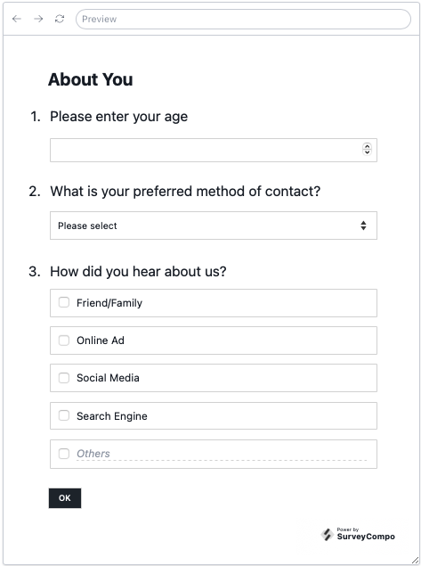{: .center}


## Adding the Second Page

The second page of the survey will ask participants to rate their overall satisfaction with our product. Here's the JSON source with the first page:

```json
{
  "name": "Product Satisfaction Survey",
  "startScreens": [ /* ... */ ],
  "pages": [
    /* ... First Page ... */
    {
      "header": "Product Satisfaction",
      "blocks": [
        {
          "title": "Overall, how satisfied are you with our product?",
          "inputs": [
            {
              "type": "LIKERT_SCALE",
              "likertInputPreset": "SATISFACTION_5"
            }
          ]
        },
        {
          "title": "What do you like most about our product?",
          "inputs": [
            {
              "type": "TEXTAREA",
              "hint": "Please share your thoughts"
            }
          ]
        },
        {
          "title": "What could be improved about our product?",
          "inputs": [
            {
              "type": "TEXTAREA",
              "hint": "Please share your thoughts"
            }
          ]
        }
      ],
      "nextButtonLabel": "Submit"
    }
  ]

}
```

The second page JSON source includes 3 blocks/questions:

- The `Overall satisfaction` question contains one input of type `LIKERT_SCALE`. While we can use `likertInputOptions` to specify the options, SurveyCompo offers a variety of presets to streamline your survey creation process. In this case, it's a 5-point satisfaction scale: `SATISFACTION_5`.

- The next two questions invite participants to provide open-ended feedback about what they like most and what could be improved about our product. Both questions use a `TEXTAREA` input field.

!!! tip  "Tip"

    The LIKERT_SCALE input functions as a collection of RADIO type inputs, making it an excellent tool for gathering feedback on a scale. SurveyCompo provides a variety of Likert scale presets, including SATISFACTION_5, LIKELIHOOD_5, and AGREEMENT_5, to facilitate your survey creation process. For a full list of Likert scale presets, see the [Input](/data-model/#input) documentation.

Let's preview the second page in the Survey Builder.

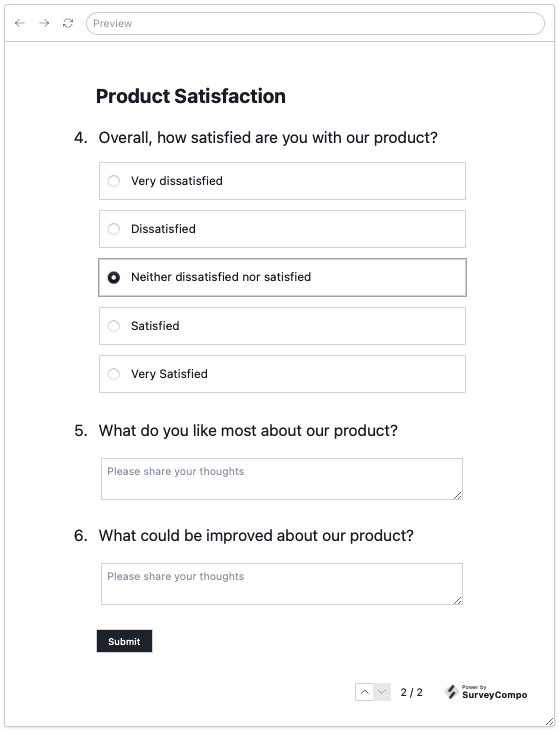{: .center}

The `nextButtonLabel` property is set to "Submit," which is the label displayed on the button that participants use to advance to the subsequent page. If this property is left unspecified, the button defaults to the label "Next". With the addition of multiple pages to our survey, a navigation bar now appears at the bottom of each page, enabling participants to move between pages. The navigation bar displays the page number and the total number of pages in the survey. The navigation bar can be hidden using the `uiShowNavigation` survey property. For more information, see the [Survey](/data-model/#survey) documentation.


## Adding a Complete Screen

The final screen of the survey is the complete screen. It provides a closing message to participants and confirms that their responses have been recorded. Here's the JSON source with the complete screen:

```json
{
  "name": "Product Satisfaction Survey",
  "startScreens": [ /* ... */ ],
  "pages": [ /* ... */ ],
  "completeScreens": [
    {
      "header": "Thank You!",
      "description": "Your feedback is greatly appreciated.",
      "okButtonLabel": "Close"
    }
  ]
}
```

Let's preview the complete screen in the Survey Builder.

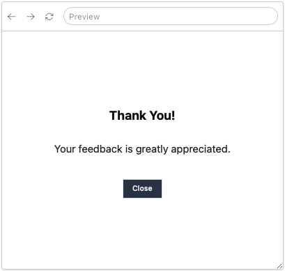{: .center}


## Randomization

SurveyCompo supports randomization of questions and answer options. Randomization is a powerful tool for reducing bias and ensuring that participants receive a unique survey experience. You can randomize pages, blocks, and inputs. For more information on randomization, see the [Randomization](/advanced/#randomization) documentation.

In this tutorial, you will add randomization to the 'How did you hear about us?' question. The inputs will be randomized to prevent order bias.

``` json
{
  "name": "Product Satisfaction Survey",
  "startScreens": [ /* ... */ ],
  "pages": [
    {
      "header": "Product Satisfaction",
      "blocks": [
        /* ... first block ...  */
        /* ... second block ... */
        {
          "title": "How did you hear about us?",
          "inputs": [
            {
              "type": "CHECKBOX",
              "randomWithinGroup": "something",
              "label":  "Friend/Family"
            },
            {
              "type": "CHECKBOX",
              "randomWithinGroup": "something",
              "label": "Online Ad"
            },
            {
              "type": "CHECKBOX",
              "randomWithinGroup": "something",
              "label":  "Social Media"

            },
            {
              "type": "CHECKBOX",
              "randomWithinGroup": "something",
              "label":  "Search Engine"
            },
            {
              "type": "CHECKBOX_TEXT",
              "label":  "Others"
            }
          ]
        }
      ]
    }
    /* ... Second Page ... */
  ],
  "completeScreens": [ /* ... */ ]
}
```

The `randomWithinGroup` attribute serves as a powerful tool for introducing randomization within your survey. By assigning the same `randomWithinGroup` string value to a group of inputs, you can shuffle their order while preserving the sequence of other questions.

In our example, all inputs, excluding the final 'Others' input, are grouped for randomization. The 'Others' input remains ungrouped to ensure its consistent placement at the end of the list, irrespective of the randomization of preceding inputs.

It's important to note that the randomization occurs upon survey load and remains consistent throughout the survey duration. To observe the varying order resulting from randomization, simply refresh the page.

Let's preview the randomization in the Survey Builder:


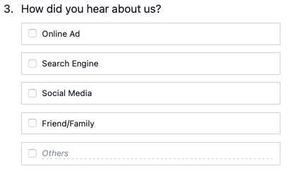{: .center}

## Disqualification

SurveyCompo supports disqualification logic to exclude participants who do not meet specific criteria. Disqualification logic is a powerful tool for ensuring that only eligible participants complete your survey. You can disqualify participants based on their inputs, and variables. For more information on disqualification, see the [Disqualification](/advanced/#disqualification) documentation.

In this tutorial, you will add disqualification logic to the survey to exclude participants under the age of 18 from completing the survey. The disqualification logic will be applied to the 'Age' input and an Abort Screen.

``` json linenums="1" hl_lines="13 24-31"
{
  "name": "Product Satisfaction Survey",
  "startScreens": [ /* ... */ ],
  "pages": [
    {
      "header": "About You",
      "blocks": [
        {
          "title": "Please enter your age",
          "inputs": [
            {
              "type": "TEXT",
              "id": "age",
              "textInputType": "NUMBER"
            }
          ]
        }
        /* ... other blocks ... */
      ]
    },
    /* ... other pages ... */
  ],
  "completeScreens": [ /* ... */ ],
  "abortScreens": [
    {
      "header": "Disqualified",
      "description": "You must be 18 years or older to participate.",
      "okButtonLabel": "Close",
      "visibleIf": "#age < 18"
    }
  ]
}
```

The 'Age' input includes an `id` property to uniquely identify the input. The `id` property is used to reference the input in the disqualification logic. The `visibleIf` property in the Abort Screen specifies the condition for disqualification. In this case, the participant is disqualified if the value of the 'Age' input is less than 18.

SurveyCompo supports multiple abort screens, allowing you to create custom disqualification messages for different scenarios. The abort screen is displayed when the disqualification condition is met, and the participant is excluded from completing the survey. If
multiple abort screens are defined, the most specific screen is displayed based on the disqualification condition.

!!! tip  "Tip"

    The `visibleIf` attribute is a powerful tool for creating conditional logic in your survey. By referencing input values and/or external variables, you can dynamically show or hide pages, screens, blocks, and inputs based on participant responses. For more information on conditional logic, see the [Conditional Logic](/advanced/#conditional-logic) documentation.

Let's preview the disqualification logic in the Survey Builder:

{: .center}

## Piping

SurveyCompo supports piping to personalize survey questions and responses based on participant inputs. Piping is a powerful tool for creating dynamic surveys that adapt to individual participants. You can pipe input values, and external variables. For more information on piping, see the [Piping](/advanced/#piping) documentation.

In this tutorial, you will add piping to the survey to personalize the 'Disqualified Screen' to include participant's age.

``` json linenums="1" hl_lines="13-18"
{
  "name": "Product Satisfaction Survey",
  /*  ... */
  "abortScreens": [
    {
      "header": "Disqualified",
      "description": "You must be 18 years or older to participate. You are currently {#age} years old.",
      "okButtonLabel": "Close",
      "visibleIf": "#age < 18"
    }
  ]
}
```

The `description` property of the Abort Screen includes the `{#age}` placeholder, which references the 'Age' input value using the id of `age`. When the participant is disqualified, the placeholder is replaced with the participant's age. Piping allows you to personalize the survey experience and provide participants with relevant information based on their responses.

Let's preview the piping in the Survey Builder and enter the age value of 11 to see the personalized message:

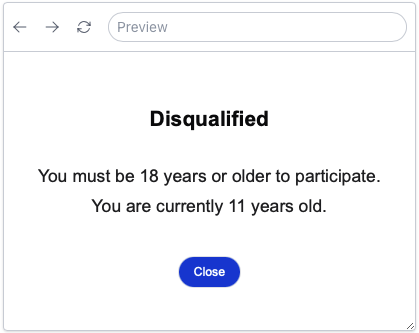{: .center}

## Validation

SurveyCompo supports input validation to ensure that participants provide accurate and complete responses. Validation is a powerful tool for improving data quality and reducing errors in your survey. You can validate inputs based on their type, format, and value. For more information on validation, see the [Validation](/advanced/#validation) documentation.

This tutorial guides you through the process of enhancing your survey with validation rules. You'll ensure the 'Age' input accepts only numerical entries within the 0-100 range. Additionally, you'll make the 'Method of Contact' question mandatory and enforce a minimum selection of two options for the 'How did you hear about us?' question.

The updated JSON source includes the following validation rules:

``` json linenums="1" hl_lines="15-29 44-49 59-65"
{
  "name": "Product Satisfaction Survey",
  "startScreens": [ /* ... */ ],
  "pages": [
    {
      "header": "About You",
      "blocks": [
        {
          "title": "Please enter your age",
          "inputs": [
            {
              "type": "TEXT",
              "id": "age",
              "textInputType": "NUMBER",
              "validations": [
                {
                  "type": "INTEGER",
                  "message": "Please enter your age in whole number"
                },
                {
                  "type": "MAX_VALUE",
                  "value": 100,
                  "message": "Please enter a valid age"
                },
                {
                  "type": "REQUIRED",
                  "message": "Please enter your age"
                }
              ]
            }
          ]
        },
        {
          "title": "What is your preferred method of contact?",
          "inputs": [
            {
              "type": "DROPDOWN",
              "hint": "Please select",
              "dropdownInputOptions": [
                "Email",
                "Phone",
                "Text Message"
              ],
              "validations": [
                {
                  "type": "REQUIRED",
                  "message": "Please select your preferred method of contact"
                }
              ]
            }
          ]
        },
        {
          "title": "How did you hear about us?",
          "subtitle": "Please select 2",
          "inputs": [
            /** ... **/
          ],
          "validations": [
            {
              "type": "MIN_SELECTION",
              "value": 2,
              "message": "Please select 2 or more options"
            }
          ]
        }
      ]
    },
    /* ... other pages ... */
  ],
  "completeScreens": [ /* ... */ ],
  "abortScreens": [ /* ... */ ]
}
```

The 'Age' input includes three validation rules:

- `INTEGER`: Ensures the input value is an integer.
- `MAX_VALUE`: Specifies the maximum value allowed for the input.
- `REQUIRED`: Makes the input mandatory.

The 'Method of Contact' question includes a `REQUIRED` validation rule to ensure that participants select a preferred contact method.

The 'How did you hear about us?' block includes a `MIN_SELECTION` validation rule to enforce a minimum selection of two options.

When a block includes a 'required' validation rule, surveyCompo automatically appends an asterisk ('*') after the block index number.


!!! tip  "Tip"

    Please note that setting `textInputType` to `NUMBER` for the 'Age' input does not inherently restrict the input to numerical values. While this setting enhances the user interface with features like a number keyboard and a number stepper, it does not enforce validation. Consequently, it remains necessary to apply the `INTEGER` validation rule to ensure the input format and value range are as desired. For an in-depth exploration of input types and their corresponding validation rules, consult the [Validation](/data-model/#validation) section of our documentation.

This tutorial illustrates how to apply one or more validation rules to inputs or blocks. By implementing these rules, you can effectively navigate participants through the survey, ensuring they provide precise and valid responses.

Now, let's examine the functionality of these validation rules within the Survey Builder:


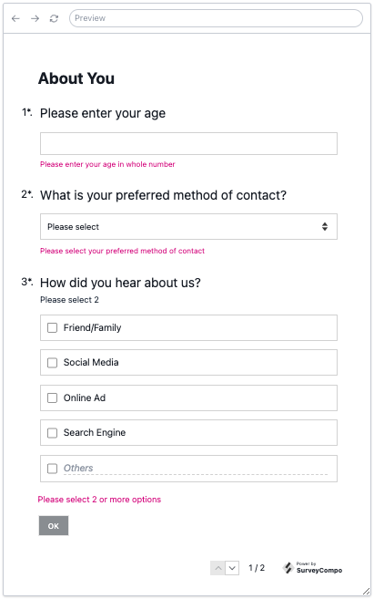{: .center}


## Conditional Logic

SurveyCompo supports conditional logic to show/hide specific pages, blocks and inputs based on participant responses or external variables. Conditional logic is a powerful tool for tailoring the survey experience to individual participants and ensuring they receive relevant questions. For more information on conditional logic, see the [Conditional Logic](/advanced/#condition) documentation.

In this tutorial, we will incorporate conditional logic into the survey. This will present a follow-up question tailored to the participant's response to the 'Overall satisfaction' question. If a participant expresses dissatisfaction, we will prompt them for additional feedback on potential product improvements. Conversely, if a participant is satisfied, we will ask them to share what they appreciate most about the product.

Below is the revised JSON source code for the second page of the survey:

``` json linenums="1" hl_lines="15 28-32 43-47"
{
  "name": "Product Satisfaction Survey",
  "startScreens": [ /* ... */ ],
  "pages": [
    /* ... first page ... */
    {
      "header": "Product Satisfaction",
      "nextButtonLabel": "Submit",
      "blocks": [
        {
          "title": "Overall, how satisfied are you with our product?",
          "inputs": [
            {
              "type": "LIKERT_SCALE",
              "id": "satisfaction",
              "likertInputPreset": "SATISFACTION_5"
            }
          ]
        },
        {
          "title": "What do you like most about our product?",
          "inputs": [
            {
              "type": "TEXTAREA",
              "hint": "Please share your thoughts"
            }
          ],
          "visibleIf": {
            "$or": [
              "#satisfaction == Very satisfied",
              "#satisfaction == Satisfied"
            ]
          }
        },
        {
          "title": "What could be improved about our product?",
          "inputs": [
            {
              "type": "TEXTAREA",
              "hint": "Please share your thoughts"
            }
          ],
          "visibleIf": {
            "$or": [
              "#satisfaction == Very dissatisfied",
              "#satisfaction == Dissatisfied"
            ]
          }
        }
      ]
    }
  ],
  "completeScreens": [ /* ... */ ],
  "abortScreens": [ /* ... */ ]
}
```

We first assign an 'id' (`satisfaction`) to the "how satisfied are you" input. We then use this id to define the `visibleIf` conditional logic. The `visibleIf` property is a powerful tool for creating conditional logic in your survey. By referencing input values and/or external variables, you can dynamically show or hide pages, screens, blocks, and inputs based on participant responses.

SurveyCompo uses Condition Expression to defined the visible condition.  In this case, we use the `$or` operator to display the 'What do you like most about our product?' block if the participant selects 'Very satisfied' or 'Satisfied' on the 'Overall satisfaction' question. Conversely, we display the 'What could be improved about our product?' block if the participant selects 'Very dissatisfied' or 'Dissatisfied'. If the participant selects 'Neither dissatisfied nor satisfied', the follow-up questions are hidden.

The Condition Expression accommodates a wide range of operators, such as `$and`, `$or`, `$not`, `>=`, `<=`, `==`, `!=`, `>`, and `<`. For a comprehensive list of operators and their application, refer to the [Conditional Logic](/advanced/#condition) section in our documentation.

To enhance user experience, you might consider segregating the conditional blocks onto a separate page. However, for the purpose of this tutorial, we will retain them on the same page to illustrate how conditional logic can dynamically display or conceal blocks based on participant responses.

Let's preview the conditional logic in the Survey Builder:

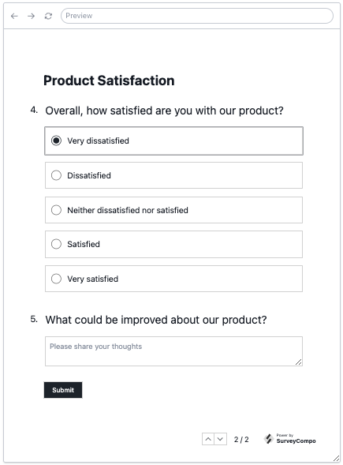{: .center}

## Customization

SurveyCompo offers a variety of customization options to tailor the survey experience to your brand and audience. You can customize the survey fonts, colors, layout and more.

In this tutorial, we will customize the survey theme to use a custom color palette and default radius for buttons, boxes and inputs. We will also change the font family to Arial.

``` json linenums="1" hl_lines="3-8"
{
  "name": "Product Satisfaction Survey",
  "theme": {
    "primaryColor": "#3b82f6",
    "fontFamily": "Arial, sans-serif",
    "defaultRadius": "2em",
    "textareaRadius": "1em"
  },
  "startScreens": [ /* ... */ ],
  "pages": [ /* ... */ ],
  "completeScreens": [ /* ... */ ],
  "abortScreens": [ /* ... */ ]
}
```
By default, SurveyCompo generates the color palette based on the `primaryColor` provided. The generated colors are used for  buttons, boxes, and inputs.  The `fontFamily` property sets the font family for all text elements in the survey. The `defaultRadius` property defines the default radius for buttons, boxes, and inputs. The `textareaRadius` property sets the radius for Textareas inputs, if not specified, the `defaultRadius` is used for Textareas.

Let's preview the customization in the Survey Builder:

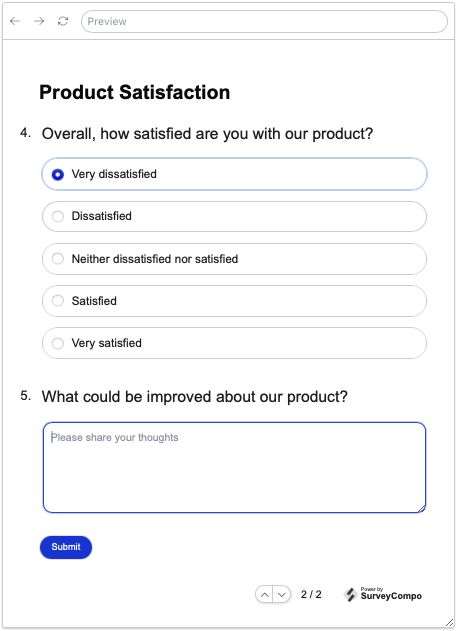{: .center}

Customization doesn't stop at colors and fonts. SurveyCompo offers a variety of customization options to tailor the survey experience to your brand and audience. You can customize the survey fonts, colors, layout, and more. For a comprehensive list of customization options, refer to the [Customization](/advanced/#customization) section in our documentation.


## HTML Text

SurveyCompo supports HTML text in the survey to enhance the visual appeal and readability of your questions and descriptions. HTML text allows you to format text, add images, and embed videos in your survey. For more information on HTML text, see the [HTML Text](/advanced/#html-text) documentation.

In this tutorial, we will add HTML text to the Page footer to provide a link to the privacy policy.

``` json linenums="1" hl_lines="11"
{
  "name": "Product Satisfaction Survey",
  "theme": { /* ... */ },
  "startScreens": [ /* ... */ ],
  "pages": [
    /* ... first page ... */
    {
      "header": "Product Satisfaction",
      "nextButtonLabel": "Submit",
      "blocks": [ /* ... */ ],
      "htmlFooter": "<p>By submitting this survey, you agree to our <a href='https://www.surveycompo.com/privacy-policy'>Privacy Policy</a></p>"
    }
  ],
  "completeScreens": [ /* ... */ ],
  "abortScreens": [ /* ... */ ]
}
```

The `htmlFooter` property allows you to add HTML text to the footer of the page. You can use HTML tags to format text, add links, and embed media. In this example, we use an anchor tag to create a hyperlink to the privacy policy.

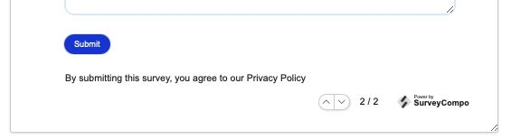{: .center}

However, a problem arises as the link in the footer does not resemble a typical hyperlink. Usually, hyperlinks are distinguished by a different color and often underlined for clarity.

SurveyCompo does not include default styles for custom HTML elements. However, you can utilize inline styles or CSS to personalize these elements. In this instance, we'll employ CSS to enhance the appearance of the hyperlink.


``` json linenums="1" hl_lines="4 12"
{
  "name": "Product Satisfaction Survey",
  "theme": { /* ... */ },
  "css": ".my-link { color: #3b82f6; text-decoration: underline; }",
  "startScreens": [ /* ... */ ],
  "pages": [
    /* ... first page ... */
    {
      "header": "Product Satisfaction",
      "nextButtonLabel": "Submit",
      "blocks": [ /* ... */ ],
      "htmlFooter": "<p>By submitting this survey, you agree to our <a href='https://www.surveycompo.com/privacy-policy' class='my-link'>Privacy Policy</a></p>"
    }
  ],
  "completeScreens": [ /* ... */ ],
  "abortScreens": [ /* ... */ ]
}
```

We first assign a class name `my-link` to the hyperlink in the `htmlFooter` property. We then define the CSS class in the `css` property. The CSS class specifies the hyperlink's color and text decoration. By applying the CSS class to the hyperlink, we can customize its appearance.

Let's preview the customized hyperlink in the Survey Builder:

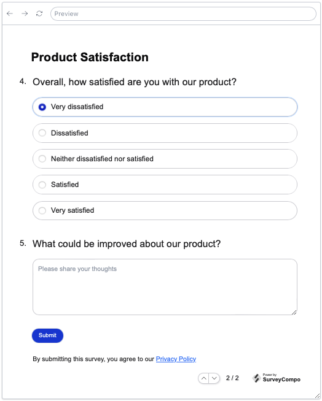{: .center}

It looks better now! HTML text applies to various elements in the survey. You can use HTML in Screens, Pages and Blocks.  For more information on HTML text, see the [HTML Text](/advanced/#html-text) documentation.


## Using Templates

We've recently appended an HTML footer to the survey's final page. But what if we want this footer to appear on all pages? Manually adding identical HTML to each page can be tedious and susceptible to errors. Fortunately, SurveyCompo provides a solution: templates. Templates are reusable components that allow you to define common elements, such as headers, footers, and styles, and apply them across multiple pages or blocks. For more information on templates, see the [Templates](/advanced/#templates) documentation.

In this tutorial, we will create a template for the HTML footer and apply it to all pages in the survey.

``` json linenums="1" hl_lines="5-8 13 18"
{
  "name": "Product Satisfaction Survey",
  "theme": { /* ... */ },
  "css": ".my-link { color: #3b82f6; text-decoration: underline; }",
  "pageTemplates": [{
    "templateName": "pageWithFooter",
    "htmlFooter": "<p>By submitting this survey, you agree to our <a href='https://www.surveycompo.com/privacy-policy' class='my-link'>Privacy Policy</a></p>"
  }],
  "startScreens": [ /* ... */ ],
  "pages": [
    {
      "header": "Product Satisfaction",
      "template": "pageWithFooter",
      "blocks": [ /* ... */ ],
    },
    {
      "header": "Product Satisfaction",
      "template": "pageWithFooter",
      "nextButtonLabel": "Submit",
      "blocks": [ /* ... */ ],
    }
  ],
  "completeScreens": [ /* ... */ ],
  "abortScreens": [ /* ... */ ]
}
```

We've successfully created a page template named `pageWithFooter` that includes an HTML footer. This template has been applied to both survey pages. Remember, if necessary, you can override the properties of the template on any specific page.

When previewed in the survey builder, the same footer will be visible on both pages.


## Adding Input Identifiers

We're close to finalizing the survey's look and feel. However, there's one last step to make the survey functional. When we collect survey responses, SurveyCompo reports respondents' inputs and selections for each survey input. For instance, if a respondent enters '18' for the age input, we expect to collect data like "input: 'age', value: 18". Hence, it's important to assign identifiers to each input in the survey.

These identifiers are useful for referencing inputs in conditional logic, validation rules, and piping. We've already added the `id` attribute to the 'Age' input on the survey's first page for implementing the 'disqualifying' logic. The input's `id` will also be reported along with its values upon survey completion. Without this identifier, it would be challenging to determine which input the value corresponds to.


``` json linenums="1" hl_lines="13"
{
  "name": "Product Satisfaction Survey",
  "startScreens": [ /* ... */ ],
  "pages": [
    {
      "header": "About You",
      "blocks": [
        {
          "title": "Please enter your age",
          "inputs": [
            {
              "type": "TEXT",
              "id": "age",
              "textInputType": "NUMBER"
            }
          ]
        }
        /* ... other blocks ... */
      ]
    },
    /* ... other pages ... */
  ]
}
```

SurveyCompo supports these optional input identifiers:

- `id`: An optional identifier for the input. The `id` attribute is useful for referencing inputs in conditional logic, validation rules, and piping.
- `name`: A name for the input, primarily used for human reference. If `id` is not provided, the `name` will be used to generate a value for `id`
- `customRef`: An optional custom reference for the input. The `customRef` attribute is useful for referencing inputs in external systems.

While input identifiers are primarily for reporting purposes, SurveyCompo doesn't require them to be unique. However, it's crucial for the `id` attribute to be unique when used for conditional logic, validation rules, and piping.

Let's add some identifiers to the survey inputs in our survey:


``` json linenums="1" hl_lines="13 23 34 44 40 46 52 58"
{
  "name": "Product Satisfaction Survey",
  "startScreens": [ /* ... */ ],
  "pages": [
    {
      "header": "About You",
      "blocks": [
        {
          "title": "Please enter your age",
          "inputs": [
            {
              "type": "TEXT",
              "id": "age",
              "textInputType": "NUMBER"
            }
          ]
        },
        {
          "title": "What is your preferred method of contact?",
          "inputs": [
            {
              "type": "DROPDOWN",
              "id": "contactMethod",
              "hint": "Please select",
              "dropdownInputOptions": ["Email", "Phone", "Text Message"]
            }
          ]
        },
        {
          "title": "How did you hear about us?",
          "inputs": [
            {
              "type": "CHECKBOX",
              "id": "friendFamily",
              "randomWithinGroup": "something",
              "label": "Friend/Family"
            },
            {
              "type": "CHECKBOX",
              "id": "onlineAd",
              "randomWithinGroup": "something",
              "label": "Online Ad"
            },
            {
              "type": "CHECKBOX",
              "id": "socialMedia",
              "randomWithinGroup": "something",
              "label": "Social Media"
            },
            {
              "type": "CHECKBOX",
              "id": "searchEngine",
              "randomWithinGroup": "something",
              "label": "Search Engine"
            },
            {
              "type": "CHECKBOX_TEXT",
              "id": "others",
              "label": "Others"
            }
          ]
        }
      ]
    },
    /* ... other pages ... */
  ],
  "completeScreens": [ /* ... */ ],
  "abortScreens": [ /* ... */ ]
}
```
Identifiers can also be assigned to blocks and pages. These identifiers will then be accessible within SurveyCompo events. For a more detailed understanding of survey events, refer to the [Events](/advanced/#events) section in our documentation.


## What's Next?

Congratulations! You've successfully created a survey in SurveyCompo using the JSON data model. You've learned how to define survey questions, answers, logic, and customization options. You've also explored advanced features like randomization, disqualification, validation, conditional logic, and HTML text. By mastering these concepts, you can create engaging and interactive surveys that provide valuable insights.

In the next part of the tutorial, we'll explore how to distribute your survey, collect responses, and analyze the results. We'll also cover advanced topics like survey events, webhooks, and integrations. Stay tuned for more exciting content!

