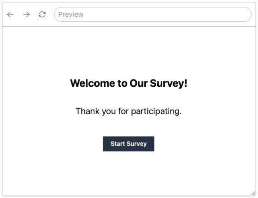
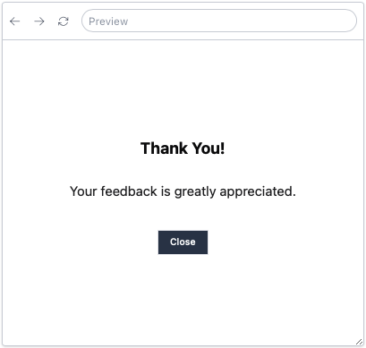
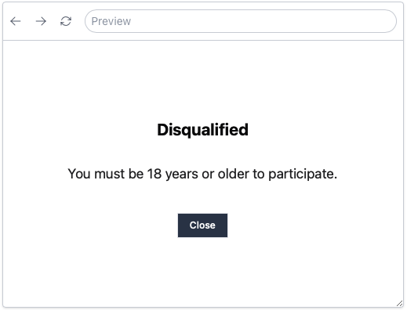

Welcome to the Getting Started Tutorial!

In this tutorial, we'll build a Product Satisfaction Survey using SurveyCompo. This survey is perfect for creating a feedback loop with your customers to understand their needs and preferences. We'll cover the basics of creating a survey, adding logic, and using advanced features to tailor the survey experience.

In this tutorial, we will guide you through creating a Product Satisfaction Survey using SurveyCompo. This survey is designed to establish a feedback loop with your customers to better understand their needs and preferences. We will cover the basics of survey creation, logic implementation, and application of advanced features to customize the survey experience.

## The Product Satisfaction Survey

The survey begins with a welcome screen and concludes with a thank-you message. To collect demographic data, we will ask participants about their age and preferred method of contact. Additionally, participants will indicate how they learned about our product or service. The survey will also evaluate product satisfaction using a rating scale and open-ended feedback questions. Participants under the age of 18 will not be eligible to complete the survey.

Let's review the questions that will be incorporated into our interactive survey:

**About You**

- Question 1: Please enter your age
- Question 2: What is your preferred method of contact?
- Question 3: How did you hear about us?

**Product Satisfaction**

- Question 4: Overall, how satisfied are you with our product?
- Question 5: What do you like most about our product? (if satisfied)
- Question 6: What could be improved about our product? (if not satisfied)

<!-- todo: add screen shot and links to source code -->

!!! tip "Tip"

    If you do not have a SurveyCompo account yet, you can register for a free one at [SurveyCompo](https://www.surveycompo.com/).
    Once registered, you can log in to the SurveyCompo Portal and begin creating surveys.

## SurveyCompo Survey Builder

The SurveyCompo Survey Builder is a robust tool for creating and managing surveys. Whether you prefer working with JSON directly or using visual tools, our builder offers flexibility and ease of use.

{: .center .embedded}

**Key Features**:

- **Intuitive Visual Editor**: Create surveys with a user-friendly drag-and-drop interface that requires no coding skills.
- **Advanced JSON Editing**: Write and edit survey definitions directly in JSON with a rich editor that includes auto-formatting, code hints, and validation.
- **Real-time Preview**: See your survey evolve in real-time as you make changes to the JSON code.
- **Survey Templates**: Kickstart your survey creation with our library of pre-made survey templates tailored for common scenarios.
- **Theme Editor**: Create custom themes to personalize the look and feel of your survey with custom colors, fonts, and styles.
- **Import/Export**: Seamlessly import existing JSON survey files or export your creation for offline usage.

As a registered user of SurveyCompo, you can access the Survey Builder easily at [https://app.surveycompo.com/surveys](https://app.surveycompo.com/surveys).

The upcoming sections of this tutorial will explore the JSON data model employed for defining surveys within SurveyCompo. We will focus less on the detailed visual interface of the Survey Builder. While the Survey Builder offers robust capabilities for survey creation, understanding the JSON data model provides direct control and enhances flexibility in survey design.

## Creating a New Survey

To create a new survey, click the `New Survey` button on the SurveyCompo [Portal](https://app.surveycompo.com). From there, you can either start a survey from scratch or choose from a list of pre-designed templates. For this tutorial, we will begin by creating a new survey from scratch.

A minimal survey JSON source looks like this:

```json
{
  "name": "Product Satisfaction Survey"
}
```

The survey JSON source is a structured document that defines the survey's questions, answers, and logic. This JSON source serves as the foundation for your survey and is used to construct the survey within the Survey Builder. The `name` field is mandatory in the survey JSON source and is the only required key. It appears in the SurveyCompo Portal and helps you identify your survey.

Let's proceed by adding the start screen.

## Adding the Start Screen

The start screen is the initial screen participants encounter upon beginning the survey. It introduces the survey and prepares participants for the upcoming questions.

Here's an example of the JSON source with a start screen:

```json
{
  "name": "Product Satisfaction Survey",
  "startScreens": [
    {
      "header": "Welcome to Our Survey!",
      "description": "Thank you for participating.",
      "okButtonLabel": "Start Survey"
    }
  ]
}
```

The JSON source for the welcome screen includes the following keys:

- `header`: The header displayed on the welcome screen.
- `description`: The message or description shown on the welcome screen.
- `okButtonLabel`: The text on the button that participants click to start the survey.

The `startScreens` key is an array that can contain multiple screens. If there are multiple screens, one of them is randomly selected as the start screen when the survey loads. However, in this case, we only have one screen.

!!! info "Info"

    For a comprehensive list of screen properties, refer to the [Screen](/data-models/screen/) documentation.

Let's integrate the welcome screen into our survey JSON source and preview it in the Survey Builder.

{: .center .small}

## Adding the First Page

The first page of the survey will request participants to input their age. We will add a text input field for this question.

Here's the JSON source for the first page:

```json linenums="1" hl_lines="7-55"
{
  "name": "Product Satisfaction Survey",
  "startScreens": [
    /* ... */
  ],
  "pages": [
    {
      "header": "About You",
      "blocks": [
        {
          "title": "Please enter your age",
          "inputs": [
            {
              "type": "TEXT",
              "textInputType": "NUMBER"
            }
          ]
        },
        {
          "title": "What is your preferred method of contact?",
          "inputs": [
            {
              "type": "DROPDOWN",
              "hint": "Please select",
              "dropdownInputOptions": ["Email", "Phone", "Text Message"]
            }
          ]
        },
        {
          "title": "How did you hear about us?",
          "inputs": [
            {
              "type": "CHECKBOX",
              "label": "Friend/Family"
            },
            {
              "type": "CHECKBOX",
              "label": "Online Ad"
            },
            {
              "type": "CHECKBOX",
              "label": "Social Media"
            },
            {
              "type": "CHECKBOX",
              "label": "Search Engine"
            },
            {
              "type": "CHECKBOX_TEXT",
              "label": "Others"
            }
          ]
        }
      ]
    }
  ]
}
```

The JSON source for the first page includes the following keys:

- `header`: The header of the page.
- `blocks`: An array containing 3 blocks, each representing a section of the page and containing questions or content.

Each block includes:

- `title`: The title of the block, which serves as the question text.
- `inputs`: An array of input fields within the block.

For the '**Age**' question input:

- `type`: Specifies it as a text input field.
- `textInputType`: Indicates it as a number input.

For the '**Method of Contact**' question input:

- `type`: Specifies it as a dropdown input field.
- `hint`: Provides hint text displayed within the dropdown.
- `dropdownInputOptions`: An array offering options for the dropdown.

For the '**How did you hear about us?**' question input:

- `type`: Specifies it as a checkbox input field.
- `label`: Displays the label or question text associated with the input field.

Note that the last input field uses `type` as `CHECKBOX_TEXT`, including a text input field for additional participant information.

!!! tip "Tip"

    The values of `type` and `textInputType` keys are case-insensitive. You can use uppercase, lowercase, or a mix of both. However, for consistency, it's recommended to use UPPERCASE.

!!! info "Info"

    The `type` key specifies the type of input field displayed within the survey. SurveyCompo supports various input types such as text, radio buttons, checkboxes, dropdowns, and more. For a complete list of input properties, refer to the [Input](/input-types/overview) documentation.

Let's add the first page into our survey JSON source and preview it in the Survey Builder.

{: .center .small }

## Adding the Second Page

The second page of the survey will prompt participants to rate their overall satisfaction with our product.

Here's the JSON source for the second page:

```json linenums="1" hl_lines="8-40"
{
  "name": "Product Satisfaction Survey",
  "startScreens": [
    /* ... */
  ],
  "pages": [
    /* ... First Page ... */
    {
      "header": "Product Satisfaction",
      "blocks": [
        {
          "title": "Overall, how satisfied are you with our product?",
          "inputs": [
            {
              "type": "LIKERT_SCALE",
              "likertInputPreset": "SATISFACTION"
            }
          ]
        },
        {
          "title": "What do you like most about our product?",
          "inputs": [
            {
              "type": "TEXTAREA",
              "hint": "Please share your thoughts"
            }
          ]
        },
        {
          "title": "What could be improved about our product?",
          "inputs": [
            {
              "type": "TEXTAREA",
              "hint": "Please share your thoughts"
            }
          ]
        }
      ],
      "nextButtonLabel": "Submit"
    }
  ]
}
```

The second page of the survey includes 3 blocks/questions:

- The `Overall satisfaction` question uses an input of type `LIKERT_SCALE`. Instead of specifying options directly with `likertInputOptions`, SurveyCompo provides presets to simplify survey creation. In this case, we use `likertInputPreset` to apply a 5-point satisfaction scale named `SATISFACTION`.

- The following two questions prompt participants to provide open-ended feedback on what they like most and what could be improved about our product.These questions use a `TEXTAREA` input field.

!!! info "Info"

    The `LIKERT_SCALE` input acts similarly to a collection of `RADIO` inputs, making it an effective tool for gathering feedback on a scale. SurveyCompo offers several Likert scale presets such as `SATISFACTION`, `LIKELIHOOD`, and `AGREEMENT` to simplify the process of creating surveys. For a comprehensive list of available Likert scale presets, refer to the [Likert Scale](/input-types/likert/) documentation.

Let's preview the second page in the Survey Builder.

{: .center .small}

The `nextButtonLabel` key is set as "Submit," serving as the label on the button participants use to proceed to the next page. If left unspecified, the default label is "Next". As multiple pages are added to the survey, a navigation bar appears at the bottom of each page. This bar allows participants to navigate between pages and displays the current page number alongside the total number of pages in the survey. To hide the navigation bar, use the `uiShowNavigation` survey key. For more details, refer to the [Survey Data Key](/data-models/survey/#survey-data-keys) documentation.

## Adding the Completion Screen

The final screen of the survey is the completion screen. It offers a closing message to participants and confirms the recording of their responses.

Here's the JSON source for the completion screen:

```json linenums="1" hl_lines="10-14"
{
  "name": "Product Satisfaction Survey",
  "startScreens": [
    /* ... */
  ],
  "pages": [
    /* ... */
  ],
  "completeScreens": [
    {
      "header": "Thank You!",
      "description": "Your feedback is greatly appreciated.",
      "okButtonLabel": "Close"
    }
  ]
}
```

Let's preview the complete screen in the Survey Builder.

{: .center .small}

## Randomization

SurveyCompo offers support for randomizing questions and answer options, a powerful feature that helps mitigate bias and provides each participant with a unique survey experience. You can apply randomization to pages, blocks, and inputs. For detailed information on implementing randomization, refer to the [Randomization](/advanced/randomization) documentation.

In this tutorial, we will add randomization for the 'How did you hear about us?' question. The inputs will be randomized to avoid any order bias.

```json linenums="1" hl_lines="17 22 27 32"
{
  "name": "Product Satisfaction Survey",
  "startScreens": [
    /* ... */
  ],
  "pages": [
    {
      "header": "Product Satisfaction",
      "blocks": [
        /* ... first block ...  */
        /* ... second block ... */
        {
          "title": "How did you hear about us?",
          "inputs": [
            {
              "type": "CHECKBOX",
              "randomWithinGroup": "something",
              "label": "Friend/Family"
            },
            {
              "type": "CHECKBOX",
              "randomWithinGroup": "something",
              "label": "Online Ad"
            },
            {
              "type": "CHECKBOX",
              "randomWithinGroup": "something",
              "label": "Social Media"
            },
            {
              "type": "CHECKBOX",
              "randomWithinGroup": "something",
              "label": "Search Engine"
            },
            {
              "type": "CHECKBOX_TEXT",
              "label": "Others"
            }
          ]
        }
      ]
    }
    /* ... Second Page ... */
  ],
  "completeScreens": [
    /* ... */
  ]
}
```

The `randomWithinGroup` key is a powerful feature for introducing randomization within your survey. By assigning the same `randomWithinGroup` string value to a group of inputs, you can shuffle their order while maintaining the sequence of other questions.

In our example, all inputs except the final 'Others' input are grouped for randomization. This ensures that the 'Others' input consistently appears at the end of the list, regardless of the randomization applied to the preceding inputs.

It's important to note that randomization occurs when the survey loads and remains consistent throughout the survey session. To see the effects of randomization, simply refresh the page.

Let's preview the randomization in the Survey Builder:

{: .center .small}

## Disqualification

SurveyCompo supports disqualification logic to exclude participants who do not meet specific criteria. This feature ensures that only eligible participants complete your survey. You can disqualify participants based on their inputs and variables. For detailed guidance on implementing disqualification logic, refer to the [Disqualification](/advanced/disqualification) documentation.

In this tutorial, we will integrate disqualification logic into the survey to exclude participants under the age of 18 from completing it. The disqualification logic will be applied to the 'Age' input and an Abort Screen.

```json linenums="1" hl_lines="15 30-33"
{
  "name": "Product Satisfaction Survey",
  "startScreens": [
    /* ... */
  ],
  "pages": [
    {
      "header": "About You",
      "blocks": [
        {
          "title": "Please enter your age",
          "inputs": [
            {
              "type": "TEXT",
              "id": "age",
              "textInputType": "NUMBER"
            }
          ]
        }
        /* ... other blocks ... */
      ]
    }
    /* ... other pages ... */
  ],
  "completeScreens": [
    /* ... */
  ],
  "abortScreens": [
    {
      "header": "Disqualified",
      "description": "You must be 18 years or older to participate.",
      "okButtonLabel": "Close",
      "visibleIf": "#age < 18"
    }
  ]
}
```

The 'Age' input is assigned an `id` key to uniquely identify it within the survey. This `id` is crucial for referencing the input in disqualification logic. The disqualification condition is defined using the `visibleIf` key in the Abort Screen. In this case, participants are disqualified if the value of the 'Age' input is less than 18.

SurveyCompo supports multiple abort screens, allowing you to create customized disqualification messages for different scenarios. The appropriate abort screen is displayed when the disqualification condition is met, ensuring participants understand why they are excluded from completing the survey.

!!! info "Info"

    The `visibleIf` key is used to implement powerful conditional logic in your survey. By referencing input values and external variables, you can dynamically control the visibility of pages, screens, blocks, and inputs based on participant responses. For detailed guidance on using conditional logic, refer to the [Conditional Logic](/advanced/conditional-logic) documentation.

Let's preview the disqualification logic in the Survey Builder:

{: .center .small}

## Piping

SurveyCompo supports piping to personalize survey questions and responses based on participant inputs. This feature enables the creation of dynamic surveys that adapt to individual participants by allowing the insertion of input values and external variables into survey content. For detailed guidance on implementing piping, refer to the [Piping](/advanced/piping/) documentation.

In this tutorial, we will incorporate piping into the survey to personalize the 'Disqualified Screen' with the participant's age.

```json linenums="1" hl_lines="7"
{
  "name": "Product Satisfaction Survey",
  /*  ... */
  "abortScreens": [
    {
      "header": "Disqualified",
      "description": "You must be 18 years or older to participate. You are currently {#age} years old.",
      "okButtonLabel": "Close",
      "visibleIf": "#age < 18"
    }
  ]
}
```

The `description` key of the Abort Screen includes the `{#age}` placeholder, which dynamically references the value of the 'Age' input using its unique identifier, `age`. When a participant is disqualified, this placeholder is replaced with the participant's actual age. Piping functionality enhances survey personalization by delivering relevant information based on participant responses.

Let's preview the piping feature in the Survey Builder and input an age value of 11 to observe the personalized message:

{: .center .small}

## Validation

SurveyCompo supports input validation to enhance data accuracy and minimize errors in your survey responses. This feature ensures that participants provide valid and complete information based on specified criteria such as input type, format, and value. For detailed guidance on implementing validation, refer to the [Validation](/advanced/validation) documentation.

This tutorial will walk you through the process of implementing validation rules to improve your survey. You'll configure the 'Age' input to accept only numerical entries within the 0-100 range. Additionally, you'll set the 'Method of Contact' question as mandatory and require participants to select at least two options for the 'How did you hear about us?' question.

The updated JSON source will include the following validation rules:

```json linenums="1" hl_lines="17-31 42-47 57-63"
{
  "name": "Product Satisfaction Survey",
  "startScreens": [
    /* ... */
  ],
  "pages": [
    {
      "header": "About You",
      "blocks": [
        {
          "title": "Please enter your age",
          "inputs": [
            {
              "type": "TEXT",
              "id": "age",
              "textInputType": "NUMBER",
              "validations": [
                {
                  "type": "INTEGER",
                  "message": "Please enter your age in whole number"
                },
                {
                  "type": "MAX_VALUE",
                  "value": 100,
                  "message": "Please enter a valid age"
                },
                {
                  "type": "REQUIRED",
                  "message": "Please enter your age"
                }
              ]
            }
          ]
        },
        {
          "title": "What is your preferred method of contact?",
          "inputs": [
            {
              "type": "DROPDOWN",
              "hint": "Please select",
              "dropdownInputOptions": ["Email", "Phone", "Text Message"],
              "validations": [
                {
                  "type": "REQUIRED",
                  "message": "Please select your preferred method of contact"
                }
              ]
            }
          ]
        },
        {
          "title": "How did you hear about us?",
          "subtitle": "Please select 2",
          "inputs": [
            /** ... **/
          ],
          "validations": [
            {
              "type": "MIN_SELECTION",
              "value": 2,
              "message": "Please select 2 or more options"
            }
          ]
        }
      ]
    }
    /* ... other pages ... */
  ],
  "completeScreens": [
    /* ... */
  ],
  "abortScreens": [
    /* ... */
  ]
}
```

The 'Age' input incorporates three essential validation rules:

- `INTEGER`: Ensures that the input value is an integer.
- `MAX_VALUE`: Specifies the maximum permissible value for the input.
- `REQUIRED`: Makes the input mandatory.

For the 'Method of Contact' question, a `REQUIRED` validation rule ensures that participants select a preferred contact method.

In the 'How did you hear about us?' block, a `MIN_SELECTION` validation rule enforces a minimum selection of two options.

When a block includes a 'required' validation rule, SurveyCompo automatically appends an asterisk ('\*') after the block index number to indicate its mandatory status.

!!! note "Note"

    Note that setting `textInputType` to `NUMBER` for the 'Age' input in SurveyCompo enhances the user interface with features like a number keyboard and stepper. However, this setting alone does not enforce numerical validation. Therefore, it's crucial to apply the `INTEGER` validation rule to ensure the correct input format and value range. For comprehensive details on input types and their associated validation rules, refer to the [Validation](/advanced/validation) section of our documentation.

Let's explore the functionality of these validation rules in action within the Survey Builder:

{: .center .small}

## Conditional Logic

SurveyCompo supports conditional logic to dynamically show or hide specific pages, blocks, and inputs based on participant responses or external variables. This feature allows for a personalized survey experience, ensuring participants receive relevant questions based on their previous answers. For detailed guidance on implementing conditional logic, refer to the [Conditional Logic](/advanced/conditional-logic) documentation.

In this tutorial, we will integrate conditional logic into the survey. Based on the participant's response to the 'Overall satisfaction' question, we will tailor the survey flow:

- If a participant expresses dissatisfaction, we will prompt them for additional feedback on potential product improvements.
- If a participant is satisfied, we will ask them to share what they appreciate most about the product.

Below is the updated JSON source code for the second page of the survey:

```json linenums="1" hl_lines="17 30-34 45-49"
{
  "name": "Product Satisfaction Survey",
  "startScreens": [
    /* ... */
  ],
  "pages": [
    /* ... first page ... */
    {
      "header": "Product Satisfaction",
      "nextButtonLabel": "Submit",
      "blocks": [
        {
          "title": "Overall, how satisfied are you with our product?",
          "inputs": [
            {
              "type": "LIKERT_SCALE",
              "id": "satisfaction",
              "likertInputPreset": "SATISFACTION"
            }
          ]
        },
        {
          "title": "What do you like most about our product?",
          "inputs": [
            {
              "type": "TEXTAREA",
              "hint": "Please share your thoughts"
            }
          ],
          "visibleIf": {
            "$or": [
              "#satisfaction == Very satisfied",
              "#satisfaction == Satisfied"
            ]
          }
        },
        {
          "title": "What could be improved about our product?",
          "inputs": [
            {
              "type": "TEXTAREA",
              "hint": "Please share your thoughts"
            }
          ],
          "visibleIf": {
            "$or": [
              "#satisfaction == Very dissatisfied",
              "#satisfaction == Dissatisfied"
            ]
          }
        }
      ]
    }
  ],
  "completeScreens": [
    /* ... */
  ],
  "abortScreens": [
    /* ... */
  ]
}
```

We assign an 'id' (`satisfaction`) to the "how satisfied are you" input. This 'id' is then used to define the `visibleIf` conditional logic, a powerful tool for creating dynamic survey experiences. By referencing input values and/or external variables, you can dynamically show or hide pages, screens, blocks, and inputs based on participant responses.

SurveyCompo uses Condition Expressions to define visibility conditions. In this case, we use the `$or` operator to display the 'What do you like most about our product?' block if the participant selects 'Very satisfied' or 'Satisfied' on the 'Overall satisfaction' question. Conversely, selecting 'Very dissatisfied' or 'Dissatisfied' will display the 'What could be improved about our product?' block. If the participant selects 'Neither dissatisfied nor satisfied', follow-up questions are hidden.

Condition Expressions support a variety of operators such as `$and`, `$or`, `$not`, `>=`, `<=`, `==`, `!=`, `>`, and `<`. For a comprehensive list of operators and their usage, refer to the [Conditional Logic](/advanced/conditional-logic) documentation.

For optimal user experience, consider organizing conditional blocks onto separate pages. However, for the purpose of this tutorial, we will keep them on the same page to demonstrate how conditional logic dynamically manages block visibility based on participant responses.

Let's preview the conditional logic in the Survey Builder:

{: .center .small}

## Customization with Theme

In this tutorial, we customize the survey theme to use a custom color palette and default radius for buttons, boxes, and inputs. Additionally, we change the font family to Arial.

```json linenums="1" hl_lines="3-8"
{
  "name": "Product Satisfaction Survey",
  "theme": {
    "primaryColor": "#3b82f6",
    "fontFamily": "Arial, sans-serif",
    "defaultRadius": "2em",
    "textareaRadius": "1em"
  },
  "startScreens": [
    /* ... */
  ],
  "pages": [
    /* ... */
  ],
  "completeScreens": [
    /* ... */
  ],
  "abortScreens": [
    /* ... */
  ]
}
```

By default, SurveyCompo generates a color palette based on the `primaryColor` provided. These colors are applied to buttons, boxes, and inputs throughout the survey. The `fontFamily` key sets the font family for all text elements. Additionally, the `defaultRadius` key defines the default corner radius for buttons, boxes, and inputs. If not specified, `textareaRadius` uses the `defaultRadius` for Textareas inputs.

Preview the customization in the Survey Builder:

{: .center .small}

SurveyCompo offers extensive customization beyond themes. You can customize surveys using custom CSS, HTML text, and different layout options to ensure they reflect your brand and engage your audience effectively. For comprehensive details on customization options, refer to the [Customization](/advanced/customization) section in our documentation.

## HTML Text

SurveyCompo supports HTML text within the survey to enhance the visual appeal and readability of your questions and descriptions. HTML text allows for formatting, adding images, and embedding videos. For details on using HTML text, refer to the [HTML Text](/customization/custom-html) documentation.

In this tutorial, we'll incorporate HTML text into the Page footer to include a link to the privacy policy.

```json linenums="1" hl_lines="17"
{
  "name": "Product Satisfaction Survey",
  "theme": {
    /* ... */
  },
  "startScreens": [
    /* ... */
  ],
  "pages": [
    /* ... first page ... */
    {
      "header": "Product Satisfaction",
      "nextButtonLabel": "Submit",
      "blocks": [
        /* ... */
      ],
      "htmlFooter": "<p>By submitting this survey, you agree to our <a href='https://www.surveycompo.com/privacy'>Privacy Policy</a></p>"
    }
  ],
  "completeScreens": [
    /* ... */
  ],
  "abortScreens": [
    /* ... */
  ]
}
```

The `htmlFooter` key allows you to incorporate HTML text into the footer of the page. This feature supports HTML tags for text formatting, adding links, and embedding media. In the following example, we use an anchor tag to create a hyperlink to the privacy policy.

{: .center .md}

However, a common issue arises where the link in the footer may not appear as a standard hyperlink. Typically, hyperlinks are distinguished by a different color and are often underlined for clarity.

SurveyCompo does not apply default styles to custom HTML elements. To enhance the appearance of the hyperlink, you can use inline styles or CSS customization.

```json linenums="1" hl_lines="6 18"
{
  "name": "Product Satisfaction Survey",
  "theme": {
    /* ... */
  },
  "css": ".my-link { color: #3b82f6; text-decoration: underline; }",
  "startScreens": [
    /* ... */
  ],
  "pages": [
    /* ... first page ... */
    {
      "header": "Product Satisfaction",
      "nextButtonLabel": "Submit",
      "blocks": [
        /* ... */
      ],
      "htmlFooter": "<p>By submitting this survey, you agree to our <a href='https://www.surveycompo.com/privacy' class='my-link'>Privacy Policy</a></p>"
    }
  ],
  "completeScreens": [
    /* ... */
  ],
  "abortScreens": [
    /* ... */
  ]
}
```

We assign the class name `my-link` to the hyperlink within the `htmlFooter` key. Next, we define the CSS class `my-link` in the `css` key to specify the hyperlink's color and text decoration. This customization allows us to enhance the appearance of the hyperlink.

Preview the customized hyperlink in the Survey Builder:

{: .center .small}

The use of HTML text extends to various elements within the survey, including Screens, Pages, and Blocks. For more details on incorporating HTML text, refer to the [HTML Text](/customization/custom-html) documentation.

## Using Templates

We've recently added an HTML footer to the final page of our survey. However, if we want this footer to appear on every page, manually duplicating the HTML across each page can be cumbersome and prone to errors. Luckily, SurveyCompo offers a solution: templates. Templates are reusable components designed for defining common elements like headers, footers, and styles, which can be applied consistently throughout your survey. For detailed guidance on using templates, refer to the [Templates](/advanced/templates) documentation.

In this tutorial, we'll create a template specifically for the HTML footer and apply it universally across all pages in the survey.

```json linenums="1" hl_lines="7-11 19 26"
{
  "name": "Product Satisfaction Survey",
  "theme": {
    /* ... */
  },
  "css": ".my-link { color: #3b82f6; text-decoration: underline; }",
  "pageTemplates": [
    {
      "templateName": "pageWithFooter",
      "htmlFooter": "<p>By submitting this survey, you agree to our <a href='https://www.surveycompo.com/privacy' class='my-link'>Privacy Policy</a></p>"
    }
  ],
  "startScreens": [
    /* ... */
  ],
  "pages": [
    {
      "header": "Product Satisfaction",
      "templateName": "pageWithFooter",
      "blocks": [
        /* ... */
      ]
    },
    {
      "header": "Product Satisfaction",
      "templateName": "pageWithFooter",
      "nextButtonLabel": "Submit",
      "blocks": [
        /* ... */
      ]
    }
  ],
  "completeScreens": [
    /* ... */
  ],
  "abortScreens": [
    /* ... */
  ]
}
```

We've successfully created a page template named `pageWithFooter` that incorporates an HTML footer. This template has been applied to both survey pages, ensuring consistency across the survey. You have the flexibility to override template properties on specific pages as needed.

When previewed in the survey builder, the HTML footer will be consistently visible on both pages where the template `pageWithFooter` is applied.

## Adding Input Identifiers

As we finalize the survey's appearance, it's crucial to ensure its functionality. When collecting survey responses, SurveyCompo records respondents' inputs and selections for each survey item. For example, if a respondent enters '18' for the age input, we expect data like `{input: 'age', value: 18}`. Therefore, assigning identifiers to each input in the survey is essential.

These identifiers are also used for referencing inputs in conditional logic, validation rules, and data piping. We've already introduced the `id` key to the 'Age' input on the survey's first page to implement disqualifying logic. The `id` ensures that the input's values are accurately reported upon survey completion. Without this identifier, determining which input corresponds to which value would be challenging.

```json linenums="1" hl_lines="15"
{
  "name": "Product Satisfaction Survey",
  "startScreens": [
    /* ... */
  ],
  "pages": [
    {
      "header": "About You",
      "blocks": [
        {
          "title": "Please enter your age",
          "inputs": [
            {
              "type": "TEXT",
              "id": "age",
              "textInputType": "NUMBER"
            }
          ]
        }
        /* ... other blocks ... */
      ]
    }
    /* ... other pages ... */
  ]
}
```

SurveyCompo supports several optional input identifiers:

- `id`: An optional identifier for the input, used for referencing in conditional logic, validation rules, and piping.
- `name`: A descriptive name for the input, primarily for human reference. If `id` is not provided, `name` is used to generate an `id` value.
- `customRef`: An optional custom reference for the input, helpful for referencing in external systems.

Let's proceed by adding identifiers to the inputs in our survey:

```json linenums="1" hl_lines="15 25 36 42 48 54 60"
{
  "name": "Product Satisfaction Survey",
  "startScreens": [
    /* ... */
  ],
  "pages": [
    {
      "header": "About You",
      "blocks": [
        {
          "title": "Please enter your age",
          "inputs": [
            {
              "type": "TEXT",
              "id": "age",
              "textInputType": "NUMBER"
            }
          ]
        },
        {
          "title": "What is your preferred method of contact?",
          "inputs": [
            {
              "type": "DROPDOWN",
              "id": "contactMethod",
              "hint": "Please select",
              "dropdownInputOptions": ["Email", "Phone", "Text Message"]
            }
          ]
        },
        {
          "title": "How did you hear about us?",
          "inputs": [
            {
              "type": "CHECKBOX",
              "id": "friendFamily",
              "randomWithinGroup": "something",
              "label": "Friend/Family"
            },
            {
              "type": "CHECKBOX",
              "id": "onlineAd",
              "randomWithinGroup": "something",
              "label": "Online Ad"
            },
            {
              "type": "CHECKBOX",
              "id": "socialMedia",
              "randomWithinGroup": "something",
              "label": "Social Media"
            },
            {
              "type": "CHECKBOX",
              "id": "searchEngine",
              "randomWithinGroup": "something",
              "label": "Search Engine"
            },
            {
              "type": "CHECKBOX_TEXT",
              "id": "others",
              "label": "Others"
            }
          ]
        }
      ]
    }
    /* ... other pages ... */
  ],
  "completeScreens": [
    /* ... */
  ],
  "abortScreens": [
    /* ... */
  ]
}
```

Identifiers can also be assigned to blocks and pages. These identifiers will then be accessible within SurveyCompo events. Events are triggered when participants interact with the survey, providing valuable insights into their behavior and responses. This is also how survey data is collected and analyzed.
For a more detailed understanding of survey events, refer to the [Events](/integration/event-and-api/) section in our documentation.

## What's Next?

Congratulations on successfully creating a survey in SurveyCompo using the JSON data model! You've learned how to define survey questions, answers, logic, and customization options. Additionally, you've explored advanced features such as randomization, disqualification, validation, conditional logic, and HTML text. Mastering these concepts enables you to build engaging and interactive surveys that yield valuable insights.

Feel free to preview the [survey](https://surveycompo.github.io/examples/examples/tutorial/index.html){:target="\_blank"} and explore its corresponding [source code](https://github.com/SurveyCompo/examples/tree/main/examples/tutorial){:target="\_blank"} on GitHub.

In the next part of the tutorial, we'll delve into distributing your survey, collecting responses, and analyzing results. We'll also cover advanced topics including survey events, webhooks, and integrations. Stay tuned for more exciting content!
