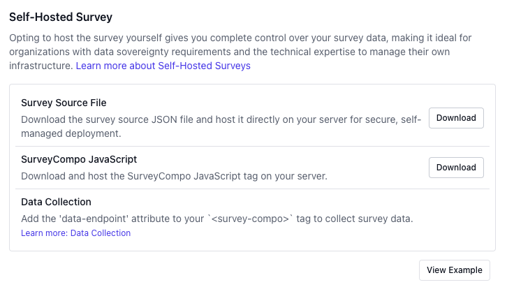

In our previous tutorial, we created a simple Product Satisfaction survey. In this guide, we’ll walk through how to publish and share the survey, collect responses, and analyze the data.

When your survey is ready, you can publish it to finalize the survey JSON model. If further edits are made, simply republish to update the survey for your audience.

SurveyCompo provides a one-click publish button that consolidates all pending edits, generating a new version of the survey JSON model with a unique survey ID and signature hash. The survey ID uniquely identifies each survey, while the signature hash verifies the integrity of the JSON data.

{: .center .md .sm}

### Sharing Your Survey with Respondents

SurveyCompo generates a unique survey page for each survey, allowing you to easily share it with respondents and begin collecting responses. Alternatively, you can embed the survey on your website, giving you complete control over its presentation to your audience. For more information, see the [Publish and Share documentation](/publish).

In this tutorial, we'll use the SurveyCompo-hosted survey page, where responses will be securely collected and stored on SurveyCompo's servers.

{: .center .md}

Here is the hosted page for the survey we created in the previous tutorial:

[https://app.surveycompo.com/page/ynU7y4b62qEVyVxcspE8.html](https://app.surveycompo.com/page/ynU7y4b62qEVyVxcspE8.html){:target="\_blank"}

## Survey Response Data

SurveyCompo provides a dashboard to view and export survey responses in real time, complete with performance metrics to help you analyze your data effectively.

{: .center .md}

## Conclusion

Congratulations! You've successfully created, published, and collected responses for your survey. In this tutorial, we covered different options for hosting and collecting survey data, as well as how to view and export responses using the SurveyCompo dashboard.
