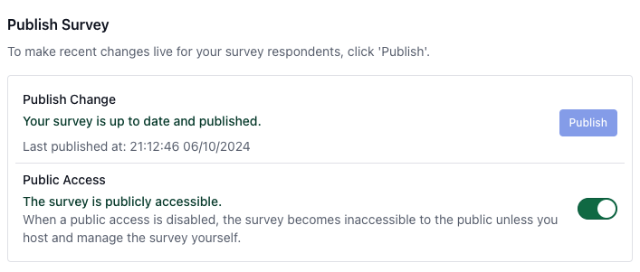

In our previous tutorial, we built a simple Product Satisfaction survey. This tutorial will cover how to publish and share the survey, collect responses, and analyze the data.

Once your survey is complete, you can publish it to finalize the survey JSON model. If you make changes after publishing, you might want to republish the survey to make the changes available to your audience.

SurveyCompo provides a one-click button for publishing. During this process, SurveyCompo consolidates all pending edits since the last publish, generates a new version of the survey JSON model with a unique survey ID and a signature hash. The survey ID uniquely identifies the survey, and the signature hash ensures the integrity of the JSON data.

For users with a paid subscription plan, there's an option to remove SurveyCompo branding from the survey, which can be enabled during publishing.

{: .center .embedded}

## Self-hosting the Survey

The published survey JSON model is all you need to host the survey on your website. You can download the model from the SurveyCompo app and host it yourself. SurveyCompo provides a JavaScript library to include on your website to render the survey. The library fetches the JSON model from your site and displays the survey.

{: .center .md}

If you host the survey yourself, you are responsible for managing data collection and storage. SurveyCompo does not collect or store any survey data in this scenario. For more details on collecting responses using survey Events, refer to the [Survey Events](/advanced/#events) section in our documentation.

Hosting both the survey model and JavaScript library on your website, and managing data collection, gives you total control over the survey data. This control helps you comply with privacy regulations and meet specific security needs.

This tutorial will focus on the SurveyCompo hosted options, detailed in the next section.

## Hosted Options

### Hosted JSON model

By default, SurveyCompo hosts the JavaScript library, and you can also choose to let SurveyCompo host your survey JSON model data. When hosted by SurveyCompo, you can embed the survey component into your website. For example:

```html
<survey-compo
  src="https://app.surveycompo.com/src/OJqcevPh0qoDNcO0mRau.json"
  sendevents
/>
```

The `sendevents` option instructs SurveyCompo to transmit survey events to its data server. This is useful if you want SurveyCompo to host the JSON model and collect responses while embedding the survey on your webpage.

### Hosted Survey Page

In this tutorial, we'll use the SurveyCompo hosted survey page. When enabled, SurveyCompo generates a unique URL for the survey to share with your audience. The survey is displayed on a SurveyCompo-hosted page, and responses are collected and stored on SurveyCompo servers.

{: .center .md}

This option is ideal if you don't have a website or prefer not to host the survey yourself. SurveyCompo provides a unique URL for each survey to share with your audience, displaying the survey on a SurveyCompo-hosted page and collecting responses on SurveyCompo servers.

Here is the hosted page for the survey we created in the previous tutorial:

[https://app.surveycompo.com/page/OJqcevPh0qoDNcO0mRau.html](https://app.surveycompo.com/page/OJqcevPh0qoDNcO0mRau.html){:target="\_blank"}

## Survey Data

SurveyCompo offers a dashboard for viewing and exporting survey responses. This dashboard presents real-time responses and performance metrics:

{: .center .md}

## Conclusion

Congratulations! You have successfully created, published, and collected responses for a survey. This tutorial explored various options for hosting and collecting survey data, and how to view and export responses using the SurveyCompo dashboard.
